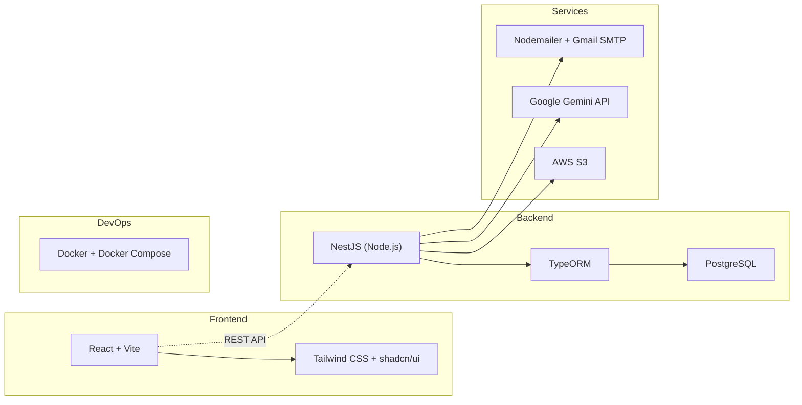

# 📋 EduVerse — Tổng hợp Quyết định Thiết kế

> **Tên sản phẩm:** EduVerse (Vũ trụ Giáo dục)  
> **Tên kỹ thuật:** `eduverse`  
> **Ngày:** 21/09/2026  
> **Trạng thái:** ✅ Hoàn thành phỏng vấn — Sẵn sàng thiết kế chi tiết

---

## 1. Thông tin Nhóm & Dự án

| Mục | Chi tiết |
|---|---|
| **Tên sản phẩm** | **EduVerse** |
| **Tên kỹ thuật** | `eduverse` (repo, folder, package, docker image) |
| **Số thành viên** | 4–5 người |
| **Kinh nghiệm** | Hỗn hợp — vài người khá backend, vài người khá frontend, còn lại đang học thêm |
| **Timeline** | ~2 tháng |
| **Nền tảng** | Web only (responsive cho mobile browser) |
| **Ngôn ngữ giao diện** | Tiếng Việt hoàn toàn |
| **Git** | Đã có repo GitHub/GitLab, chưa có code |

---

## 2. Tech Stack Đã Chọn



| Layer | Công nghệ | Lý do |
|---|---|---|
| **Frontend** | React + Vite | Nhóm đã biết JSX, nhanh, phổ biến |
| **UI Library** | Tailwind CSS + shadcn/ui | Đẹp, linh hoạt, không cần viết CSS từ đầu |
| **Backend** | NestJS (TypeScript) | Modular, mạnh, tài liệu nhiều |
| **ORM** | TypeORM | Phổ biến nhất với NestJS, decorator giống Java entity |
| **Database** | PostgreSQL | Quan hệ phức tạp, JSONB, miễn phí, enterprise-grade |
| **File Storage** | AWS S3 | Chuyên nghiệp, scalable, phổ biến nhất trong doanh nghiệp |
| **Email** | Nodemailer + Gmail SMTP | Miễn phí, đơn giản, đủ cho đồ án |
| **AI** | Google Gemini API | Free tier rộng rãi, tiếng Việt tốt |
| **Deployment** | Docker + Docker Compose | Một lệnh chạy xong, dễ demo, dễ chấm |

---

## 3. Kiến trúc Hệ thống

| Mục | Quyết định |
|---|---|
| **Mô hình** | Monolith modular (NestJS modules) |
| **Authentication** | JWT (Access Token + Refresh Token) |
| **Authorization** | RBAC (Role-Based Access Control) |
| **Real-time** | Không — dùng polling/refresh |
| **API Style** | REST API |

### Các NestJS Modules dự kiến:

```
src/
├── auth/           # Đăng ký, đăng nhập, JWT, reset password
├── users/          # CRUD người dùng, hồ sơ, avatar
├── roles/          # RBAC: Admin, Teacher, Student, Manager
├── courses/        # CRUD khóa học, xuất bản, phê duyệt
├── chapters/       # CRUD chương (thuộc khóa học)
├── lessons/        # CRUD bài học (thuộc chương)
├── documents/      # Upload/download tài liệu
├── classes/        # Tạo lớp, mã tham gia, ghi danh
├── quizzes/        # Tạo bài kiểm tra trắc nghiệm
├── questions/      # Ngân hàng câu hỏi (MC + T/F)
├── assignments/    # Giao bài tập, nộp file
├── grades/         # Điểm số, nhận xét, bảng điểm
├── progress/       # Tiến độ hoàn thành bài học
├── ai/             # Tích hợp Gemini sinh câu hỏi
├── mail/           # Gửi email (xác thực, thông báo)
├── upload/         # File upload service (AWS S3)
└── common/         # Guards, decorators, pipes, filters
```

---

## 4. Cấu trúc Dữ liệu Cốt lõi

```mermaid
erDiagram
    USER ||--o{ ENROLLMENT : "ghi danh"
    USER ||--o{ COURSE : "tạo (giảng viên)"
    COURSE ||--o{ CHAPTER : "chứa"
    CHAPTER ||--o{ LESSON : "chứa"
    LESSON ||--o{ DOCUMENT : "đính kèm"
    COURSE ||--o{ CLASS : "tổ chức thành"
    CLASS ||--o{ ENROLLMENT : "có"
    CLASS ||--o{ QUIZ : "thuộc"
    CLASS ||--o{ ASSIGNMENT : "thuộc"
    QUIZ ||--o{ QUESTION : "chứa"
    QUIZ ||--o{ QUIZ_ATTEMPT : "được làm"
    ASSIGNMENT ||--o{ SUBMISSION : "được nộp"
    USER ||--o{ QUIZ_ATTEMPT : "làm bài"
    USER ||--o{ SUBMISSION : "nộp bài"
    USER ||--o{ LESSON_PROGRESS : "theo dõi"
    LESSON ||--o{ LESSON_PROGRESS : "được theo dõi"
    SUBMISSION ||--o| GRADE : "được chấm"
    QUIZ_ATTEMPT ||--o| GRADE : "được tính điểm"

    USER {
        uuid id PK
        string email
        string password_hash
        string full_name
        enum role "Admin|Teacher|Student|Manager"
        boolean is_active
        boolean email_verified
    }
    COURSE {
        uuid id PK
        string title
        text description
        enum status "Draft|Published|Archived"
        uuid owner_id FK
    }
    CLASS {
        uuid id PK
        uuid course_id FK
        string class_code "mã tham gia"
        date start_date
        date end_date
    }
```

---

## 5. Phạm vi MVP (Phase 1) — 10 nhóm chức năng

| # | Nhóm chức năng | Mô tả ngắn | Độ phức tạp |
|---|---|---|---|
| 1 | ✅ Quản lý tài khoản & xác thực | Register, Login, Reset Password, Email Verify | ⭐⭐ |
| 2 | ✅ Quản lý người dùng & phân quyền | RBAC: Admin, Teacher, Student, Manager | ⭐⭐ |
| 3 | ✅ Quản lý khóa học | CRUD khóa học, xuất bản, phê duyệt | ⭐⭐ |
| 4 | ✅ Quản lý chương & bài học | CRUD nội dung, sắp xếp thứ tự | ⭐⭐ |
| 5 | ✅ Quản lý tài liệu | Upload/Download file đính kèm | ⭐⭐ |
| 6 | ✅ Quản lý lớp học | Tạo lớp, mã tham gia, ghi danh | ⭐⭐⭐ |
| 7 | ✅ Bài kiểm tra trắc nghiệm | Tạo quiz (MC + T/F), làm bài, chấm tự động | ⭐⭐⭐⭐ |
| 8 | ✅ Bài tập | Giao bài, nộp file, chấm điểm thủ công | ⭐⭐⭐ |
| 9 | ✅ Điểm số & phản hồi | Bảng điểm, nhận xét giảng viên | ⭐⭐ |
| 10 | ✅ Tiến độ học tập | % hoàn thành bài học | ⭐⭐ |

### Phase 2 (nếu còn thời gian):
- Thông báo (trong hệ thống + email)
- Thảo luận (Forum/Comment)
- AI sinh câu hỏi trắc nghiệm
- Báo cáo & thống kê
- Nhật ký hoạt động

---

## 6. Loại câu hỏi hỗ trợ

| Loại | Chấm | Phase |
|---|---|---|
| Trắc nghiệm nhiều lựa chọn (Multiple Choice) | Tự động | MVP |
| Đúng/Sai (True/False) | Tự động | MVP |

---

## 7. Các Tài liệu Thiết kế Cần Làm Tiếp

| # | Tài liệu | Trạng thái | Mô tả |
|---|---|---|---|
| 1 | **ERD chi tiết (Database Schema)** | 🔲 Chưa làm | Thiết kế toàn bộ bảng, quan hệ, constraints |
| 2 | **Use Case Diagrams** | 🔲 Chưa làm | Sơ đồ use case cho từng actor |
| 3 | **Use Case Specifications** | 🔲 Chưa làm | Mô tả chi tiết luồng chính/phụ từng use case |
| 4 | **API Specification** | 🔲 Chưa làm | Danh sách endpoints, request/response format |
| 5 | **UI Wireframes** | 🔲 Chưa làm | Phác thảo giao diện các trang chính |
| 6 | **System Architecture Diagram** | 🔲 Chưa làm | Sơ đồ kiến trúc tổng thể, luồng dữ liệu |
| 7 | **Sequence Diagrams** | 🔲 Chưa làm | Luồng tương tác cho các nghiệp vụ quan trọng |
| 8 | **Project Plan / Sprint Plan** | 🔲 Chưa làm | Phân chia sprint, giao việc cho từng thành viên |
| 9 | **Git Workflow & Conventions** | 🔲 Chưa làm | Quy ước branch, commit, code review |
| 10 | **Coding Conventions** | 🔲 Chưa làm | Quy ước đặt tên, format, linting |

---

## 8. Quyết định Nghiệp vụ (Đã Giải Quyết)

> [!NOTE]
> Tất cả câu hỏi mở đã được giải đáp ngày 21/09/2026.

| # | Câu hỏi | Quyết định |
|---|---|---|
| 1 | Cloud Storage cụ thể? | **AWS S3** — phổ biến nhất trong doanh nghiệp |
| 2 | Một user có nhiều role? | **Không** — 1 user = 1 role duy nhất (đơn giản hóa RBAC) |
| 3 | Giảng viên tự đăng ký? | **Không** — Tài khoản giảng viên do Admin tạo. Học viên tự đăng ký bình thường |
| 4 | Khóa học có giá tiền? | **Miễn phí** — nhưng DB có trường `price` (default 0) để mở rộng sau |
| 5 | Tên sản phẩm? | **EduVerse** — tên kỹ thuật: `eduverse` |

### Quy tắc nghiệp vụ quan trọng rút ra:

- 🔑 **Đăng ký tài khoản:** Chỉ có vai trò **Student** được tự đăng ký. Các vai trò khác (Teacher, Manager, Admin) do Admin tạo.
- 👤 **Phân quyền:** Mỗi user có đúng **1 role** — lưu trực tiếp trong bảng `users` (không cần bảng trung gian `user_roles`).
- 💰 **Giá khóa học:** Hiện tại miễn phí, nhưng entity `Course` sẽ có trường `price: decimal(10,2) DEFAULT 0` để sẵn sàng mở rộng.
- ☁️ **File storage:** Dùng AWS S3 SDK (`@aws-sdk/client-s3`). Cần cấu hình: bucket name, region, access key, secret key qua environment variables.

