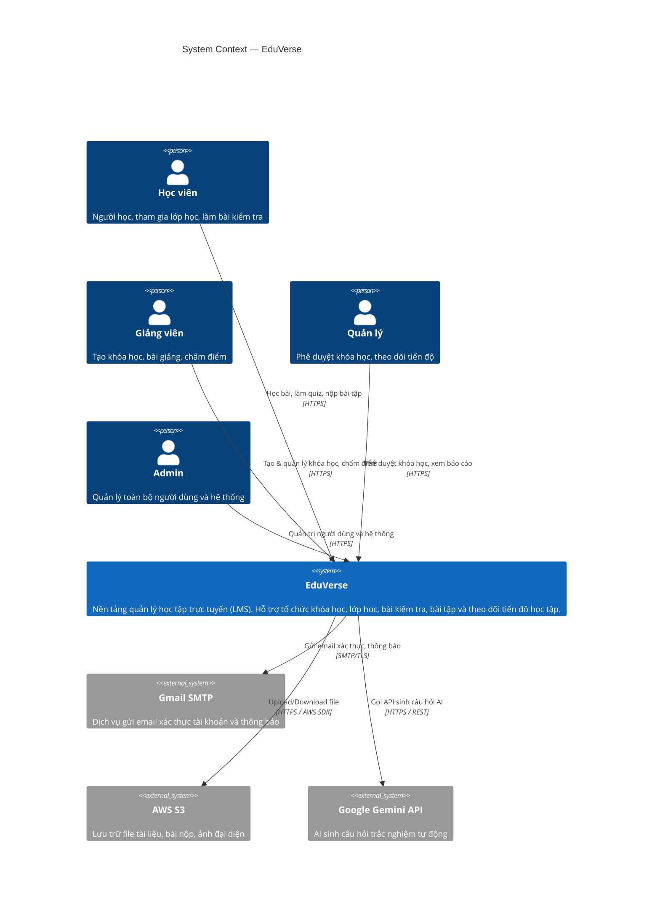
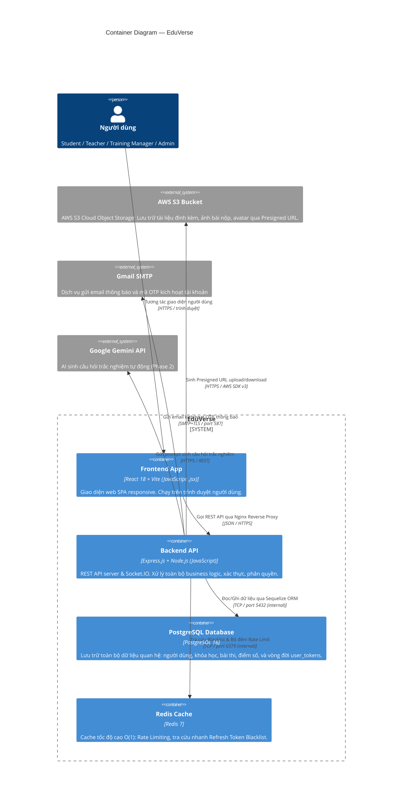

# 🏗️ System Architecture — EduVerse

> **Phiên bản:** 1.0  
> **Cập nhật lần cuối:** 25/09/2026  
> **Mức độ:** C4 Level 1 (System Context) + C4 Level 2 (Container)  
> **Trạng thái:** ✅ Hoàn thành

---

## 1. C4 Level 1 — System Context Diagram

> Mô tả EduVerse tương tác với ai và với hệ thống nào ở cấp độ cao nhất.



---

## 2. C4 Level 2 — Container Diagram

> Mô tả chi tiết các thành phần (container) bên trong EduVerse và cách chúng giao tiếp.



---

## 3. Mô tả Chi tiết Các Container

| Container | Công nghệ | Port | Vai trò |
|---|---|---|---|
| **Frontend App** | React 18 + Vite (JavaScript) + Tailwind CSS + shadcn/ui | `80`/`443` (prod qua Nginx), `5173` (dev) | Giao diện web SPA, responsive, xử lý client state |
| **Backend API** | Express.js 4 + Node.js (ES Modules) + Sequelize | `3000` (internal prod, exposed dev) | REST API, Socket.IO Server, Business Logic, Auth/RBAC |
| **PostgreSQL** | PostgreSQL 16 | `5432` (internal network) | Nguồn dữ liệu quan hệ chính & lưu trữ bền vững `user_tokens` (audit log) |
| **Redis** | Redis 7 | `6379` (internal network) | Cache tốc độ cao $O(1)$: tra cứu Token Blacklist, bộ đếm Rate Limiting |
| **AWS S3** (External) | AWS S3 SDK v3 | Cloud HTTPS | Lưu trữ tài liệu học tập, ảnh avatar, file nộp bài tập |

---

## 4. Các Luồng Kết nối Chính

### 4.1. REST API — Frontend ↔ Backend & Cơ chế Reverse Proxy

React là ứng dụng SPA (Single Page Application) thực thi hoàn toàn trên trình duyệt người dùng. Luồng giao tiếp API được phân tách rõ ràng theo môi trường:

```
[Development]:
Trình duyệt  ──>  localhost:5173 (Vite HMR Dev Server)
Trình duyệt  ──>  localhost:3000/api/v1/* (Express.js API - bật CORS cho localhost:5173)

[Production - Docker Compose]:
Trình duyệt  ──>  [HTTPS :80/443]  ──>  Nginx (Frontend Container)
                                          │
                                          ├── Phục vụ Static SPA Assets (HTML, JS, CSS)
                                          └── Reverse Proxy `/api/v1/*` ──> http://backend:3000
```

- **Lợi ích kiến trúc Production:**
  - Trình duyệt chỉ cần kết nối đến 1 cổng duy nhất (80/443).
  - Triệt tiêu vấn đề CORS (Cross-Origin Resource Sharing) trong môi trường triển khai thực tế.
  - Port `3000` của Backend được bảo vệ an toàn trong mạng nội bộ Docker, không expose ra ngoài Internet.
- **Format:** JSON over HTTP/HTTPS
- **Auth header:** `Authorization: Bearer <access_token>`
- **Refresh flow:** Tự động gửi kèm `Cookie: refreshToken=...` (HttpOnly, Secure, SameSite=Strict)

### 4.2. Real-time Notifications (Socket.IO)

```
Frontend  ←→  [WS / wss://]  ←→  Backend (Socket.IO Server)
```

- **Thư viện:** `socket.io` (Backend) và `socket.io-client` (Frontend)
- **Mục đích:** Push thông báo real-time (Phase 2)
- **Events:** `notification.new`, `grade.updated`

> [!NOTE]
> Socket.IO được thiết kế sẵn cho Phase 2. Phase 1 MVP dùng HTTP polling đơn giản qua TanStack Query.

### 4.3. Docker Internal Network — Backend ↔ Database/Redis

```
backend-container  →  [Docker bridge network]  →  postgres-container
backend-container  →  [Docker bridge network]  →  redis-container
```

- **Network name:** `eduverse-network` (Docker Compose internal)
- **Hostname:** `postgres`, `redis` (tên service trong `docker-compose.yml`)
- **Không expose ra ngoài** — chỉ accessible trong Docker network

### 4.4. Kiến trúc Quản lý Token & Cache 2 Lớp (PostgreSQL + Redis)

Hệ thống kết hợp sức mạnh của **PostgreSQL** (lưu trữ bền vững, toàn vẹn quan hệ) và **Redis** (truy xuất bộ nhớ $O(1)$) để tối ưu hóa hiệu năng và bảo mật:

```
                      ┌───────────────────────────────────────────────┐
                      │              Express.js Backend               │
                      └───────┬───────────────────────────────┬───────┘
                              │ Kiểm tra nhanh O(1)           │ Ghi nhận trạng thái / Audit
                              ▼                               ▼
                 ┌─────────────────────────┐     ┌─────────────────────────┐
                 │       Redis Cache       │     │  PostgreSQL user_tokens │
                 │                         │     │                         │
                 │ • Blacklist kiểm tra    │     │ • Single Source of Truth│
                 │   tức thì mỗi request   │     │ • Lưu trữ OTP kích hoạt │
                 │ • Rate Limit Counters   │     │ • Quản lý token rotation│
                 │ • Cache dữ liệu tạm     │     │ • Audit log lịch sử     │
                 └─────────────────────────┘     └─────────────────────────┘
```

| Thành phần | Dữ liệu | Cơ chế & Key Pattern | Thời gian sống (TTL) | Mục đích |
|---|---|---|---|---|
| **Redis** | Refresh Token Blacklist | `rt_blacklist:<token_hash>` | 7 ngày | Chặn ngay Refresh Token bị thu hồi mà không cần query DB |
| **Redis** | Rate Limit Counter | `rl:<ip>:<endpoint>` | 1 phút – 1 giờ | Chống brute-force đăng nhập, spam gửi OTP |
| **PostgreSQL** | Token Kích hoạt Email | Bảng `user_tokens` (`email_verification`) | 10 phút | Lưu mã OTP 6 số hash SHA-256 phục vụ kích hoạt tài khoản |
| **PostgreSQL** | Token Đặt lại Mật khẩu | Bảng `user_tokens` (`password_reset`) | 15 phút | Chuỗi ngẫu nhiên hash SHA-256 phục vụ đổi mật khẩu an toàn |
| **PostgreSQL** | Refresh Token Lifecycle | Bảng `user_tokens` (`refresh_token`) | 7 ngày | Lưu phiên làm việc hợp lệ, hỗ trợ thu hồi đa thiết bị (`allDevices`) |

### 4.5. External Services

| Service | Giao thức | Mục đích |
|---|---|---|
| **Gmail SMTP** | SMTP+TLS (port 587) | Gửi email xác thực, reset mật khẩu |
| **AWS S3** | HTTPS (AWS SDK v3) | Upload tài liệu, ảnh bài nộp, avatar qua Presigned URL |
| **Google Gemini API** | HTTPS (REST) | AI sinh câu hỏi trắc nghiệm (Phase 2) |

---

## 5. Môi trường Triển khai

### Development (Local)

```
docker-compose up -d postgres redis
npm run dev (Backend Express.js)
npm run dev (Frontend Vite)
```

```
localhost:5173  →  Frontend (Vite dev server)
localhost:3000  →  Backend (Express.js API)
localhost:5432  →  PostgreSQL (exposed for GUI tools: DBeaver, pgAdmin)
localhost:6379  →  Redis (exposed for RedisInsight)
```

### Production (Docker Compose)

```
                    ┌────────────────────────────────────────────────────────┐
                    │                      Docker Host                       │
                    │                                                        │
Internet ──:80/443──│──> [Frontend: Nginx]                                   │
                    │         │                                              │
                    │         ├── Phục vụ Static React SPA                   │
                    │         └── Proxy `/api/v1/*` (nội bộ Docker)          │
                    │                  │                                     │
                    │                  ▼                                     │
                    │         [Backend: Express.js :3000]                    │
                    │            │         │                                 │
                    │        :5432         :6379                             │
                    │            ▼         ▼                                 │
                    │     [PostgreSQL] [Redis]                               │
                    └────────────────────────────────────────────────────────┘
                                 │           │
                             AWS S3     Gmail SMTP
                           (external)  (external)
```

---

## 6. Cấu hình Docker Compose (Tổng quan)

```yaml
# docker-compose.yml (tóm tắt)
services:
  frontend:
    image: eduverse-frontend
    ports: ["80:80", "443:443"]
    depends_on: [backend]

  backend:
    image: eduverse-backend
    expose: ["3000"] # Nội bộ mạng Docker, Nginx kết nối trực tiếp
    # ports: ["3000:3000"]  # Chỉ mở khi dev/debug
    depends_on: [postgres, redis]
    environment:
      - DATABASE_URL=postgresql://...
      - REDIS_URL=redis://redis:6379
      - JWT_SECRET=...
      - AWS_S3_BUCKET=...
      - GEMINI_API_KEY=...

  postgres:
    image: postgres:16-alpine
    volumes: [postgres-data:/var/lib/postgresql/data]

  redis:
    image: redis:7-alpine

networks:
  default:
    name: eduverse-network
```

---

## 7. Các Quyết định Kiến trúc Liên quan

| Quyết định | Xem chi tiết |
|---|---|
| Tại sao chọn Express.js (JavaScript) | [design-decisions.md — ADR-001](./design-decisions.md#adr-001) |
| Tại sao chọn PostgreSQL | [design-decisions.md — ADR-002](./design-decisions.md#adr-002) |
| Tại sao dùng JWT & Cơ chế Token 2 Lớp | [design-decisions.md — ADR-003](./design-decisions.md#adr-003) |
| Tại sao dùng Monolith | [design-decisions.md — ADR-004](./design-decisions.md#adr-004) |
| Tại sao chọn Vite + React (JavaScript) | [design-decisions.md — ADR-005](./design-decisions.md#adr-005) |
| Tại sao dùng Docker Compose | [design-decisions.md — ADR-006](./design-decisions.md#adr-006) |
| Tại sao chọn AWS S3 (Presigned URL) | [design-decisions.md — ADR-007](./design-decisions.md#adr-007) |
| Tại sao chọn Google Gemini Flash | [design-decisions.md — ADR-008](./design-decisions.md#adr-008) |
| Chiến lược Real-time: Polling & Socket.IO | [design-decisions.md — ADR-009](./design-decisions.md#adr-009) |

---

_Cập nhật lần cuối: 25/09/2026_
