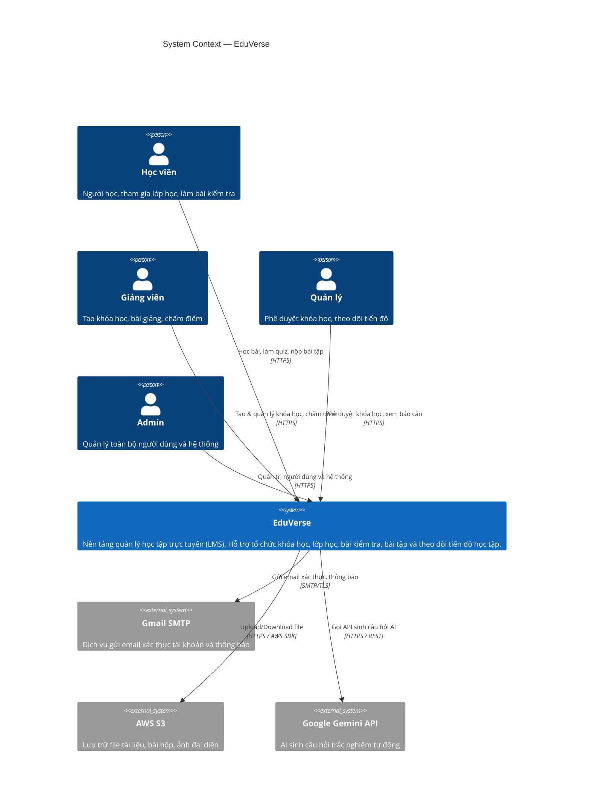
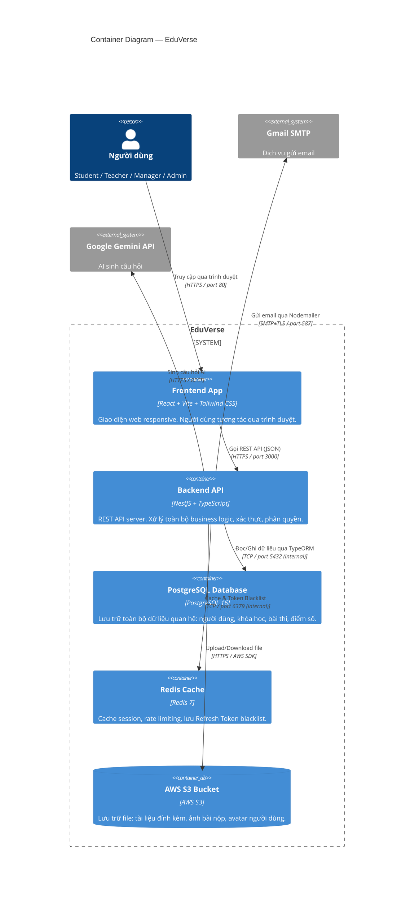

# 🏗️ System Architecture — EduVerse

> **Phiên bản:** 1.0  
> **Cập nhật lần cuối:** 25/09/2026  
> **Mức độ:** C4 Level 1 (System Context) + C4 Level 2 (Container)  
> **Trạng thái:** ✅ Hoàn thành

---

## 1. C4 Level 1 — System Context Diagram

> Mô tả EduVerse tương tác với ai và với hệ thống nào ở cấp độ cao nhất.



---

## 2. C4 Level 2 — Container Diagram

> Mô tả chi tiết các thành phần (container) bên trong EduVerse và cách chúng giao tiếp.



---

## 3. Mô tả Chi tiết Các Container

| Container | Công nghệ | Port | Vai trò |
|---|---|---|---|
| **Frontend App** | React 18 + Vite + Tailwind CSS + shadcn/ui | `80` (prod), `5173` (dev) | Giao diện web SPA, responsive |
| **Backend API** | NestJS 10 + TypeScript + TypeORM | `3000` | REST API, Business Logic, Auth/RBAC |
| **PostgreSQL** | PostgreSQL 16 | `5432` (internal) | Lưu trữ dữ liệu quan hệ chính |
| **Redis** | Redis 7 | `6379` (internal) | Cache, Refresh Token blacklist |
| **AWS S3** | AWS S3 (external) | — | File storage dài hạn |

---

## 4. Các Luồng Kết nối Chính

### 4.1. REST API — Frontend ↔ Backend

```
Browser  →  [HTTPS :443]   →  Frontend (React/Vite)
Frontend →  [HTTPS :3000]  →  Backend (NestJS)
```

- **Format:** JSON over HTTP/HTTPS
- **Auth header:** `Authorization: Bearer <access_token>`
- **Timeout:** 30 giây
- **CORS:** Backend chỉ chấp nhận origin từ Frontend domain

### 4.2. WebSocket — Real-time Notifications

```
Frontend  ←→  [WS / wss://]  ←→  Backend (NestJS Gateway)
```

- **Thư viện:** NestJS WebSocket Gateway (`@nestjs/websockets`)
- **Mục đích:** Push thông báo real-time (Phase 2)
- **Events:** `notification.new`, `grade.updated`

> [!NOTE]
> WebSocket được thiết kế sẵn cho Phase 2. Phase 1 MVP dùng HTTP polling đơn giản.

### 4.3. Docker Internal Network — Backend ↔ Database/Redis

```
backend-container  →  [Docker bridge network]  →  postgres-container
backend-container  →  [Docker bridge network]  →  redis-container
```

- **Network name:** `eduverse-network` (Docker Compose internal)
- **Hostname:** `postgres`, `redis` (tên service trong `docker-compose.yml`)
- **Không expose ra ngoài** — chỉ accessible trong Docker network

### 4.4. Redis — Cache & Session

```
Backend  →  [SET/GET/DEL]  →  Redis
```

| Dữ liệu | Key Pattern | TTL |
|---|---|---|
| Refresh Token Blacklist | `rt_blacklist:<token_hash>` | 7 ngày |
| Rate Limit Counter | `rl:<ip>:<endpoint>` | 1 phút |
| Email OTP | `otp:<user_id>` | 15 phút |

### 4.5. External Services

| Service | Giao thức | Mục đích |
|---|---|---|
| **Gmail SMTP** | SMTP+TLS (port 587) | Gửi email xác thực, reset mật khẩu |
| **AWS S3** | HTTPS (AWS SDK) | Upload tài liệu, ảnh bài nộp, avatar |
| **Google Gemini API** | HTTPS (REST) | AI sinh câu hỏi trắc nghiệm (Phase 2) |

---

## 5. Môi trường Triển khai

### Development (Local)

```
docker-compose up -d
```

```
localhost:5173  →  Frontend (Vite dev server)
localhost:3000  →  Backend (NestJS)
localhost:5432  →  PostgreSQL (exposed for dev tools)
localhost:6379  →  Redis (exposed for dev tools)
```

### Production (Docker Compose)

```
                    ┌─────────────────────────────────┐
                    │          Docker Host             │
                    │                                  │
Internet ──:80/443──│── [Frontend: Nginx]              │
                    │         │                        │
                    │         │ REST API :3000         │
                    │         ▼                        │
                    │   [Backend: NestJS]              │
                    │     │         │                  │
                    │  :5432     :6379                 │
                    │     ▼         ▼                  │
                    │ [PostgreSQL] [Redis]             │
                    └─────────────────────────────────┘
                              │           │
                          AWS S3     Gmail SMTP
                        (external)  (external)
```

---

## 6. Cấu hình Docker Compose (Tổng quan)

```yaml
# docker-compose.yml (tóm tắt)
services:
  frontend:
    image: eduverse-frontend
    ports: ["80:80"]
    depends_on: [backend]

  backend:
    image: eduverse-backend
    ports: ["3000:3000"]
    depends_on: [postgres, redis]
    environment:
      - DATABASE_URL=postgresql://...
      - REDIS_URL=redis://redis:6379
      - JWT_SECRET=...
      - AWS_S3_BUCKET=...
      - GEMINI_API_KEY=...

  postgres:
    image: postgres:16-alpine
    volumes: [postgres-data:/var/lib/postgresql/data]

  redis:
    image: redis:7-alpine

networks:
  default:
    name: eduverse-network
```

---

## 7. Các Quyết định Kiến trúc Liên quan

| Quyết định | Xem chi tiết |
|---|---|
| Tại sao chọn NestJS | [design-decisions.md — ADR-001](./design-decisions.md#adr-001) |
| Tại sao chọn PostgreSQL | [design-decisions.md — ADR-002](./design-decisions.md#adr-002) |
| Tại sao dùng JWT | [design-decisions.md — ADR-003](./design-decisions.md#adr-003) |
| Tại sao dùng Monolith | [design-decisions.md — ADR-004](./design-decisions.md#adr-004) |
| Tại sao chọn Vite + React | [design-decisions.md — ADR-005](./design-decisions.md#adr-005) |
| Tại sao dùng Docker Compose | [design-decisions.md — ADR-006](./design-decisions.md#adr-006) |

---

_Cập nhật lần cuối: 25/09/2026_
