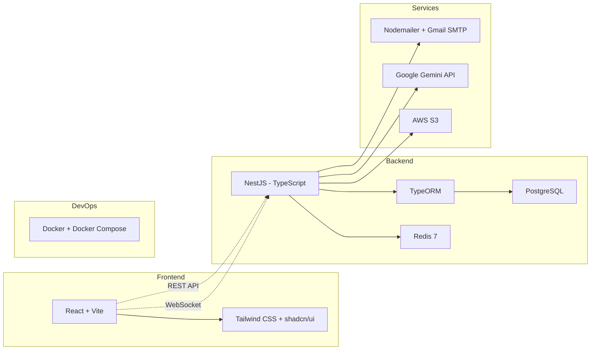

# Tech Stack & Quyết định Kiến trúc — EduVerse

> Tài liệu này ghi lại **tất cả quyết định kỹ thuật** của dự án kèm lý do.  
> Khi cần thay đổi, cập nhật tại đây và tạo PR để cả nhóm review.  
> **Phiên bản:** 1.1 — Cập nhật: 25/09/2026 (bổ sung Redis, WebSocket, Storage, Email)

---

## 1. Tổng quan Tech Stack



---

## 2. Chi tiết Quyết định

### Frontend

| Quyết định | Lựa chọn | Version | Lý do | Các lựa chọn đã cân nhắc |
|---|---|---|---|---|
| Framework | **React + Vite** | React 18, Vite 5 | Nhóm đã biết JSX, nhanh, phổ biến, tài liệu nhiều | Next.js (trùng chức năng với NestJS), Vue (phải học mới), Angular (phức tạp) |
| UI Library | **Tailwind CSS + shadcn/ui** | Tailwind 3.4 | Utility-first, component đẹp sẵn, linh hoạt, phổ biến nhất với React | Ant Design (khó custom), MUI (nặng), Bootstrap (cũ) |
| State Management | _Chưa quyết định_ | — | Sẽ quyết khi bắt đầu code frontend | React Query, Zustand, Redux Toolkit |

### Backend

| Quyết định | Lựa chọn | Version | Lý do | Các lựa chọn đã cân nhắc |
|---|---|---|---|---|
| Framework | **NestJS (TypeScript)** | NestJS 10, Node 20 | Modular architecture, decorator-based, tài liệu nhiều, phù hợp enterprise | Express (thiếu cấu trúc), Spring Boot (Java, nhóm không rành) |
| ORM | **TypeORM** | TypeORM 0.3 | Phổ biến nhất với NestJS, decorator giống Java entity, dễ học | Prisma (schema-first khác biệt), Sequelize (TS support kém), Drizzle (cộng đồng nhỏ) |
| Kiến trúc | **Monolith modular** | — | 1 app chia module rõ ràng, dễ dev/deploy/debug, phù hợp nhóm 4–5 người | Microservices (quá phức tạp cho nhóm nhỏ) |
| API Style | **REST API** | — | Đơn giản, phổ biến, đủ cho yêu cầu | GraphQL (phức tạp, không cần thiết) |
| Cache / Session | **Redis** | Redis 7 | Stateless JWT cần blacklist Refresh Token, rate limiting, OTP storage | Lưu DB (chậm), In-memory (không scalable) |
| Real-time | **WebSocket** (Phase 2) | @nestjs/websockets | Push thông báo không cần reload trang | Polling (tốn bandwidth), SSE (1 chiều) |

### Database

| Quyết định | Lựa chọn | Version | Lý do | Các lựa chọn đã cân nhắc |
|---|---|---|---|---|
| DBMS | **PostgreSQL** | PostgreSQL 16 | Quan hệ phức tạp (khóa học → lớp → học viên), JSONB, miễn phí, enterprise-grade | MySQL (ít tính năng hơn), MongoDB (NoSQL không phù hợp LMS), SQL Server (không cần với NestJS) |

### Services bên ngoài

| Quyết định | Lựa chọn | Version / Plan | Lý do | Các lựa chọn đã cân nhắc |
|---|---|---|---|---|
| File Storage | **AWS S3** | SDK v3 (`@aws-sdk/client-s3`) | Phổ biến nhất trong doanh nghiệp, scalable, SDK tốt | GCS (ít phổ biến hơn), Local disk (không chuyên nghiệp), MinIO (phức tạp setup) |
| Email | **Nodemailer + Gmail SMTP** | Nodemailer 6 | Miễn phí, dễ cài đặt, 500 email/ngày đủ cho đồ án | SendGrid (trả phí), Mailtrap (không gửi thật) |
| AI | **Google Gemini API** | gemini-1.5-flash | Free tier rộng rãi (15 req/phút, 1M token/ngày), tiếng Việt tốt | OpenAI (trả phí từ đầu), Ollama (cần GPU) |

### DevOps & Deployment

| Quyết định | Lựa chọn | Version | Lý do | Các lựa chọn đã cân nhắc |
|---|---|---|---|---|
| Deployment | **Docker + Docker Compose** | Docker 25, Compose v2 | 1 lệnh chạy xong, đồng nhất môi trường, dễ demo/chấm bài | Cloud deploy (phức tạp), npm start trực tiếp (không đồng nhất) |

### Xác thực & Phân quyền

| Quyết định | Lựa chọn | Lý do |
|---|---|---|
| Authentication | **JWT (Access Token + Refresh Token)** | Stateless, phổ biến với SPA (React), tự động gia hạn phiên |
| Authorization | **RBAC (Role-Based Access Control)** | Đơn giản, đủ cho 4 vai trò cố định |
| Số role per user | **1 role duy nhất** | Đơn giản hóa, lưu trực tiếp trong bảng users |

### Khác

| Quyết định | Lựa chọn | Lý do |
|---|---|---|
| Real-time (Phase 1) | **HTTP polling** | Đơn giản, đủ dùng cho MVP |
| Real-time (Phase 2) | **WebSocket** (`@nestjs/websockets`) | Push thông báo real-time mà không tải lại trang |
| Nền tảng | **Web only** (responsive) | Đủ cho yêu cầu, không cần mobile app |
| Ngôn ngữ UI | **Tiếng Việt hoàn toàn** | Phù hợp bối cảnh đơn vị đào tạo Việt Nam |
| Tài liệu | **Docs-as-Code** (Markdown + Mermaid trong Git) | Version control, miễn phí, review qua PR |

---

## 3. Cấu trúc Module Backend (NestJS)

```
src/
├── auth/           # Đăng ký, đăng nhập, JWT, reset password
├── users/          # CRUD người dùng, hồ sơ, avatar
├── courses/        # CRUD khóa học, xuất bản, phê duyệt
├── chapters/       # CRUD chương (thuộc khóa học)
├── lessons/        # CRUD bài học (thuộc chương)
├── documents/      # Upload/download tài liệu
├── classes/        # Tạo lớp, mã tham gia, ghi danh
├── quizzes/        # Tạo bài kiểm tra trắc nghiệm
├── questions/      # Ngân hàng câu hỏi (MC + T/F)
├── assignments/    # Giao bài tập, nộp file
├── grades/         # Điểm số, nhận xét, bảng điểm
├── progress/       # Tiến độ hoàn thành bài học
├── ai/             # Tích hợp Gemini sinh câu hỏi
├── mail/           # Gửi email (xác thực, thông báo)
├── upload/         # File upload service (AWS S3)
└── common/         # Guards, decorators, pipes, filters
```

---

_Cập nhật lần cuối: 25/09/2026 — Bổ sung Redis, WebSocket, cột Version_
