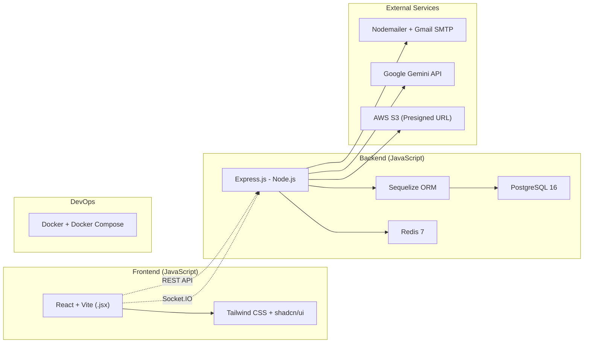

# Tech Stack & Quyết định Kiến trúc — EduVerse

> Tài liệu này ghi lại **tất cả quyết định kỹ thuật** của dự án kèm lý do.  
> Khi cần thay đổi, cập nhật tại đây và tạo PR để cả nhóm review.  
> **Phiên bản:** 2.0 — Cập nhật: 25/09/2026 (Chuyển đổi toàn diện sang Express.js JavaScript ES Modules, Sequelize ORM, Joi, Socket.IO và React .jsx)

---

## 1. Tổng quan Tech Stack



---

## 2. Chi tiết Quyết định

### Frontend

| Quyết định | Lựa chọn | Version | Lý do | Các lựa chọn đã cân nhắc |
|---|---|---|---|---|
| Ngôn ngữ & Framework | **React + Vite (JavaScript)** | React 18, Vite 5 | Dùng JavaScript thuần (`.jsx`, `.js`), HMR cực nhanh, quen thuộc với mọi thành viên, không rào cản type checking | TypeScript (`.tsx`), Next.js (phức tạp), Vue 3 |
| UI Library | **Tailwind CSS + shadcn/ui** | Tailwind 3.4 | Utility-first, component đẹp sẵn, linh hoạt, tùy biến cao | Ant Design, MUI, Bootstrap |
| Routing | **React Router** | v6.22+ | Chuẩn công nghiệp cho React SPA, hỗ trợ Protected Routes và Lazy Loading | TanStack Router, tự viết router |
| State Management | **TanStack Query + Zustand** | React Query v5, Zustand v4 | **Phân tách 2 lớp State:**<br>• *Server State (TanStack Query):* Tự động cache API, re-fetch khi nộp bài/đổi dữ liệu, loại bỏ prop drilling, quản lý `isLoading`/`isError`.<br>• *Client State (Zustand):* Siêu nhẹ (<2KB), lưu trữ phiên đăng nhập (`currentUser`, access token trong RAM) và trạng thái UI (Sidebar, Theme, Modals). | Redux Toolkit (quá cồng kềnh, boilerplate nhiều) |
| HTTP Client | **Axios** | v1.6+ | Hỗ trợ Interceptors xử lý tự động gắn Access Token và xoay vòng Refresh Token (Token Rotation) | Fetch API native |
| Form & Validation | **React Hook Form** | RHF v7 | Hiệu năng cao, re-render tối thiểu, dễ tích hợp với component UI | Formik |
| Icons | **Lucide React** | v0.3+ | Bộ icon chính thức đi kèm shadcn/ui, nhẹ, đồng bộ thiết kế | FontAwesome, React Icons |

### Backend

| Quyết định | Lựa chọn | Version | Lý do | Các lựa chọn đã cân nhắc |
|---|---|---|---|---|
| Ngôn ngữ & Framework | **Express.js (Node.js)** | Express 4.x, Node 20 | **JavaScript thuần (ES Modules: `import/export`)**. Nhẹ, linh hoạt, thư viện phong phú, cả nhóm đều quen thuộc, phát triển nhanh | NestJS (phức tạp, bắt buộc TS), Fastify, Koa |
| ORM | **Sequelize** | Sequelize v6 | ORM phổ biến nhất cho Node.js/Express + PostgreSQL. Hỗ trợ đầy đủ Model quan hệ, Transactions, Migrations, Hooks | TypeORM (thiếu decorator khi dùng JS), Prisma, pg thuần |
| Kiến trúc | **3 lớp phân tầng (Layered Architecture)** | Routes $\rightarrow$ Controllers $\rightarrow$ Services $\rightarrow$ Models | Mô hình chuẩn mực, quen thuộc nhất với Express.js, tách biệt rõ ràng router, business logic và database | MVC truyền thống, Hexagonal Architecture |
| Validation | **Joi** | Joi v17 | Thư viện validate schema số 1 cho Express, validate chi tiết `req.body`, `req.query`, `req.params` qua middleware | express-validator, Zod |
| API Style | **REST API** | — | Đơn giản, phổ biến, chuẩn JSON | GraphQL |
| Cache & Rate Limit | **Redis** | Redis 7 (`ioredis`) | Tốc độ O(1): lưu Rate Limit counters, kiểm tra nhanh Refresh Token Blacklist, cache dữ liệu tạm | In-memory (không chia sẻ được giữa các container), DB |
| Real-time | **Socket.IO** (Phase 2) | Socket.IO v4 | Chuẩn công nghiệp cho real-time web trên Node.js/Express, hỗ trợ fallback polling, rooms, reconnection tự động | ws native, SSE |

### Database

| Quyết định | Lựa chọn | Version | Lý do | Các lựa chọn đã cân nhắc |
|---|---|---|---|---|
| DBMS | **PostgreSQL** | PostgreSQL 16 | Quan hệ phức tạp (khóa học → lớp → học viên), JSONB, miễn phí, enterprise-grade | MySQL, MongoDB |

### Services bên ngoài

| Quyết định   | Lựa chọn                    | Version / Plan                | Lý do                                                                          | Các lựa chọn đã cân nhắc                 |
| --------------| -----------------------------| -------------------------------| --------------------------------------------------------------------------------| ------------------------------------------|
| File Storage | **AWS S3**                  | SDK v3 (`@aws-sdk/client-s3`) | Phổ biến nhất trong doanh nghiệp, scalable, SDK tốt, an toàn với Presigned URL | GCS, Local disk (phình container), MinIO |
| Email        | **Nodemailer + Gmail SMTP** | Nodemailer 6                  | Miễn phí, dễ cài đặt, 500 email/ngày đủ cho đồ án                              | SendGrid, Mailtrap                       |
| AI           | **Google Gemini API**       | gemini-1.5-flash              | Free tier rộng rãi (15 req/phút, 1M token/ngày), tiếng Việt tốt                | OpenAI, Ollama                           |

### DevOps & Deployment

| Quyết định | Lựa chọn                    | Version               | Lý do                                                    | Các lựa chọn đã cân nhắc          |
| ------------| -----------------------------| -----------------------| ----------------------------------------------------------| -----------------------------------|
| Deployment | **Docker + Docker Compose** | Docker 25, Compose v2 | 1 lệnh chạy xong, đồng nhất môi trường, dễ demo/chấm bài | Cloud deploy, npm start trực tiếp |

### Xác thực & Phân quyền

| Quyết định | Lựa chọn | Lý do |
|---|---|---|
| Authentication | **JWT (Access Token + Refresh Token)** | Stateless, phổ biến với SPA (React), tự động gia hạn phiên qua HttpOnly Cookie |
| Authorization | **RBAC (Role-Based Access Control)** | Đơn giản, đủ cho 4 vai trò cố định qua `role.middleware.js` |
| Các vai trò (Roles) | **4 vai trò: `student`, `teacher`, `training_manager`, `admin`** | Khớp chính xác với cột `role` trong bảng `users` (CSDL) |
| Số role per user | **1 role duy nhất** | Đơn giản hóa, lưu trực tiếp trong bảng users |

### Khác

| Quyết định | Lựa chọn | Lý do |
|---|---|---|
| Real-time (Phase 1) | **HTTP polling** | Đơn giản, đủ dùng cho MVP |
| Real-time (Phase 2) | **Socket.IO** (`socket.io` server & `socket.io-client`) | Push thông báo real-time mà không tải lại trang |
| Nền tảng | **Web only** (responsive) | Đủ cho yêu cầu, không cần mobile app |
| Ngôn ngữ UI | **Tiếng Việt hoàn toàn** | Phù hợp bối cảnh đơn vị đào tạo Việt Nam |
| Tài liệu | **Docs-as-Code** (Markdown + Mermaid trong Git) | Version control, miễn phí, review qua PR |

---

## 3. Cấu trúc Module Backend (Express.js Layered Architecture)

Hệ thống Backend áp dụng **Kiến trúc 3 lớp phân tầng chuẩn mực cho Express.js** bằng **JavaScript thuần (ES Modules: `import/export`)**:

```
Request ──> [Routes] ──> [Middlewares: Auth/Validate] ──> [Controllers] ──> [Services] ──> [Sequelize Models] ──> PostgreSQL
```

### 3.1. Cây Thư mục Tổng thể Backend (`backend/src/`)

```
backend/src/
├── config/                      # Cấu hình hệ thống (load .env qua dotenv)
│   ├── database.js              # Khởi tạo Sequelize instance kết nối PostgreSQL
│   ├── redis.js                 # Cấu hình ioredis client
│   ├── jwt.js                   # Cấu hình secret key và thời hạn Access/Refresh Token
│   ├── s3.js                    # Cấu hình AWS SDK v3 S3 Client
│   └── mailer.js                # Cấu hình Nodemailer transporter
├── controllers/                 # Tầng tiếp nhận HTTP Request & trả về Response JSON
│   ├── auth.controller.js       # Đăng ký, đăng nhập, verify OTP, refresh token, logout
│   ├── user.controller.js       # Profile cá nhân, đổi mật khẩu, quản lý người dùng
│   ├── course.controller.js     # CRUD khóa học, duyệt khóa học, xuất bản
│   ├── chapter.controller.js    # Quản lý chương học
│   ├── lesson.controller.js     # Quản lý bài học lý thuyết
│   ├── material.controller.js   # Tài liệu đính kèm bài học (course_materials)
│   ├── class.controller.js      # Tạo lớp, mã mời tham gia, ghi danh
│   ├── quiz.controller.js       # Quản lý bài kiểm tra trắc nghiệm, lượt thi
│   ├── question.controller.js   # Ngân hàng câu hỏi & đáp án
│   ├── assignment.controller.js # Giao bài tập, thiết lập deadline theo lớp
│   ├── grade.controller.js      # Chấm điểm bài tập, tổng kết bảng điểm
│   ├── progress.controller.js   # Theo dõi tiến độ bài học (lesson_progress)
│   ├── notification.controller.js # Danh sách thông báo, đánh dấu đã đọc
│   ├── ai.controller.js         # Gọi Gemini sinh câu hỏi tự động
│   └── upload.controller.js     # Sinh Presigned URL tải file lên AWS S3
├── services/                    # Tầng Xử lý Business Logic nghiệp vụ (Không chứa req/res)
│   ├── auth.service.js          # Logic băm mật khẩu, sinh token, kiểm tra OTP, rotation
│   ├── user.service.js          # Logic tìm kiếm, cập nhật hồ sơ, phân quyền
│   ├── course.service.js        # Logic phê duyệt, xuất bản, kiểm tra quyền tác giả
│   ├── class.service.js         # Logic tạo mã mời, kiểm tra sĩ số lớp, ghi danh
│   ├── quiz.service.js          # Logic tính điểm trắc nghiệm tự động, thời gian làm bài
│   ├── assignment.service.js    # Logic nộp bài, kiểm tra trễ hạn nộp (deadline)
│   ├── grade.service.js         # Logic tổng hợp điểm số lớp học
│   ├── mail.service.js          # Gửi email qua Gmail SMTP (mẫu OTP, reset password)
│   ├── ai.service.js            # Xây dựng prompt & gọi Google Gemini API
│   ├── upload.service.js        # Tạo Presigned Upload/Download URL với AWS S3
│   └── tokenBlacklist.service.js # Đẩy & kiểm tra Refresh Token trên Redis
├── models/                      # Tầng Định nghĩa Thực thể & Quan hệ CSDL (Sequelize Models)
│   ├── index.js                 # Gom toàn bộ models và thiết lập quan hệ (hasMany, belongsTo)
│   ├── User.js                  # Ánh xạ bảng users
│   ├── UserToken.js             # Ánh xạ bảng user_tokens (OTP, Refresh Token)
│   ├── Course.js                # Ánh xạ bảng courses
│   ├── Chapter.js               # Ánh xạ bảng chapters
│   ├── Lesson.js                # Ánh xạ bảng lessons
│   ├── CourseMaterial.js        # Ánh xạ bảng course_materials
│   ├── Class.js                 # Ánh xạ bảng classes
│   ├── Enrollment.js            # Ánh xạ bảng enrollments
│   ├── Quiz.js                  # Ánh xạ bảng quizzes
│   ├── ClassQuiz.js             # Ánh xạ bảng class_quizzes
│   ├── Question.js              # Ánh xạ bảng questions
│   ├── QuestionOption.js        # Ánh xạ bảng question_options
│   ├── QuizAttempt.js           # Ánh xạ bảng quiz_attempts
│   ├── QuizAttemptAnswer.js     # Ánh xạ bảng quiz_attempt_answers
│   ├── Assignment.js            # Ánh xạ bảng assignments
│   ├── ClassAssignment.js       # Ánh xạ bảng class_assignments
│   ├── AssignmentSubmission.js  # Ánh xạ bảng assignment_submissions
│   └── LessonProgress.js        # Ánh xạ bảng lesson_progress
├── routes/                      # Tầng Định tuyến API Endpoints
│   ├── index.js                 # Router tổng hợp (prefix /api/v1)
│   ├── auth.routes.js           # /api/v1/auth/*
│   ├── user.routes.js           # /api/v1/users/*
│   ├── course.routes.js         # /api/v1/courses/* (bao gồm cả chapters & lessons)
│   ├── class.routes.js          # /api/v1/classes/* (lớp học, ghi danh, mã mời)
│   ├── quiz.routes.js           # /api/v1/quizzes/* (bài thi, câu hỏi, lượt làm bài)
│   ├── assignment.routes.js     # /api/v1/assignments/* (bài tập, hạn nộp, nộp bài)
│   ├── grade.routes.js          # /api/v1/grades/* (chấm điểm, bảng điểm)
│   ├── notification.routes.js   # /api/v1/notifications/* (danh sách thông báo, đã đọc)
│   ├── ai.routes.js             # /api/v1/ai/* (sinh câu hỏi tự động qua Gemini)
│   └── upload.routes.js         # /api/v1/uploads/* (Presigned URL S3)
├── middlewares/                 # Tầng Middleware trung gian
│   ├── auth.middleware.js       # Giải mã JWT Bearer Token, kiểm tra blacklist Redis
│   ├── role.middleware.js       # Phân quyền RBAC (checkRole('teacher', 'admin'))
│   ├── validate.middleware.js   # Middleware validate request body/query bằng Joi
│   ├── error.middleware.js      # Global Error Handling Middleware (bắt lỗi 4xx, 5xx)
│   └── rateLimit.middleware.js  # Giới hạn tần suất gọi API qua Redis
├── validations/                 # Các Schema kiểm tra tính hợp lệ dữ liệu (Joi)
│   ├── auth.validation.js       # Schema cho register, login, verifyOtp, changePassword
│   ├── course.validation.js     # Schema cho createCourse, updateCourse
│   ├── quiz.validation.js       # Schema cho createQuiz, submitQuiz
│   └── assignment.validation.js # Schema cho createAssignment, submitAssignment
├── sockets/                     # Quản lý Real-time Socket.IO (Phase 2)
│   ├── index.js                 # Khởi tạo Socket.IO server, xác thực JWT handshake
│   └── notification.socket.js   # Push sự kiện: notification.new, grade.updated
├── utils/                       # Hàm tiện ích dùng chung
│   ├── apiResponse.js           # Format chuẩn JSON response: { success, statusCode, message, data }
│   ├── apiError.js              # Custom Error class kế thừa Error
│   └── logger.js                # Ghi log request/error
├── app.js                       # Cấu hình Express App: CORS, Helmet, Cookie-Parser, Routes, Error Middleware
└── server.js                    # Entry point: Kết nối CSDL Sequelize, khởi động server HTTP / Socket.IO
```

---

## 4. Cấu trúc Thư mục Frontend (React SPA Architecture)

Ứng dụng Frontend được xây dựng bằng **React + Vite (JavaScript thuần `.jsx` / `.js`)** theo kiến trúc **Feature-based (Chia theo tính năng nghiệp vụ)**, đồng bộ trực tiếp với các API của Backend Express:

### 4.1. Cây Thư mục Tổng thể Frontend (`frontend/src/`)

```
frontend/src/
├── assets/                  # Tài nguyên tĩnh: Logos, minh họa vector, banners, fonts
├── components/              # Các UI Components nguyên tử dùng chung (shadcn/ui + Tailwind)
│   ├── ui/                  # Components từ shadcn/ui: button.jsx, dialog.jsx, dropdown.jsx, input.jsx...
│   ├── layout/              # Navbar.jsx, Sidebar.jsx, Footer.jsx, Breadcrumb.jsx
│   └── feedback/            # LoadingSpinner.jsx, ErrorBoundary.jsx, EmptyState.jsx, ConfirmDialog.jsx
├── features/                # Các Module Tính năng Nghiệp vụ chính (Domain Features)
│   ├── auth/                # Nghiệp vụ Auth: Form đăng nhập, đăng ký, modal OTP, hooks
│   │   ├── api/             # authApi.js (các hàm gọi Axios auth endpoints)
│   │   ├── components/      # LoginForm.jsx, RegisterForm.jsx, OtpVerificationModal.jsx
│   │   └── hooks/           # useLogin.js, useAuth.js (React Query mutations)
│   ├── courses/             # Quản lý khóa học: CourseCard.jsx, CourseForm.jsx, ChapterList.jsx
│   ├── classes/             # Quản lý lớp học: ClassList.jsx, MemberTable.jsx, InviteModal.jsx
│   ├── quizzes/             # Làm bài trắc nghiệm: QuizPlayer.jsx, TimerCountdown.jsx, QuestionCard.jsx
│   ├── assignments/         # Bài tập: AssignmentSubmitForm.jsx, FileUploadDropzone.jsx, GradeViewer.jsx
│   ├── grades/              # Quản lý điểm số: GradeBookTable.jsx, TeacherGradingModal.jsx
│   ├── notifications/       # Thông báo: NotificationPopover.jsx, NotificationItem.jsx, useNotifications.js
│   └── dashboard/           # Trang chủ quản trị/học tập: StatCard.jsx, ProgressChart.jsx
├── layouts/                 # Khung giao diện bọc ngoài trang (Layout wrappers)
│   ├── MainLayout.jsx       # Layout chung cho khách và học viên (Header + Body + Footer)
│   ├── DashboardLayout.jsx  # Layout dành cho Giảng viên / Quản lý / Admin (Sidebar + Header)
│   └── AuthLayout.jsx       # Layout căn giữa cho các trang đăng nhập/đăng ký
├── pages/                   # Các trang đích gắn trực tiếp vào URL Routes
│   ├── HomePage.jsx
│   ├── LoginPage.jsx
│   ├── CourseDetailPage.jsx
│   ├── ClassDetailPage.jsx
│   ├── QuizExamPage.jsx
│   └── ProfilePage.jsx
├── routes/                  # Cấu hình Điều hướng (React Router v6)
│   ├── AppRoutes.jsx        # Cây định tuyến chính của toàn ứng dụng
│   ├── ProtectedRoute.jsx   # Guard chặn truy cập nếu chưa đăng nhập
│   └── RoleBasedRoute.jsx   # Guard kiểm tra quyền hạn (`student`, `teacher`, `admin`...)
├── services/                # Tầng Tương tác Mạng & Hạ tầng API
│   ├── api.client.js        # Axios Instance với baseURL và timeout
│   └── interceptors.js      # Tự động gắn Bearer Token & bắt lỗi 401 để kích hoạt Token Rotation
├── stores/                  # Quản lý Client Global State bằng Zustand
│   ├── auth.store.js        # useAuthStore: Lưu user hiện tại, access token RAM, cờ đăng nhập
│   └── ui.store.js          # useUIStore: Bật/tắt Sidebar, Dark/Light Theme, Notifications Panel
├── hooks/                   # Custom Hooks tiện ích dùng chung
│   ├── useDebounce.js       # Debounce input tìm kiếm
│   ├── useSocket.js         # Kết nối Socket.IO client (Phase 2)
│   └── useMediaQuery.js     # Nhận diện kích thước màn hình Mobile/Tablet/Desktop
└── utils/                   # Hàm trợ giúp logic (formatCurrency.js, formatDate.js, helpers.js)
```

---

_Cập nhật lần cuối: 25/09/2026 — Chuyển đổi toàn diện sang Express.js (JavaScript ES Modules) và React (.jsx)_
