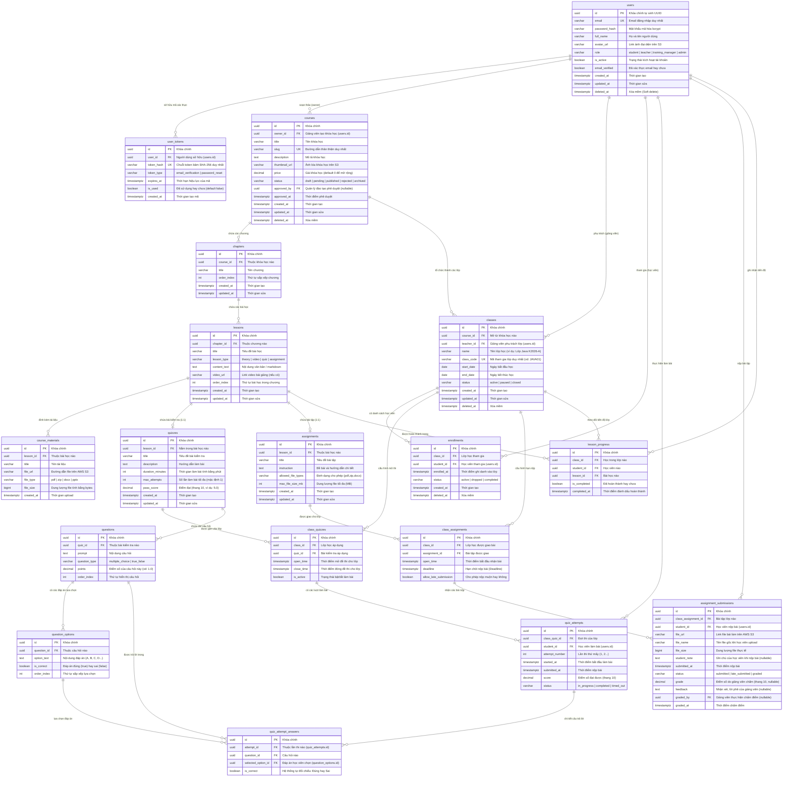

# 🗃️ Sơ Đồ Thực Thể Quan Hệ (Entity Relationship Diagram - ERD)

> **Hệ thống:** EduVerse (LMS)  
> **Cơ sở dữ liệu:** PostgreSQL 16+  
> **Quy chuẩn:** Chuẩn 3NF (Third Normal Form), 100% Primary Key UUID, Single Source of Truth cho điểm số và tiến độ.

---

## 1. Sơ Đồ ERD Tổng Thể Hệ Thống

---

## 2. Phân Tích Các Ràng Buộc Khóa Chính & Khóa Duy Nhất (Key Constraints)

| Bảng | Tên Constraint / Index | Cột ràng buộc & Điều kiện | Mục đích nghiệp vụ |
|---|---|---|---|
| `users` | `uq_users_email_active` | `UNIQUE(email) WHERE deleted_at IS NULL` | Email duy nhất cho user đang hoạt động (không xung đột khi xóa mềm) |
| `user_tokens` | `uq_user_tokens_hash` | `UNIQUE(token_hash)` | Mỗi token kích hoạt/reset mật khẩu là duy nhất |
| `courses` | `uq_courses_slug_active` | `UNIQUE(slug) WHERE deleted_at IS NULL` | Đường dẫn URL duy nhất cho khóa học đang tồn tại |
| `quizzes` | `uq_quizzes_lesson` | `UNIQUE(lesson_id)` | Mỗi bài học dạng quiz chỉ chứa duy nhất 1 đề thi trắc nghiệm (1:1) |
| `assignments` | `uq_assignments_lesson` | `UNIQUE(lesson_id)` | Mỗi bài học dạng assignment chỉ chứa duy nhất 1 bài tập (1:1) |
| `classes` | `uq_classes_code_active` | `UNIQUE(class_code) WHERE deleted_at IS NULL` | Mã tham gia lớp học là duy nhất toàn hệ thống |
| `enrollments` | `uq_enrollments_active` | `UNIQUE(class_id, student_id) WHERE deleted_at IS NULL` | Học viên không ghi danh trùng vào 1 lớp (cho phép ghi danh lại nếu từng hủy) |
| `class_quizzes` | `uq_class_quizzes_class_quiz` | `UNIQUE(class_id, quiz_id)` | Mỗi bài kiểm tra chỉ cấu hình lịch thi 1 lần cho 1 lớp |
| `class_assignments`| `uq_class_assignments_class_asg`| `UNIQUE(class_id, assignment_id)` | Mỗi bài tập chỉ gán deadline 1 lần cho 1 lớp |
| `quiz_attempts` | `uq_quiz_attempts_unique` | `UNIQUE(class_quiz_id, student_id, attempt_number)` | Đảm bảo tính toàn vẹn số lần thi của học viên |
| `quiz_attempt_answers`| `uq_attempt_answers_unique`| `UNIQUE(attempt_id, question_id)` | Chống trùng lặp câu trả lời cho cùng 1 câu hỏi trong 1 lần thi |
| `assignment_submissions`| `uq_assignment_submissions` | `UNIQUE(class_assignment_id, student_id)` | Mỗi học viên có 1 bản nộp chính thức cho mỗi bài tập |
| `lesson_progress` | `uq_lesson_progress_unique` | `UNIQUE(class_id, student_id, lesson_id)` | Mỗi bài học chỉ có 1 trạng thái hoàn thành duy nhất cho học viên trong lớp |

