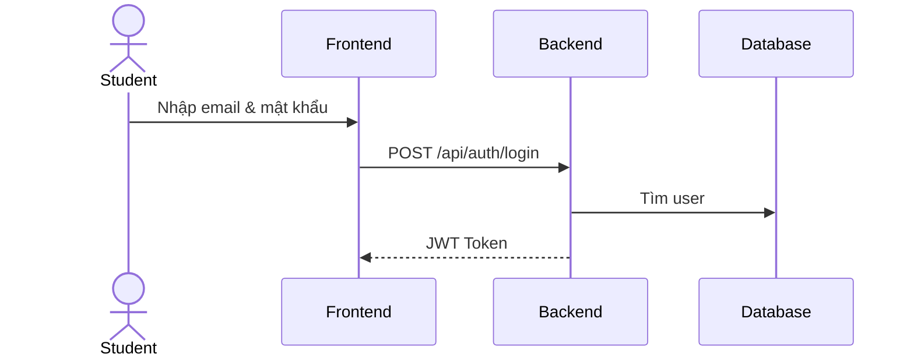
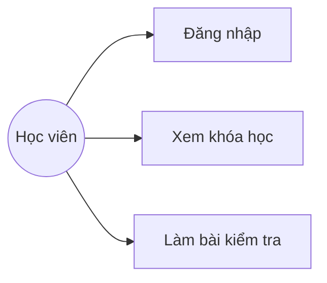

# 📁 EduVerse — Cấu trúc Thư mục & Quy ước Tài liệu

> **Phương pháp:** Docs-as-Code  
> **Format:** Markdown (.md) + Mermaid diagrams  
> **Version Control:** Git (cùng repo với code)

---

## 1. Cấu trúc Thư mục Tổng thể

```
eduverse/
│
├── 📄 README.md                     # Giới thiệu dự án, hướng dẫn cài đặt
├── 📄 .gitignore
├── 📄 docker-compose.yml
├── 📄 .env.example                  # Mẫu biến môi trường
│
├── 📂 docs/                         # ⭐ TOÀN BỘ TÀI LIỆU NẰM Ở ĐÂY
│   ├── 📄 README.md                 # Mục lục tài liệu (index)
│   │
│   ├── 📂 requirements/             # Phân tích yêu cầu
│   │   ├── 📄 srs.md                # Đặc tả yêu cầu phần mềm (SRS)
│   │   ├── 📄 business-rules.md     # Quy tắc nghiệp vụ
│   │   └── 📄 glossary.md           # Thuật ngữ nghiệp vụ
│   │
│   ├── 📂 use-cases/                # Phân tích use case
│   │   ├── 📄 use-case-diagram.md   # Sơ đồ use case (Mermaid)
│   │   ├── 📄 uc-auth.md            # UC: Xác thực (đăng ký, đăng nhập...)
│   │   ├── 📄 uc-course.md          # UC: Quản lý khóa học
│   │   ├── 📄 uc-class.md           # UC: Quản lý lớp học
│   │   ├── 📄 uc-lesson.md          # UC: Quản lý bài học
│   │   ├── 📄 uc-quiz.md            # UC: Bài kiểm tra
│   │   ├── 📄 uc-assignment.md      # UC: Bài tập
│   │   ├── 📄 uc-grade.md           # UC: Điểm số & phản hồi
│   │   ├── 📄 uc-progress.md        # UC: Tiến độ học tập
│   │   └── 📄 uc-user.md            # UC: Quản lý người dùng
│   │
│   ├── 📂 architecture/             # Thiết kế kiến trúc
│   │   ├── 📄 system-architecture.md    # Kiến trúc tổng thể
│   │   ├── 📄 tech-stack.md             # Tech stack & lý do chọn
│   │   ├── 📄 deployment.md             # Chiến lược deploy (Docker)
│   │   └── 📄 security.md              # Xác thực, phân quyền, bảo mật
│   │
│   ├── 📂 database/                 # Thiết kế cơ sở dữ liệu
│   │   ├── 📄 erd.md                # ERD diagram (Mermaid)
│   │   ├── 📄 schema.md             # Chi tiết từng bảng, cột, constraint
│   │   └── 📄 seed-data.md          # Dữ liệu mẫu ban đầu
│   │
│   ├── 📂 api/                      # Thiết kế API
│   │   ├── 📄 api-overview.md       # Tổng quan API, conventions
│   │   ├── 📄 api-auth.md           # API: Xác thực
│   │   ├── 📄 api-users.md          # API: Người dùng
│   │   ├── 📄 api-courses.md        # API: Khóa học
│   │   ├── 📄 api-classes.md        # API: Lớp học
│   │   ├── 📄 api-lessons.md        # API: Bài học
│   │   ├── 📄 api-quizzes.md        # API: Bài kiểm tra
│   │   ├── 📄 api-assignments.md    # API: Bài tập
│   │   └── 📄 api-upload.md         # API: Upload file
│   │
│   ├── 📂 ui/                       # Thiết kế giao diện
│   │   ├── 📄 sitemap.md            # Cấu trúc trang & navigation
│   │   ├── 📄 wireframes.md         # Wireframes các trang chính
│   │   └── 📂 mockups/              # File hình ảnh mockup (nếu có)
│   │       └── 📄 .gitkeep
│   │
│   ├── 📂 sequences/                # Sequence diagrams
│   │   ├── 📄 seq-login.md          # Luồng đăng nhập
│   │   ├── 📄 seq-enroll.md         # Luồng ghi danh lớp học
│   │   ├── 📄 seq-quiz.md           # Luồng làm bài kiểm tra
│   │   └── 📄 seq-submit.md         # Luồng nộp bài tập
│   │
│   └── 📂 project/                  # Quản lý dự án
│       ├── 📄 project-plan.md       # Kế hoạch & phân công sprint
│       ├── 📄 git-workflow.md       # Quy ước Git (branch, commit, PR)
│       ├── 📄 coding-conventions.md # Quy ước code
│       └── 📂 meeting-notes/        # Biên bản họp nhóm
│           └── 📄 2026-09-21.md     # Biên bản theo ngày
│
├── 📂 backend/                      # NestJS backend (code)
│   └── ...
│
├── 📂 frontend/                     # React frontend (code)
│   └── ...
│
└── 📂 assets/                       # Tài nguyên dùng chung
    ├── 📂 images/                   # Logo, banner, hình ảnh
    └── 📂 diagrams/                 # Diagram xuất hình (PNG/SVG backup)
```

---

## 2. Quy ước Đặt tên File

| Quy tắc | Ví dụ | Giải thích |
|---|---|---|
| Viết thường, dùng dấu gạch ngang | `api-courses.md` | Chuẩn URL-friendly |
| Tiền tố theo loại | `uc-auth.md`, `api-auth.md`, `seq-login.md` | Dễ nhận biết loại tài liệu |
| Biên bản họp theo ngày | `2026-09-21.md` | Dễ sắp xếp theo thời gian |
| Không dùng tiếng Việt có dấu | ❌ `đặc-tả.md` → ✅ `srs.md` | Tránh lỗi encoding trên các OS khác nhau |
| Không dùng khoảng trắng | ❌ `api courses.md` → ✅ `api-courses.md` | Tương thích terminal & URL |

### Tiền tố theo loại tài liệu:

| Tiền tố | Loại | Ví dụ |
|---|---|---|
| `uc-` | Use Case | `uc-auth.md`, `uc-quiz.md` |
| `api-` | API Specification | `api-courses.md`, `api-auth.md` |
| `seq-` | Sequence Diagram | `seq-login.md`, `seq-enroll.md` |
| (không tiền tố) | Tài liệu chung | `erd.md`, `srs.md`, `sitemap.md` |

---

## 3. Format Tài liệu

### Tất cả tài liệu viết bằng Markdown (.md)

**Tại sao Markdown?**
- ✅ Git diff được (thấy rõ ai sửa gì)
- ✅ GitHub/GitLab render trực tiếp, đẹp
- ✅ Không cần tool đặc biệt để đọc/sửa
- ✅ Hỗ trợ Mermaid diagram (GitHub render native)

### Diagram dùng Mermaid (nhúng trong Markdown)

Thay vì dùng draw.io, Figma, hay Visio rồi export hình — ta viết diagram bằng code Mermaid ngay trong file `.md`. GitHub sẽ tự render thành hình.

**Ví dụ ERD:**
````markdown
```mermaid
erDiagram
    USER ||--o{ ENROLLMENT : "ghi danh"
    COURSE ||--o{ CLASS : "tổ chức"
```
````

**Ví dụ Sequence Diagram:**
````markdown

````

**Ví dụ Use Case Diagram:**
````markdown

````

> [!TIP]
> **Backup hình ảnh:** Nếu cần hình PNG/SVG (cho báo cáo Word), export từ [mermaid.live](https://mermaid.live) và lưu vào `assets/diagrams/`.

---

## 4. Template Mẫu cho Tài liệu

### 4.1. Template Use Case Specification (`uc-*.md`)

```markdown
# UC-001: Đăng nhập hệ thống

## Thông tin chung
| Mục | Chi tiết |
|---|---|
| **Mã UC** | UC-001 |
| **Tên** | Đăng nhập hệ thống |
| **Tác nhân** | Khách chưa đăng nhập |
| **Mô tả** | Người dùng đăng nhập để truy cập hệ thống |
| **Điều kiện trước** | Đã có tài khoản |
| **Điều kiện sau** | Nhận được JWT token, chuyển đến trang chính |

## Luồng chính (Main Flow)
1. Người dùng truy cập trang đăng nhập
2. Nhập email và mật khẩu
3. Nhấn nút "Đăng nhập"
4. Hệ thống xác thực thông tin
5. Hệ thống trả về JWT token
6. Chuyển hướng đến dashboard

## Luồng phụ (Alternative Flows)
- **3a.** Nhấn "Quên mật khẩu" → Chuyển đến UC-003
- **4a.** Email chưa xác thực → Hiển thị thông báo cần xác thực

## Luồng ngoại lệ (Exception Flows)
- **4b.** Sai email hoặc mật khẩu → Hiển thị lỗi "Thông tin không chính xác"
- **4c.** Tài khoản bị khóa → Hiển thị "Tài khoản đã bị khóa"
```

### 4.2. Template API Specification (`api-*.md`)

```markdown
# API: Xác thực (Authentication)

Base URL: `/api/auth`

## POST /api/auth/login

Đăng nhập và nhận JWT token.

**Request Body:**
| Field | Type | Required | Mô tả |
|---|---|---|---|
| email | string | ✅ | Email đã đăng ký |
| password | string | ✅ | Mật khẩu |

**Response 200:**
```json
{
  "accessToken": "eyJhbG...",
  "refreshToken": "eyJhbG...",
  "user": {
    "id": "uuid",
    "email": "user@example.com",
    "fullName": "Nguyễn Văn A",
    "role": "student"
  }
}
```

**Response 401:**
```json
{
  "statusCode": 401,
  "message": "Email hoặc mật khẩu không chính xác"
}
```
```

### 4.3. Template Biên bản họp (`meeting-notes/YYYY-MM-DD.md`)

```markdown
# Biên bản họp nhóm — 2026-09-21

| Mục | Chi tiết |
|---|---|
| **Ngày** | 21/09/2026 |
| **Thời gian** | 14:00 – 15:30 |
| **Tham dự** | Thành viên A ✅, B ✅, C ✅, D ❌ (vắng) |

## Nội dung thảo luận
- Thống nhất tech stack
- Phân chia module

## Quyết định
- Dùng NestJS + React
- Sprint 1 bắt đầu từ 28/09

## Công việc giao
| Thành viên | Công việc | Deadline |
|---|---|---|
| A | Thiết kế ERD | 25/09 |
| B | Viết Use Case auth | 25/09 |

## Buổi họp tiếp theo
- **Ngày:** 28/09/2026
- **Mục tiêu:** Review ERD, bắt đầu Sprint 1
```

---

## 5. Workflow Git cho Tài liệu


### Quy ước Branch cho tài liệu:

| Loại | Format | Ví dụ |
|---|---|---|
| Tài liệu mới | `docs/<tên-tài-liệu>` | `docs/erd`, `docs/use-cases` |
| Cập nhật tài liệu | `docs/update-<tên>` | `docs/update-erd` |
| Code feature | `feature/<tên>` | `feature/auth`, `feature/quiz` |
| Fix bug | `fix/<tên>` | `fix/login-validation` |

### Quy ước Commit Message:

| Prefix | Dùng khi | Ví dụ |
|---|---|---|
| `docs:` | Thêm/sửa tài liệu | `docs: add ERD v1` |
| `feat:` | Thêm tính năng code | `feat: implement login API` |
| `fix:` | Sửa bug | `fix: validate email format` |
| `refactor:` | Tái cấu trúc code | `refactor: extract auth guard` |
| `chore:` | Config, tooling | `chore: add docker-compose` |

---

## 6. Tóm tắt Quy ước

> [!IMPORTANT]
> **5 quy tắc vàng cho tài liệu EduVerse:**

1. **Mọi tài liệu nằm trong `docs/`** — không lưu ở nơi khác
2. **Viết bằng Markdown** — không dùng Word/Google Docs cho tài liệu kỹ thuật
3. **Diagram bằng Mermaid** — nhúng trong Markdown, GitHub render tự động
4. **Đặt tên file: lowercase + dấu gạch ngang** — `api-courses.md`, không `API Courses.md`
5. **Mỗi thay đổi tài liệu = 1 PR** — review như code, có lịch sử rõ ràng
