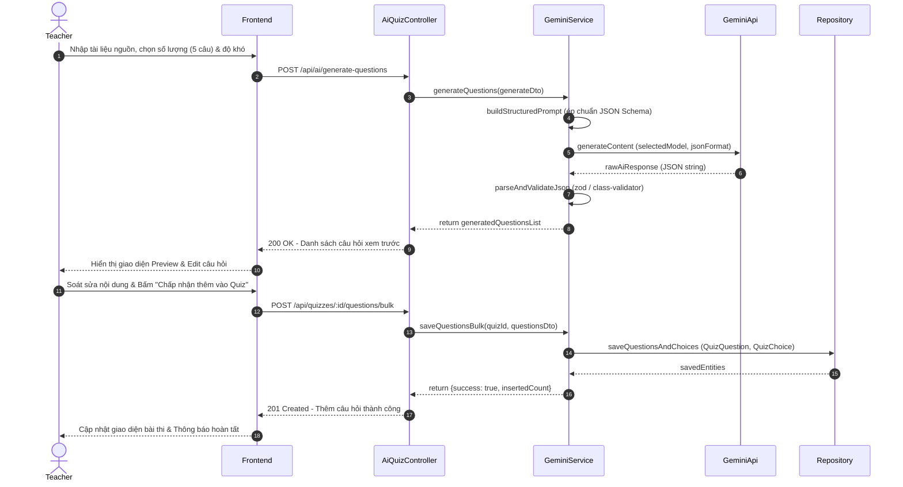
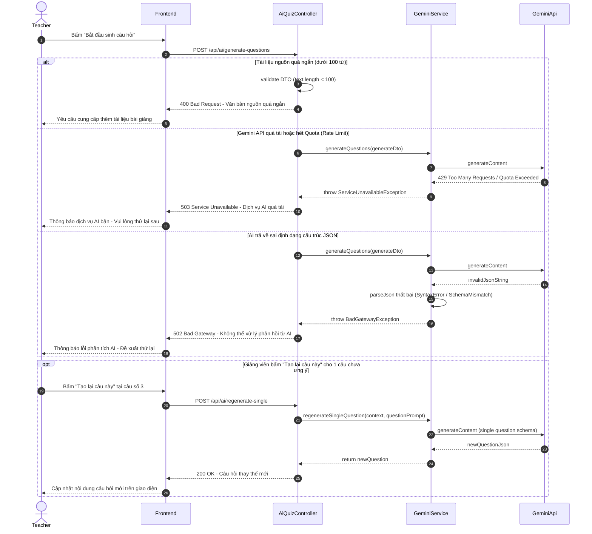

# 🔄 SEQ-AI-001: Giảng viên sinh câu hỏi trắc nghiệm bằng Gemini AI

> **Use Case liên quan:** [UC-AI-001](../use-cases/actor-teacher.md#uc-ai-001)  
> **Actor chính:** Giảng viên (Teacher)  
> **Tóm tắt luồng:** Giảng viên cung cấp đoạn văn bản bài giảng hoặc tài liệu, cấu hình số lượng và độ khó câu hỏi. Hệ thống gửi Structured Prompt tới Google Gemini API để tự động sinh câu hỏi theo chuẩn JSON. Giảng viên xem trước, chỉnh sửa trên giao diện và lưu chính thức vào ngân hàng câu hỏi của đề thi.

---

## 1. Sơ Đồ Tuần Tự (Sequence Diagram)

### 1.1. Luồng Thành Công — Sinh câu hỏi & Lưu vào Quiz (Happy Path)

### 1.2. Luồng Ngoại Lệ & Tạo Lại Câu Hỏi Đơn (Error Paths & Regenerate Single)

---

## 2. Bảng Mô Tả Chi Tiết Các Bước

### 2.1. Luồng Sinh câu hỏi & Lưu vào Quiz (Happy Path — tương ứng 18 bước trên sơ đồ 1.1)

| Bước | Từ | Đến | Phương thức / Thao tác | Dữ liệu gửi | Dữ liệu nhận | Mô tả nghiệp vụ |
|:---:|---|---|---|---|---|---|
| 1 | Teacher | Frontend | Thiết lập Prompt | `{contextText, count: 5, difficulty: 'MEDIUM'}` | — | Giảng viên dán văn bản bài giảng, chọn số lượng và độ khó |
| 2 | Frontend | AiQuizController | `POST /api/ai/generate-questions` | `GenerateQuestionsDto` | — | Gửi yêu cầu sinh câu hỏi lên backend |
| 3 | AiQuizController | GeminiService | `geminiService.generateQuestions()` | `GenerateQuestionsDto` | — | Controller kiểm tra quyền Giảng viên và gọi AI Service |
| 4 | GeminiService | GeminiService | `buildStructuredPrompt()` | — | `systemPrompt + userPrompt` | Thiết lập prompt chỉ định Gemini trả về định dạng JSON thuần |
| 5 | GeminiService | GeminiApi | `model.generateContent()` | `prompt, responseSchema: JSON` | — | Gọi SDK Google Gen AI gửi request sang máy chủ Gemini |
| 6 | GeminiApi | GeminiService | Trả kết quả | — | `rawAiResponse` | Gemini trả về chuỗi JSON chứa danh sách câu hỏi và đáp án |
| 7 | GeminiService | GeminiService | `parseAndValidateJson()` | `rawAiResponse` | `validatedQuestions` | Parse chuỗi JSON và kiểm tra schema hợp lệ bằng Zod |
| 8 | GeminiService | AiQuizController | Return | — | `questionsList` | Trả về danh sách câu hỏi đã được làm sạch |
| 9 | AiQuizController | Frontend | `HTTP 200 OK` | — | `{questions: [...]}` | Phản hồi danh sách câu hỏi AI sinh về cho Frontend |
| 10 | Frontend | Teacher | Render Preview | — | — | Hiển thị màn hình cho Giảng viên duyệt và chỉnh sửa từng câu |
| 11 | Teacher | Frontend | Duyệt & Bấm lưu | `{quizId, approvedQuestions}` | — | Giảng viên sửa đổi nếu cần và nhấn "Chấp nhận thêm vào Quiz" |
| 12 | Frontend | AiQuizController | `POST /api/quizzes/:id/questions/bulk` | `SaveQuestionsBulkDto` | — | Gửi danh sách các câu hỏi đã được phê duyệt để lưu |
| 13 | AiQuizController | GeminiService | `geminiService.saveQuestionsBulk()` | `(quizId, questionsDto)` | — | Chuyển tiếp dữ liệu lưu trữ sang tầng Service |
| 14 | GeminiService | QuestionRepository | `repo.saveQuestionsAndChoices()` | `[QuizQuestion, QuizChoice]` | — | Thực hiện bulk insert câu hỏi và các lựa chọn vào Database |
| 15 | QuestionRepository | GeminiService | Trả kết quả | — | `savedEntities` | Xác nhận đã lưu các bản ghi thành công |
| 16 | GeminiService | AiQuizController | Return | — | `{success: true, insertedCount}` | Báo cáo số lượng câu hỏi đã thêm vào bài kiểm tra |
| 17 | AiQuizController | Frontend | `HTTP 201 Created` | — | `{success: true, insertedCount}` | Phản hồi kết quả lưu thành công về trình duyệt |
| 18 | Frontend | Teacher | Toast thông báo | — | — | Hiển thị thông báo thành công và cập nhật ngân hàng đề thi |

---

## 3. Ghi Chú Kỹ Thuật & Nghiệp Vụ Quan Trọng

- **Bảo mật & Quản lý API Key:**
  - **Bảo vệ Secret:** `GEMINI_API_KEY` chỉ được lưu trữ trong biến môi trường server (`.env`), **tuyệt đối không gửi key về phía client**.
  - **Prompt Injection Defense:** Làm sạch đoạn văn bản đầu vào (`contextText`), giới hạn tối đa **10,000 ký tự** mỗi lần gửi để tránh tấn công làm tràn context window hoặc thao túng prompt hệ thống.
  - **Rate Limiting AI:** Giới hạn mỗi giảng viên được gọi API sinh câu hỏi tối đa **10 lần/giờ** để kiểm soát chi phí API và chống lạm dụng.

- **Hiệu năng & Độ tin cậy:**
  - **Cơ chế Model linh hoạt (Dynamic Model Selection):**
    - Tên model **không hardcode**, được đọc động qua `ConfigService` (`GEMINI_MODEL`, mặc định `gemini-1.5-flash`).
    - Hỗ trợ Giảng viên chọn chế độ qua DTO (`modelTier: 'FAST' | 'PRO'`): Dùng bản **Flash** cho trắc nghiệm nhanh thông thường, hoặc bản **Pro** cho các đề thi chuyên sâu cần suy luận logic nhiều bước.
  - **Structured Outputs (JSON Mode):** Sử dụng tính năng `responseSchema` của Gemini API để ép buộc AI trả về đúng chuẩn JSON, giảm thiểu tỷ lệ lỗi phân tích chuỗi (Parse error) xuống dưới 1%.
  - **Fallback / Retry Policy:** Áp dụng cơ chế Exponential Backoff retry tối đa 2 lần với các lỗi mạng tạm thời hoặc mã HTTP 429/503 từ Google API.

- **Phụ thuộc kỹ thuật (Dependencies):**
  - Backend: `@google/genai` (hoặc `@google/generative-ai`), `zod` để validate schema JSON từ AI.
  - Database: Bảng `quizzes`, bảng `quiz_questions` (`id`, `quiz_id`, `content`, `explanation`, `points`), bảng `quiz_choices` (`id`, `question_id`, `content`, `is_correct`).
