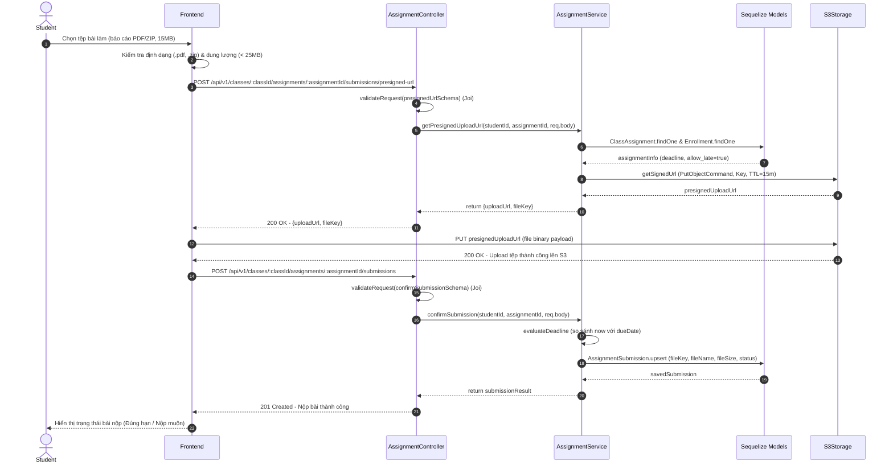
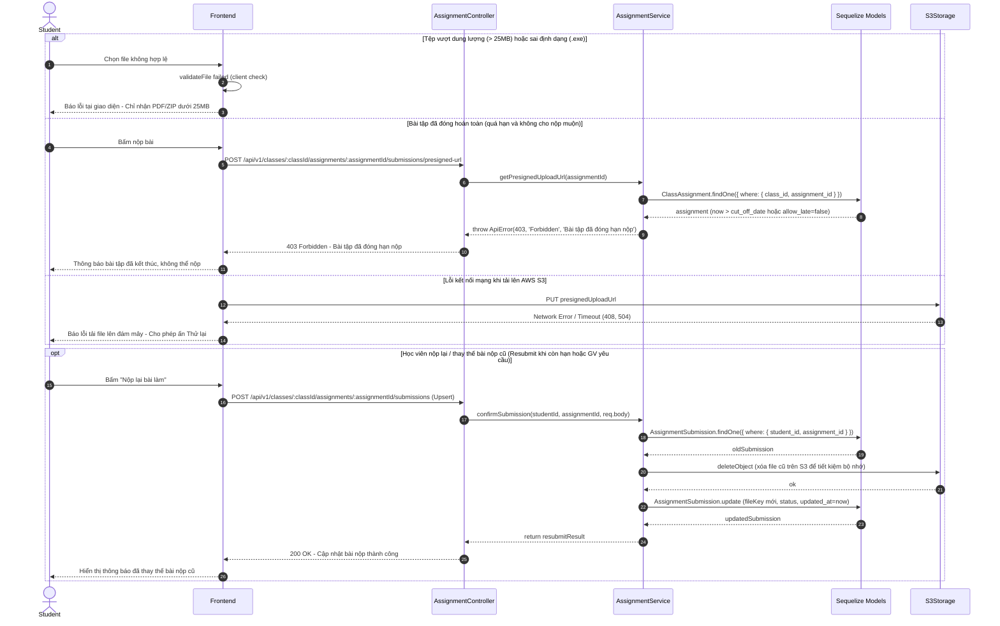

# 🔄 SEQ-ASSIGN-001: Học viên nộp bài tập (Upload file AWS S3)

> **Use Case liên quan:** [UC-ASSIGN-001](../use-cases/actor-student.md#uc-assign-001)  
> **Actor chính:** Học viên (Student)  
> **Tóm tắt luồng:** Học viên chọn tệp bài làm (PDF, ZIP), hệ thống sử dụng cơ chế **S3 Presigned URL** để học viên tải tệp trực tiếp lên cloud storage an toàn mà không làm nghẽn băng thông backend server. Sau khi upload thành công, hệ thống ghi nhận bản ghi nộp bài, đối chiếu với hạn nộp (Deadline) để phân loại trạng thái `submitted` (Đúng hạn) hoặc `late_submitted` (Nộp muộn).

---

## 1. Sơ Đồ Tuần Tự (Sequence Diagram)

### 1.1. Luồng Thành Công — Nộp bài qua Presigned URL S3 (Happy Path)

### 1.2. Luồng Ngoại Lệ & Nộp Lại File (Error Paths & Resubmission)

---

## 2. Bảng Mô Tả Chi Tiết Các Bước

### 2.1. Luồng Nộp bài qua Presigned URL S3 (Happy Path — tương ứng 20 bước trên sơ đồ 1.1)

| Bước | Từ | Đến | Phương thức / Thao tác | Dữ liệu gửi | Dữ liệu nhận | Mô tả nghiệp vụ |
|:---:|---|---|---|---|---|---|
| 1 | Student | Frontend | Chọn tệp | `{fileName: "report.pdf", size: 15MB}` | — | Học viên kéo thả hoặc chọn tệp bài làm từ máy tính |
| 2 | Frontend | Frontend | Client Validation | — | `boolean (valid)` | Kiểm tra dung lượng (< 25MB) và phần mở rộng (.pdf, .zip, .docx) |
| 3 | Frontend | AssignmentController | `POST /api/v1/classes/:classId/assignments/:assignmentId/submissions/presigned-url` | `req.body` | — | Gửi metadata của tệp để xin đường dẫn upload trực tiếp |
| 4 | AssignmentController | AssignmentService | `svc.getPresignedUploadUrl()` | `(studentId, assignmentId, req.body)` | — | Chuyển tiếp sau khi qua `auth.middleware.js` & `validateRequest(Joi)` |
| 5 | AssignmentService | Sequelize Models | `ClassAssignment & Enrollment` | `assignmentId, studentId` | — | Kiểm tra học viên có thuộc lớp và bài tập có đang mở không |
| 6 | Sequelize Models | AssignmentService | Trả kết quả | — | `assignmentInfo` | Trả về thông tin hạn nộp (`due_date`) và chính sách nộp muộn |
| 7 | AssignmentService | S3Storage | `s3Client.send(PutObjectCommand)` | `{Bucket, Key: uuid_filename, TTL: 900s}` | — | Yêu cầu AWS S3 sinh Presigned URL với chữ ký bảo mật |
| 8 | S3Storage | AssignmentService | Trả kết quả | — | `presignedUploadUrl` | S3 trả về URL có chữ ký tạm thời hiệu lực trong 15 phút |
| 9 | AssignmentService | AssignmentController | Return | — | `{uploadUrl, fileKey}` | Trả về Presigned URL và định danh file (Key) trên S3 |
| 10 | AssignmentController | Frontend | `HTTP 200 OK` | — | `{uploadUrl, fileKey}` | Phản hồi thông tin upload về cho Frontend |
| 11 | Frontend | S3Storage | `PUT presignedUploadUrl` | `file (binary stream)` | — | Trình duyệt tải trực tiếp tệp lên AWS S3 qua URL có chữ ký |
| 12 | S3Storage | Frontend | Trả kết quả | — | `HTTP 200 OK` | AWS S3 xác nhận tệp đã được lưu trữ thành công |
| 13 | Frontend | AssignmentController | `POST /api/v1/classes/:classId/assignments/:assignmentId/submissions` | `req.body` | — | Gửi thông tin xác nhận bài nộp kèm `fileKey` (Hỗ trợ nộp mới & nộp lại) |
| 14 | AssignmentController | AssignmentService | `svc.confirmSubmission()` | `(studentId, assignmentId, req.body)` | — | Validate qua Joi và chuyển tiếp dữ liệu xác nhận nộp bài sang Service |
| 15 | AssignmentService | AssignmentService | `evaluateDeadline()` | `now, assignment.due_date` | `status` | So sánh thời điểm nộp với Deadline (`submitted` hoặc `late_submitted`) |
| 16 | AssignmentService | AssignmentSubmission Model | `AssignmentSubmission.upsert()` | `{assignment_id, user_id, file_key, status}` | — | Lưu thông tin bản ghi nộp bài vào PostgreSQL |
| 17 | AssignmentSubmission Model | AssignmentService | Trả kết quả | — | `savedSubmission` | Xác nhận lưu bài nộp thành công vào DB |
| 18 | AssignmentService | AssignmentController | Return | — | `submissionResult` | Trả về kết quả bài nộp cho Controller |
| 19 | AssignmentController | Frontend | `HTTP 201 Created` | — | `{id, status, submittedAt, fileName}` | Phản hồi thông tin xác nhận nộp bài về cho Frontend |
| 20 | Frontend | Student | Render UI | — | — | Cập nhật giao diện: hiển thị trạng thái "Đã nộp", mốc thời gian và tên tệp |

---

## 3. Ghi Chú Kỹ Thuật & Nghiệp Vụ Quan Trọng

- **Bảo mật Cloud Storage & Presigned URL:**
  - **Không lưu S3 Credentials ở Client:** `AWS_ACCESS_KEY_ID` và `AWS_SECRET_ACCESS_KEY` chỉ nằm tại biến môi trường backend server (`.env`).
  - **Presigned URL TTL ngắn:** Đường dẫn upload chỉ có hiệu lực trong **15 phút (900 giây)**. Sau thời gian này, URL tự động bị vô hiệu hóa.
  - **S3 Bucket Private:** Toàn bộ bucket lưu trữ bài tập đều được thiết lập quyền `Block Public Access`. Khi giảng viên tải bài nộp về chấm, hệ thống cũng sinh Presigned Get URL tạm thời để xem.
  - **Sanitize File Key:** Tên file lưu trên S3 được sinh dưới dạng: `assignments/{assignmentId}/{studentId}/{uuid}_{sanitizedOriginalName}` để tránh trùng lặp và bảo vệ cấu trúc thư mục.

- **Hiệu năng & Tối ưu Băng thông (Offloading):**
  - **Bỏ qua tải trọng máy chủ API (Server Bypass):** Bằng cách dùng Presigned URL, luồng truyền tải dữ liệu nặng (15MB - 50MB) đi thẳng từ trình duyệt học viên đến máy chủ AWS S3, giúp máy chủ Express.js không bị chiếm dụng RAM và CPU.
  - **Tối ưu chi phí lưu trữ:** Khi học viên nộp lại bài (`Resubmit`), hệ thống tự động xóa object cũ trên S3 để tránh lãng phí dung lượng lưu trữ đám mây.

- **Phụ thuộc kỹ thuật (Dependencies):**
  - Backend: `express`, `@aws-sdk/client-s3`, `@aws-sdk/s3-request-presigner`, `sequelize`, `joi`.
  - Database: Bảng `assignments` (`id`, `course_id`, `title`), bảng `class_assignments` (`id`, `class_id`, `assignment_id`, `due_date`, `cut_off_date`, `allow_late`), bảng `assignment_submissions` (`id`, `assignment_id`, `user_id`, `file_key`, `file_name`, `file_size`, `status: submitted | late_submitted`, `submitted_at`).
