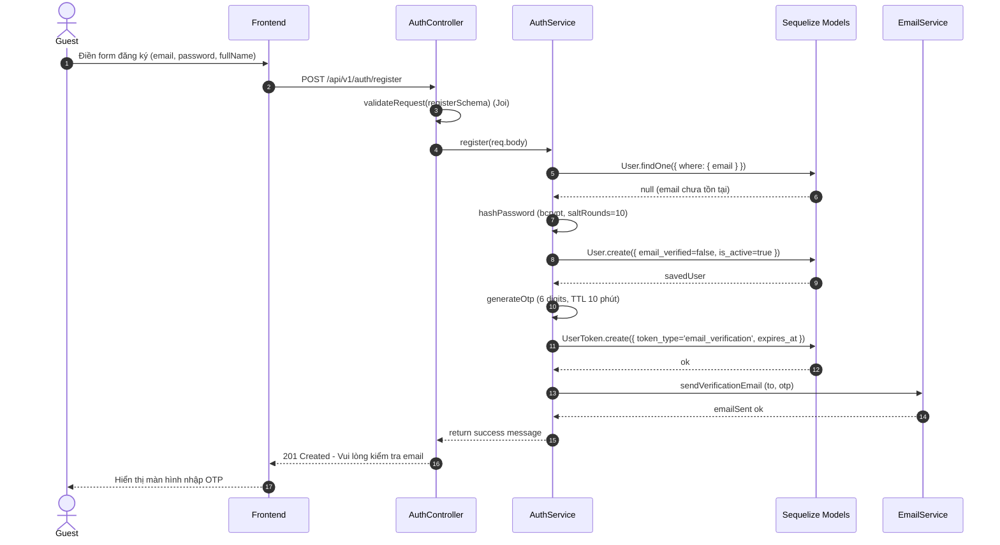
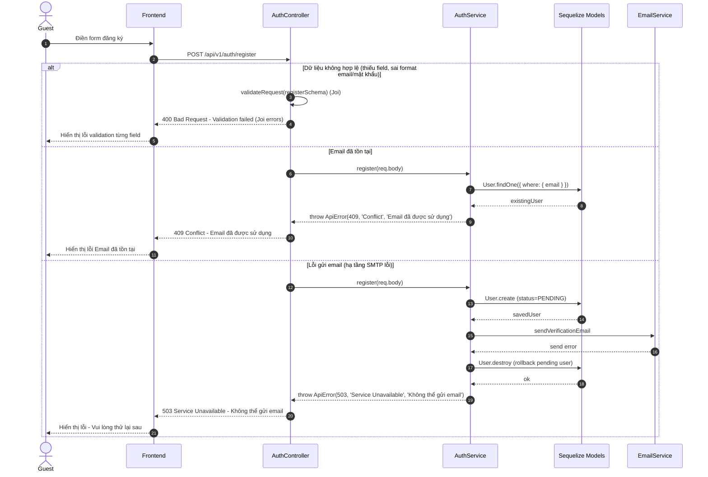
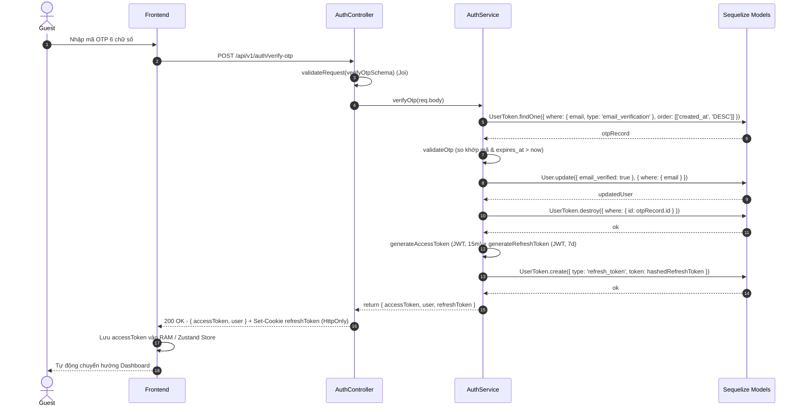
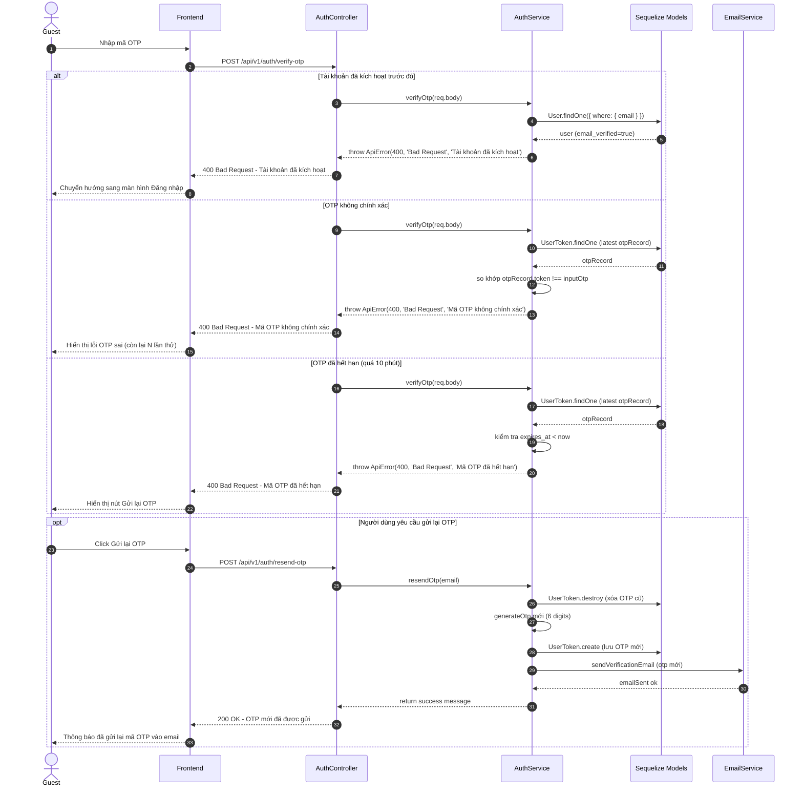

# 🔄 SEQ-AUTH-001: Đăng ký tài khoản & Xác thực Email OTP

> **Use Case liên quan:** [UC-AUTH-001](../use-cases/actor-student.md#uc-auth-001), [UC-AUTH-004](../use-cases/actor-student.md#uc-auth-004)  
> **Actor chính:** Khách chưa đăng nhập (Guest)  
> **Tóm tắt luồng:** Người dùng điền form đăng ký, hệ thống tạo tài khoản trạng thái `PENDING`, gửi email chứa mã OTP 6 chữ số. Người dùng nhập OTP để kích hoạt tài khoản và nhận JWT token để tự động đăng nhập.

---

## 1. Sơ Đồ Tuần Tự (Sequence Diagram)

### 1.1. Luồng Thành Công — Đăng Ký (Happy Path)

### 1.2. Luồng Ngoại Lệ — Đăng Ký (Error Paths)

### 1.3. Luồng Thành Công — Xác Thực OTP (Happy Path)

### 1.4. Luồng Ngoại Lệ — Xác Thực OTP (Error Paths)

---

## 2. Bảng Mô Tả Chi Tiết Các Bước

### 2.1. Luồng Đăng Ký (Happy Path — tương ứng 16 bước trên sơ đồ 1.1)

| Bước | Từ | Đến | Phương thức / Thao tác | Dữ liệu gửi | Dữ liệu nhận | Mô tả nghiệp vụ |
|:---:|---|---|---|---|---|---|
| 1 | Guest | Frontend | Nhập form | `{email, password, fullName}` | — | Người dùng điền form thông tin đăng ký |
| 2 | Frontend | AuthController | `POST /api/v1/auth/register` | `req.body` | — | Gửi request đăng ký lên backend API qua Axios |
| 3 | AuthController | AuthService | `authService.register(req.body)` | `req.body` | — | Chuyển tiếp payload sau khi qua `validateRequest(registerSchema)` (Joi) |
| 4 | AuthService | User Model | `User.findOne({ where: { email } })` | `{email}` | `User \| null` | Kiểm tra xem email đã được sử dụng chưa |
| 5 | User Model | AuthService | Trả kết quả | — | `null` | Xác nhận email chưa tồn tại trong hệ thống |
| 6 | AuthService | AuthService | `bcrypt.hash(password, 10)` | `plainPassword` | `hashedPassword` | Băm mật khẩu bằng bcrypt (saltRounds = 10) |
| 7 | AuthService | User Model | `User.create({ email, password_hash, full_name, email_verified: false })` | User object | — | Lưu người dùng mới ở trạng thái chờ xác thực email |
| 8 | User Model | AuthService | Trả kết quả | — | `savedUser` | Xác nhận đã tạo user thành công trong PostgreSQL |
| 9 | AuthService | AuthService | `generateOtp()` | — | `otp (6 digits)` | Sinh ngẫu nhiên mã số OTP 6 chữ số (TTL 10 phút) |
| 10 | AuthService | UserToken Model | `UserToken.create({ user_id, token, type: 'email_verification', expires_at })` | Token object | — | Lưu record OTP vào bảng `user_tokens` để đối chiếu |
| 11 | UserToken Model | AuthService | Trả kết quả | — | `ok` | Xác nhận lưu record OTP thành công |
| 12 | AuthService | MailerService | `mailer.sendVerificationEmail()` | `{to: email, otp}` | — | Gửi email chứa mã OTP xác thực qua Nodemailer Gmail SMTP |
| 13 | MailerService | AuthService | Trả kết quả | — | `emailSent ok` | Dịch vụ gửi email hoàn tất thành công |
| 14 | AuthService | AuthController | Return | — | `{message}` | Trả về thông báo thành công cho Controller |
| 15 | AuthController | Frontend | `HTTP 201 Created` | — | `{message}` | Trả về response thông báo kiểm tra hòm thư |
| 16 | Frontend | Guest | Render UI | — | — | Hiển thị màn hình nhập mã xác thực OTP |

### 2.2. Luồng Xác Thực OTP (Happy Path — tương ứng 15 bước trên sơ đồ 1.3)

| Bước | Từ | Đến | Phương thức / Thao tác | Dữ liệu gửi | Dữ liệu nhận | Mô tả nghiệp vụ |
|:---:|---|---|---|---|---|---|
| 1 | Guest | Frontend | Nhập OTP | `{email, otp: "123456"}` | — | Người dùng lấy mã 6 chữ số từ email nhập vào form |
| 2 | Frontend | AuthController | `POST /api/v1/auth/verify-otp` | `req.body` | — | Gửi email kèm mã OTP lên backend |
| 3 | AuthController | AuthService | `authService.verifyOtp(req.body)` | `req.body` | — | Middleware Joi xác thực hợp lệ và chuyển tiếp sang service |
| 4 | AuthService | UserToken Model | `UserToken.findOne({ where: { email, type: 'email_verification' } })` | `{email}` | — | Truy vấn bản ghi OTP gần nhất của email này |
| 5 | UserToken Model | AuthService | Trả kết quả | — | `otpRecord` | Trả về record chứa mã OTP và thời gian hết hạn |
| 6 | AuthService | AuthService | `validateOtp()` | — | `boolean` | Kiểm tra so khớp mã OTP và `expires_at > now` |
| 7 | AuthService | User Model | `User.update({ email_verified: true }, { where: { email } })` | `{email_verified: true}` | — | Cập nhật tài khoản sang trạng thái đã kích hoạt email |
| 8 | User Model | AuthService | Trả kết quả | — | `updatedUser` | Xác nhận user đã được kích hoạt thành công |
| 9 | AuthService | UserToken Model | `UserToken.destroy({ where: { id: otpRecord.id } })` | `{id}` | — | Xóa bản ghi OTP đã dùng để tránh replay attack |
| 10 | UserToken Model | AuthService | Trả kết quả | — | `ok` | Xác nhận đã xóa OTP khỏi hệ thống |
| 11 | AuthService | AuthService | `jwt.sign({ userId, role }, accessSecret, { expiresIn: '15m' })` | `{userId, role}` | `accessToken` | Tạo JWT Access Token (15 phút) và Refresh Token (7 ngày) |
| 12 | AuthService | AuthController | Return | — | `{accessToken, refreshToken, user}` | Trả về token và thông tin cơ bản của user |
| 13 | AuthController | Frontend | `HTTP 200 OK` | Set-Cookie: refreshToken | `{accessToken, user}` | Phản hồi access token trong body JSON và cookie HttpOnly |
| 14 | Frontend | Frontend | `useAuthStore.getState().setAuth(...)` | `accessToken` | — | Lưu Access Token vào RAM (Zustand store), tránh lưu localStorage |
| 15 | Frontend | Guest | Chuyển hướng | — | — | Tự động chuyển hướng người dùng vào Dashboard |

---

## 3. Ghi Chú Kỹ Thuật & Nghiệp Vụ Quan Trọng

- **Bảo mật:**
  - Mật khẩu phải được hash bằng `bcrypt` (`bcryptjs`) với `saltRounds = 10` — **tuyệt đối không lưu plain text**.
  - OTP chỉ có hiệu lực **10 phút** kể từ thời điểm phát hành (`expires_at = now + 10min`).
  - **Chống Replay Attack:** Ngay khi xác thực OTP thành công, bản ghi OTP phải được **xóa ngay lập tức** khỏi DB (`UserToken.destroy`).
  - **Chống Brute-force OTP:** Giới hạn tối đa **5 lần thử sai** cho mỗi phiên OTP. Nếu sai quá 5 lần, hủy mã OTP hiện tại và yêu cầu gửi lại.
  - **Rate Limiting:** Áp dụng rate limit qua Redis cho endpoint `/api/v1/auth/resend-otp` — tối đa **3 lần/giờ** cho mỗi địa chỉ email.
  - **Rollback khi lỗi gửi email:** Nếu SMTP lỗi ở bước gửi mã xác thực, hệ thống phải rollback/xóa bản ghi `User` vừa tạo (`User.destroy`) để tránh tình trạng user bị kẹt không thể đăng ký lại.
  - **HTTP Status Code chuẩn:** 
    - Lỗi validation Joi hoặc OTP sai/hết hạn: `400 Bad Request`.
    - Trùng email: `409 Conflict`.
    - Lỗi gửi mail hạ tầng: `503 Service Unavailable` (không dùng `500 Internal Server Error`).

- **Hiệu năng & Khả năng mở rộng:**
  - Tác vụ gửi email thực hiện bất đồng bộ (async), tránh nghẽn luồng xử lý chính của Express server.
  - Đánh Index trên cột `email` của bảng `users` và `user_tokens`.

- **Phụ thuộc kỹ thuật (Dependencies):**
  - Backend: `express`, `nodemailer`, `jsonwebtoken`, `bcryptjs`, `joi`, `ioredis`.
  - Database: Bảng `users` (`id`, `email`, `password_hash`, `full_name`, `email_verified`, `role`), bảng `user_tokens` (`id`, `user_id`, `token`, `token_type`, `expires_at`).

