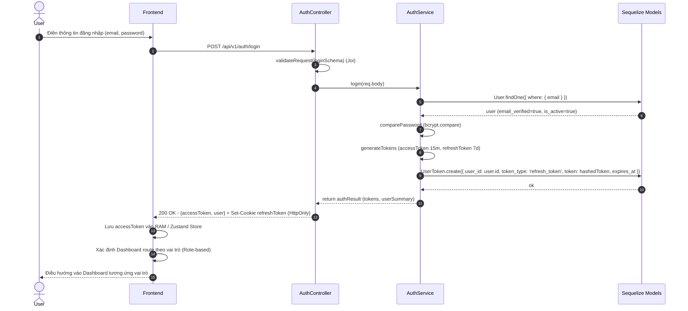
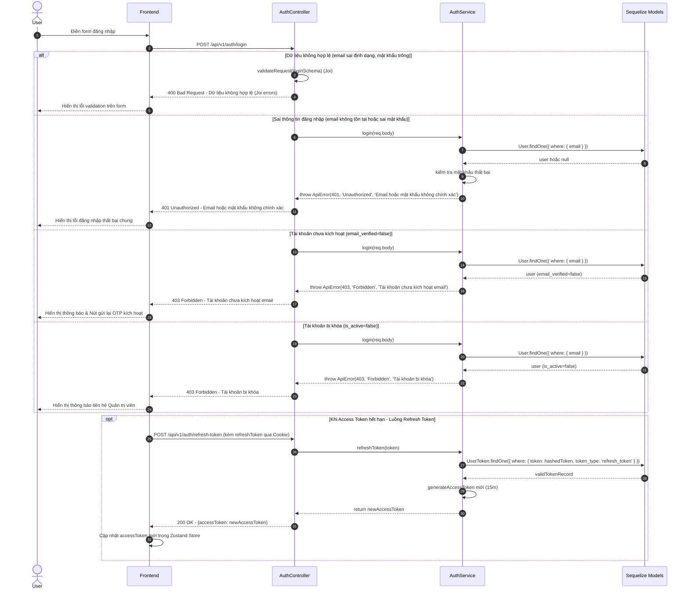

# 🔄 SEQ-AUTH-002: Đăng nhập & Cấp JWT Token

> **Use Case liên quan:** [UC-AUTH-002](../use-cases/actor-student.md#uc-auth-002)  
> **Actor chính:** Tất cả vai trò (Học viên, Giảng viên, Quản trị viên, Quản lý đào tạo)  
> **Tóm tắt luồng:** Người dùng nhập email và mật khẩu, hệ thống kiểm tra danh tính qua hash bcrypt, xác thực trạng thái tài khoản (`ACTIVE`), sinh cặp mã JWT (Access Token hạn ngắn + Refresh Token hạn dài), lưu Refresh Token và điều hướng người dùng tới Dashboard tương ứng với vai trò.

---

## 1. Sơ Đồ Tuần Tự (Sequence Diagram)

### 1.1. Luồng Thành Công — Đăng Nhập (Happy Path)

### 1.2. Luồng Ngoại Lệ & Cấp Lại Token (Error Paths & Refresh Flow)

---

## 2. Bảng Mô Tả Chi Tiết Các Bước

### 2.1. Luồng Đăng Nhập (Happy Path — tương ứng 14 bước trên sơ đồ 1.1)

| Bước | Từ | Đến | Phương thức / Thao tác | Dữ liệu gửi | Dữ liệu nhận | Mô tả nghiệp vụ |
|:---:|---|---|---|---|---|---|
| 1 | User | Frontend | Nhập form | `{email, password}` | — | Người dùng điền email và mật khẩu tại trang Login |
| 2 | Frontend | AuthController | `POST /api/v1/auth/login` | `req.body` | — | Gửi request đăng nhập lên backend API qua Axios |
| 3 | AuthController | AuthService | `authService.login(req.body)` | `req.body` | — | Chuyển tiếp payload sau khi qua `validateRequest(loginSchema)` (Joi) |
| 4 | AuthService | User Model | `User.findOne({ where: { email } })` | `{email}` | — | Tìm kiếm thông tin người dùng trong cơ sở dữ liệu theo email |
| 5 | User Model | AuthService | Trả kết quả | — | `user (is_active=true)` | Trả về thực thể user với mật khẩu băm và trạng thái hoạt động |
| 6 | AuthService | AuthService | `bcrypt.compare()` | `(plainPassword, user.password_hash)` | `boolean (true)` | So khớp mật khẩu người dùng nhập với hash đã lưu |
| 7 | AuthService | AuthService | `generateTokens()` | `{sub: user.id, role: user.role}` | `tokens` | Sinh cặp Access Token (TTL 15 phút) và Refresh Token (TTL 7 ngày) |
| 8 | AuthService | UserToken Model | `UserToken.create(...)` | `{user_id, token: hashedToken, token_type: 'refresh_token'}` | — | Băm và lưu Refresh Token vào PostgreSQL/Redis để quản lý phiên và thu hồi |
| 9 | UserToken Model | AuthService | Trả kết quả | — | `ok` | Xác nhận lưu phiên đăng nhập thành công |
| 10 | AuthService | AuthController | Return | — | `{accessToken, refreshToken, user}` | Trả về kết quả xác thực cho Controller |
| 11 | AuthController | Frontend | `HTTP 200 OK` | `Set-Cookie: refreshToken` | `{accessToken, user}` | Trả Access Token trong body JSON, đính kèm Refresh Token qua httpOnly cookie |
| 12 | Frontend | Frontend | Xử lý token | `accessToken, user.role` | — | Lưu Access Token vào RAM (Zustand Store) và đọc vai trò người dùng |
| 13 | Frontend | Frontend | Role-based routing | `user.role` | — | Xác định đường dẫn Dashboard phù hợp (`/student`, `/teacher`, `/admin`) |
| 14 | Frontend | User | Điều hướng | — | — | Chuyển hướng người dùng vào màn hình làm việc tương ứng |

---

## 3. Ghi Chú Kỹ Thuật & Nghiệp Vụ Quan Trọng

- **Bảo mật:**
  - **Thông điệp lỗi bảo mật (Information Leakage):** Khi sai thông tin đăng nhập, **chỉ trả về một câu thông báo chung**: *"Email hoặc mật khẩu không chính xác"*. Tuyệt đối không chỉ rõ email không tồn tại hay sai mật khẩu để ngăn tấn công dò quét tài khoản (User Enumeration).
  - **Cơ chế Token (JWT Dual-token):**
    - **Access Token:** Hạn ngắn (**15 phút**), mang payload `{sub: userId, email, role}`, ký bằng secret key `JWT_ACCESS_SECRET`. Lưu trữ tại RAM client (Zustand).
    - **Refresh Token:** Hạn dài (**7 ngày**), lưu dưới dạng mã hóa `SHA-256` hoặc `bcrypt` trong bảng `user_tokens`, trả về qua `httpOnly`, `Secure`, `SameSite=Strict` Cookie nhằm chống tấn công XSS.
  - **Thu hồi phiên đăng nhập (Token Revocation / Logout):** Xóa bản ghi Refresh Token trong DB và đẩy vào Blacklist Redis khi người dùng bấm Đăng xuất hoặc khi phát hiện Refresh Token bị dùng lại bất thường (Refresh Token Rotation).
  - **Chống Brute-force Login:** Áp dụng Rate Limiting qua Redis (`ioredis`) — tối đa **5 lần thử đăng nhập sai liên tiếp trong 5 phút** cho mỗi IP/Email.

- **Hiệu năng & Khả năng mở rộng:**
  - Bản ghi Refresh Token có thể lưu trữ/cache trong **Redis** với TTL tự động để tối ưu tốc độ tra cứu O(1) và giảm tải cho PostgreSQL.
  - Phía Frontend dùng **Axios Interceptor** để tự động bắt mã `401 Unauthorized` khi Access Token hết hạn, âm thầm gọi `/api/v1/auth/refresh-token` lấy token mới mà không làm gián đoạn trải nghiệm người dùng.

- **Phụ thuộc kỹ thuật (Dependencies):**
  - Backend: `express`, `jsonwebtoken`, `bcryptjs`, `cookie-parser`, `joi`, `ioredis`.
  - Database: Bảng `users` (`id`, `email`, `password_hash`, `role`, `is_active`, `email_verified`), bảng `user_tokens` (`id`, `user_id`, `token`, `token_type`, `expires_at`).
