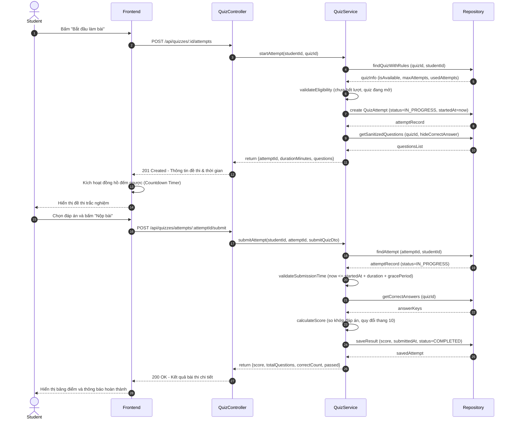
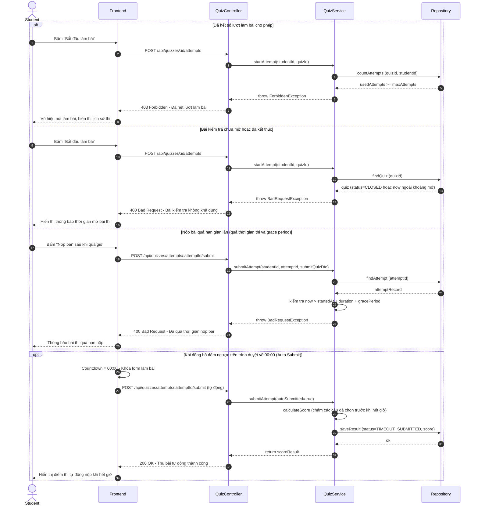

# 🔄 SEQ-QUIZ-001: Học viên làm bài kiểm tra & Tự động chấm điểm (Auto Grading)

> **Use Case liên quan:** [UC-QUIZ-001](../use-cases/actor-student.md#uc-quiz-001)  
> **Actor chính:** Học viên (Student)  
> **Tóm tắt luồng:** Học viên bắt đầu bài kiểm tra trắc nghiệm, hệ thống khởi tạo phiên làm bài (`QuizAttempt`) và trả về danh sách câu hỏi (đã ẩn đáp án đúng). Khi học viên nộp bài (hoặc hết giờ), hệ thống tự động so khớp đáp án, tính điểm theo thang 10, cập nhật bảng điểm và phản hồi kết quả tức thì.

---

## 1. Sơ Đồ Tuần Tự (Sequence Diagram)

### 1.1. Luồng Thành Công — Khởi tạo, Làm bài & Chấm điểm (Happy Path)

### 1.2. Luồng Ngoại Lệ & Hết Giờ Tự Động Thu Bài (Error Paths & Auto-Submit)

---

## 2. Bảng Mô Tả Chi Tiết Các Bước

### 2.1. Luồng Khởi tạo & Chấm điểm Tự động (Happy Path — tương ứng 28 bước trên sơ đồ 1.1)

| Bước | Từ | Đến | Phương thức / Thao tác | Dữ liệu gửi | Dữ liệu nhận | Mô tả nghiệp vụ |
|:---:|---|---|---|---|---|---|
| 1 | Student | Frontend | Bấm nút | — | — | Học viên bấm "Bắt đầu làm bài" tại trang chi tiết bài học |
| 2 | Frontend | QuizController | `POST /api/quizzes/:id/attempts` | `Bearer Token, quizId` | — | Gửi yêu cầu bắt đầu lượt làm bài mới |
| 3 | QuizController | QuizService | `quizService.startAttempt()` | `(studentId, quizId)` | — | Chuyển tiếp yêu cầu sau khi guard JWT xác thực học viên |
| 4 | QuizService | QuizRepository | `repo.findQuizWithRules()` | `quizId, studentId` | — | Truy vấn thông tin đề thi, thời gian mở và lịch sử các lần thi trước |
| 5 | QuizRepository | QuizService | Trả kết quả | — | `quizInfo` | Trả về thông số: thời lượng, số lần đã thi, giới hạn số lần làm |
| 6 | QuizService | QuizService | `validateEligibility()` | — | `boolean (true)` | Xác thực học viên đủ điều kiện làm bài (còn lượt, trong khung giờ mở) |
| 7 | QuizService | AttemptRepository | `repo.create()` | `{quizId, studentId, startedAt: now, status: IN_PROGRESS}` | — | Tạo bản ghi phiên thi mới ghi nhận thời gian bắt đầu chính xác |
| 8 | AttemptRepository | QuizService | Trả kết quả | — | `attemptRecord` | Trả về thông tin phiên thi vừa tạo kèm `attemptId` |
| 9 | QuizService | QuestionRepository | `repo.getSanitizedQuestions()` | `quizId` | — | Lấy toàn bộ câu hỏi và các lựa chọn đáp án |
| 10 | QuestionRepository | QuizService | Trả kết quả | — | `questionsList` | Trả về danh sách câu hỏi **đã loại bỏ trường isCorrect** để bảo mật |
| 11 | QuizService | QuizController | Return | — | `{attemptId, durationMinutes, questions}` | Trả về dữ liệu phiên thi cho Controller |
| 12 | QuizController | Frontend | `HTTP 201 Created` | — | `{attemptId, durationMinutes, questions}` | Phản hồi thông tin đề thi và thời lượng về Frontend |
| 13 | Frontend | Frontend | Bật Timer | `durationMinutes` | — | Khởi chạy đồng hồ đếm ngược hiển thị thời gian làm bài còn lại |
| 14 | Frontend | Student | Render UI | — | — | Hiển thị giao diện bài thi trắc nghiệm kèm câu hỏi và đáp án |
| 15 | Student | Frontend | Nộp bài | `{answers: [...]}` | — | Học viên hoàn thành chọn đáp án và nhấn nút "Nộp bài" |
| 16 | Frontend | QuizController | `POST /api/quizzes/attempts/:attemptId/submit` | `SubmitQuizDto` | — | Gửi danh sách câu trả lời của học viên lên máy chủ |
| 17 | QuizController | QuizService | `quizService.submitAttempt()` | `(studentId, attemptId, dto)` | — | Chuyển tiếp dữ liệu nộp bài sang Service |
| 18 | QuizService | AttemptRepository | `repo.findAttempt()` | `attemptId, studentId` | — | Truy vấn kiểm tra phiên thi có tồn tại và đang diễn ra hay không |
| 19 | AttemptRepository | QuizService | Trả kết quả | — | `attemptRecord` | Trả về bản ghi phiên thi với trạng thái `IN_PROGRESS` |
| 20 | QuizService | QuizService | `validateSubmissionTime()` | `now, attempt.startedAt` | `boolean (valid)` | Kiểm tra thời điểm nộp nằm trong thời hạn cho phép (+ 30s ân hạn mạng) |
| 21 | QuizService | QuestionRepository | `repo.getCorrectAnswers()` | `quizId` | — | Truy vấn bộ đáp án đúng từ ngân hàng câu hỏi để chấm điểm |
| 22 | QuestionRepository | QuizService | Trả kết quả | — | `answerKeys` | Trả về danh sách đáp án đúng chuẩn của bài kiểm tra |
| 23 | QuizService | QuizService | `calculateScore()` | `(answers, answerKeys)` | `scoreResult` | So khớp từng câu, đếm số câu đúng và quy đổi sang thang điểm 10 |
| 24 | QuizService | AttemptRepository | `repo.saveResult()` | `{score, submittedAt, status: COMPLETED}` | — | Cập nhật điểm số và trạng thái hoàn thành vào cơ sở dữ liệu |
| 25 | AttemptRepository | QuizService | Trả kết quả | — | `savedAttempt` | Xác nhận lưu kết quả bài thi thành công |
| 26 | QuizService | QuizController | Return | — | `{score, totalQuestions, correctCount, passed}` | Trả về kết quả đánh giá cho Controller |
| 27 | QuizController | Frontend | `HTTP 200 OK` | — | `{score, totalQuestions, correctCount, passed}` | Phản hồi bảng điểm và thông tin tổng kết bài thi về client |
| 28 | Frontend | Student | Render Kết quả | — | — | Hiển thị điểm số đạt được, tỉ lệ đúng/sai và trạng thái Đạt/Không đạt |

---

## 3. Ghi Chú Kỹ Thuật & Nghiệp Vụ Quan Trọng

- **Bảo mật & Chống gian lận (Anti-Cheat):**
  - **Lọc đáp án (Sanitize Question Payload):** Khi trả danh sách câu hỏi về cho học viên lúc bắt đầu làm bài, **tuyệt đối không gửi kèm trường `isCorrect`** hay bất kỳ dấu hiệu nào chỉ ra đáp án đúng trong JSON nhằm ngăn chặn gian lận qua F12 Inspect Element / Network Tab.
  - **Tính giờ trên Server (Server-side Timer Authority):** Thời gian làm bài được tính dựa trên mốc `startedAt` được lưu cố định trong DB lúc tạo attempt, không phụ thuộc vào đồng hồ máy tính của học viên.
  - **Thời gian ân hạn (Grace Period):** Cho phép bù tối đa **30 giây** khi nộp bài để bù trừ cho độ trễ truyền tải mạng (Network Latency). Nếu nộp vượt quá `startedAt + duration + 30s`, hệ thống sẽ từ chối hoặc đánh dấu bài thi không hợp lệ.
  - **Xáo trộn câu hỏi & đáp án (Shuffle):** Hệ thống có thể xáo trộn ngẫu nhiên thứ tự câu hỏi và thứ tự các đáp án A/B/C/D cho từng học viên khác nhau để hạn chế nhìn bài nhau.

- **Hiệu năng & Khả năng mở rộng:**
  - Bộ đáp án chuẩn (`answerKeys`) của đề thi nên được lưu cache trong **Redis** với TTL bằng thời lượng đợt thi để tránh việc truy vấn nhiều lần vào DB mỗi khi có học viên nộp bài cùng thời điểm.
  - Hỗ trợ lưu bản nháp câu trả lời định kỳ vào `LocalStorage` của trình duyệt phòng trường hợp học viên vô tình bị mất kết nối mạng.

- **Phụ thuộc kỹ thuật (Dependencies):**
  - Backend: `@nestjs/common`, TypeORM, PostgreSQL.
  - Database: Bảng `quizzes` (`id`, `title`, `duration_minutes`, `max_attempts`, `pass_score`), bảng `quiz_questions` (`id`, `quiz_id`, `content`, `points`), bảng `quiz_choices` (`id`, `question_id`, `content`, `is_correct`), bảng `quiz_attempts` (`id`, `student_id`, `quiz_id`, `started_at`, `submitted_at`, `score`, `status: IN_PROGRESS | COMPLETED | TIMEOUT_SUBMITTED`).
