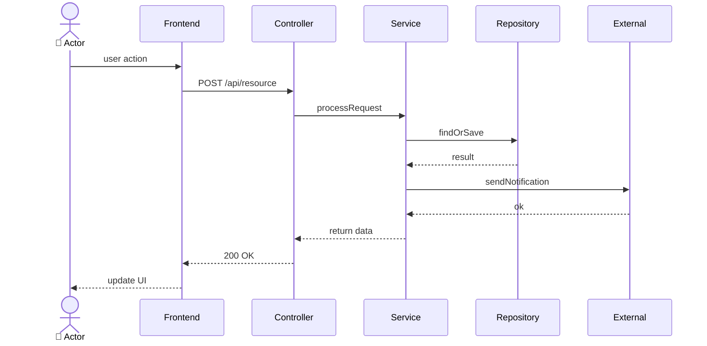
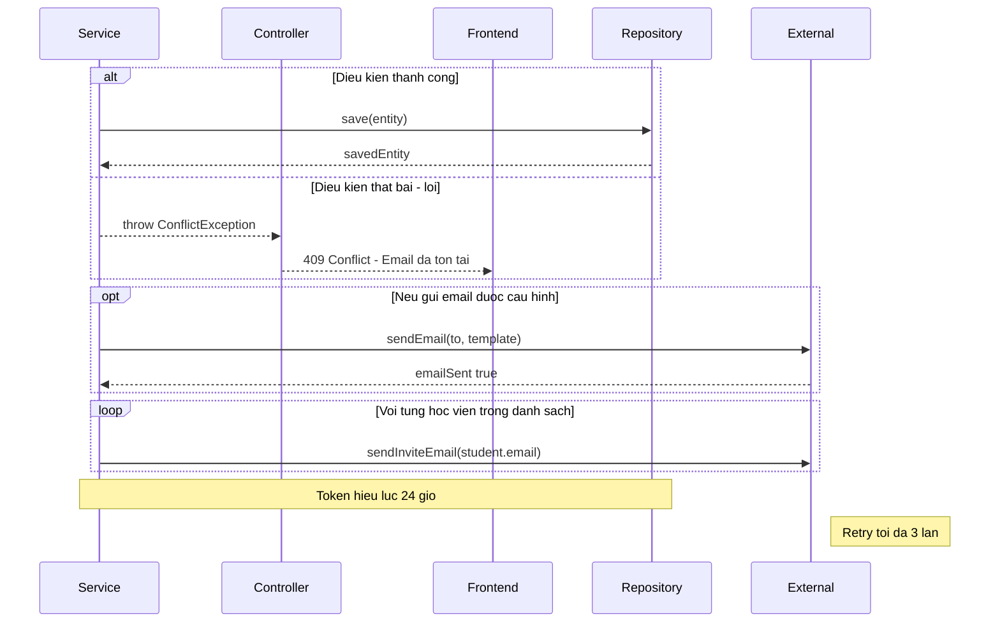
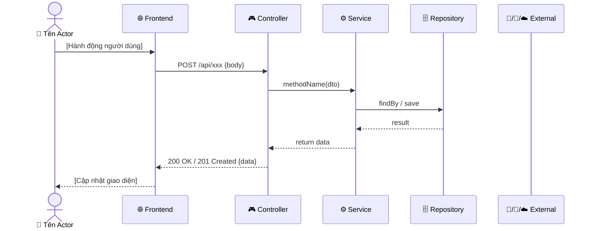
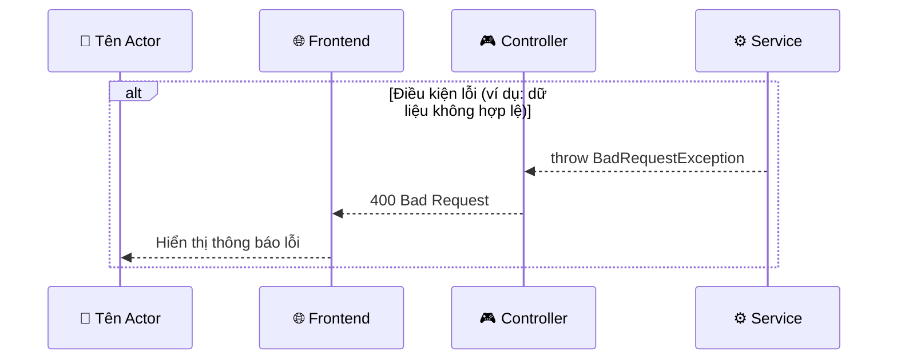

# 📐 Template Chuẩn — Sequence Diagram EduVerse

> **Tài liệu quy chuẩn kỹ thuật:** Hướng dẫn cấu trúc và ký hiệu thống nhất cho toàn bộ Sequence Diagram của hệ thống EduVerse.  
> **Áp dụng cho:** Toàn bộ thành viên dự án.

---

## 1. Quyết định Thiết kế Template (Design Decisions)

| #   | Quyết định                | Lựa chọn                                                                        | Lý do                                               |
| -----| ---------------------------| ---------------------------------------------------------------------------------| -----------------------------------------------------|
| 1   | **Số lớp (Participants)** | 6 lớp: Actor → Frontend → Controller → Service → Repository → External Services | Phản ánh đúng kiến trúc NestJS + React của hệ thống |
| 2   | **Error Handling**        | Có — hiển thị luồng ngoại lệ chính kèm HTTP Error Code                          | Chứng minh đã nghĩ đến các trường hợp lỗi           |
| 3   | **Cấu trúc nội dung**     | Mermaid Diagram + Bảng mô tả bước                                               | Trực quan khi thuyết trình + chi tiết khi đọc       |
| 4   | **Message Labels**        | HTTP Method + API Endpoint thực tế (ví dụ: `POST /api/auth/register`)           | Liên kết trực tiếp đến lớp API implementation       |
| 5   | **Tổ chức file**          | 1 file `seq-template.md` (chuẩn này) + mỗi luồng 1 file riêng                   | Dễ review, diff gọn gàng trên Git                   |

---

## 2. Danh Sách Sequence Diagrams (Priority List)

| Mã | Luồng | Actor chính | Độ phức tạp | Ưu tiên | Trạng thái / File |
|---|---|---|---|:---:|---|
| **SEQ-AUTH-001** | Đăng ký tài khoản & Xác thực Email OTP | Khách chưa đăng nhập | ⭐⭐⭐ | 🔴 P1 | ✅ [seq-auth-001.md](seq-auth-001.md) |
| **SEQ-AUTH-002** | Đăng nhập & Cấp JWT Token | Tất cả vai trò | ⭐⭐ | 🔴 P1 | ✅ [seq-auth-002.md](seq-auth-002.md) |
| **SEQ-QUIZ-001** | Học viên làm bài kiểm tra & Auto Grading | Student | ⭐⭐⭐ | 🔴 P1 | ✅ [seq-quiz-001.md](seq-quiz-001.md) |
| **SEQ-AI-001** | Giảng viên sinh câu hỏi bằng Gemini AI | Teacher | ⭐⭐⭐ | 🔴 P1 | ✅ [seq-ai-001.md](seq-ai-001.md) |
| **SEQ-ASSIGN-001** | Học viên nộp bài tập (Upload file S3) | Student | ⭐⭐⭐ | 🔴 P1 | ✅ [seq-assign-001.md](seq-assign-001.md) |
| **SEQ-CLASS-001** | Học viên ghi danh vào lớp bằng mã | Student | ⭐⭐ | 🟡 P2 | 📋 Chuẩn CRUD (Đặc tả qua API & ERD) |
| **SEQ-MGMT-001** | Quản lý phê duyệt khóa học | Training Manager | ⭐⭐ | 🟡 P2 | 📋 Chuẩn CRUD (Đặc tả qua API & ERD) |
| **SEQ-GRADE-001** | Giảng viên chấm bài tập & gửi phản hồi | Teacher | ⭐⭐ | 🟡 P2 | 📋 Chuẩn CRUD (Đặc tả qua API & ERD) |

---

## 3. Định nghĩa Participants (Thành phần tham gia)

Mỗi sequence diagram đều sử dụng thống nhất **6 participant** sau:




### Giải thích từng lớp:

| Participant | Alias | Mô tả | Màu gợi ý |
|---|---|---|---|
| **Actor** | `User` | Người dùng thực tế (Student/Teacher/Manager/Admin) | 👤 |
| **Frontend** | `FE` | React/Vite SPA chạy trên trình duyệt | 🌐 |
| **Controller** | `CTRL` | NestJS `@Controller` — nhận HTTP request, validate DTO | 🎮 |
| **Service** | `SVC` | NestJS `@Injectable Service` — xử lý business logic | ⚙️ |
| **Repository/DB** | `DB` | TypeORM Repository + PostgreSQL database | 🗄️ |
| **External** | `EXT` | Email SMTP (Nodemailer), AI API (Gemini), File Storage (AWS S3) | 📧/🤖/☁️ |


> **Lưu ý:** Nếu luồng không gọi External Service (ví dụ luồng đăng nhập đơn giản), có thể bỏ participant `EXT`.

---

## 4. Bảng Ký Hiệu Mũi Tên Chuẩn

| Ký hiệu Mermaid | Ý nghĩa | Sử dụng khi nào |
|---|---|---|
| `Actor->>FE:` | Solid line (Đường liền, mũi tên mở) | Hành động của người dùng, gửi request |
| `FE-->>Actor:` | Dashed line (Đường đứt, mũi tên mở) | Phản hồi về giao diện (render, hiển thị) |
| `FE->>CTRL:` | Solid | Gọi HTTP API (ghi rõ `POST /api/...`) |
| `CTRL-->>FE:` | Dashed | HTTP Response (ghi rõ `200 OK`, `201 Created`, `400 Bad Request`...) |
| `CTRL->>SVC:` | Solid | Gọi method trong Service |
| `SVC-->>CTRL:` | Dashed | Trả về dữ liệu / throw Exception |
| `SVC->>DB:` | Solid | Gọi Repository method (ví dụ: `findByEmail()`, `save()`) |
| `DB-->>SVC:` | Dashed | Trả về kết quả truy vấn (Entity / null) |
| `SVC->>EXT:` | Solid | Gọi dịch vụ ngoài (sendEmail, callGemini, uploadToS3) |
| `EXT-->>SVC:` | Dashed | Phản hồi từ dịch vụ ngoài |

---

## 5. Cú pháp Alt/Opt/Loop Chuẩn



---

## 6. Template Cấu Trúc File Mỗi Luồng

Mỗi file sequence diagram phải theo đúng cấu trúc sau:

````markdown
# 🔄 [SEQ-XXX-NNN]: [Tên luồng]

> **Use Case liên quan:** [UC-XXX-NNN](../use-cases/actor-xxx.md#uc-xxx-nnn)  
> **Actor chính:** [Tên Actor]  
> **Tóm tắt luồng:** [Mô tả ngắn 1-2 câu về mục đích của luồng này]

---

## 1. Sơ Đồ Tuần Tự (Sequence Diagram)

### 1.1. Luồng Thành Công (Happy Path)



### 1.2. Luồng Ngoại Lệ (Error Path)



---

## 2. Bảng Mô Tả Chi Tiết Các Bước (Step Description Table)

| Bước | Từ | Đến | Phương thức / Endpoint | Dữ liệu gửi | Dữ liệu nhận | Mô tả nghiệp vụ |
|:---:|---|---|---|---|---|---|
| 1 | Actor | Frontend | — | ... | — | ... |
| 2 | Frontend | Controller | `POST /api/...` | `{field1, field2}` | — | ... |
| 3 | Controller | Service | `serviceName.method(dto)` | DTO object | — | ... |
| 4 | Service | DB | `repo.findOneBy({...})` | Query params | Entity / null | ... |
| ... | ... | ... | ... | ... | ... | ... |

---

## 3. Ghi Chú Quan Trọng

- **Bảo mật:** ...
- **Hiệu năng:** ...
- **Phụ thuộc:** ...
````

---

## 7. Kiểm Tra Chất Lượng (QA Checklist)

Trước khi commit một file sequence diagram, kiểm tra:

- [ ] Đủ 6 participants (hoặc bỏ `EXT` nếu không cần).
- [ ] Mỗi request (solid arrow `→→`) đều có response tương ứng (dashed `-->`).
- [ ] Có ít nhất 1 khối `alt` / `opt` thể hiện xử lý lỗi hoặc tình huống rẽ nhánh.
- [ ] Message labels trên mũi tên ghi rõ HTTP Method + API Endpoint khi giao tiếp Frontend ↔ Controller.
- [ ] Có Bảng mô tả bước Step Description Table đầy đủ.
- [ ] File được đặt tên đúng quy ước: `seq-{domain}-{số thứ tự 3 chữ số}.md`.
