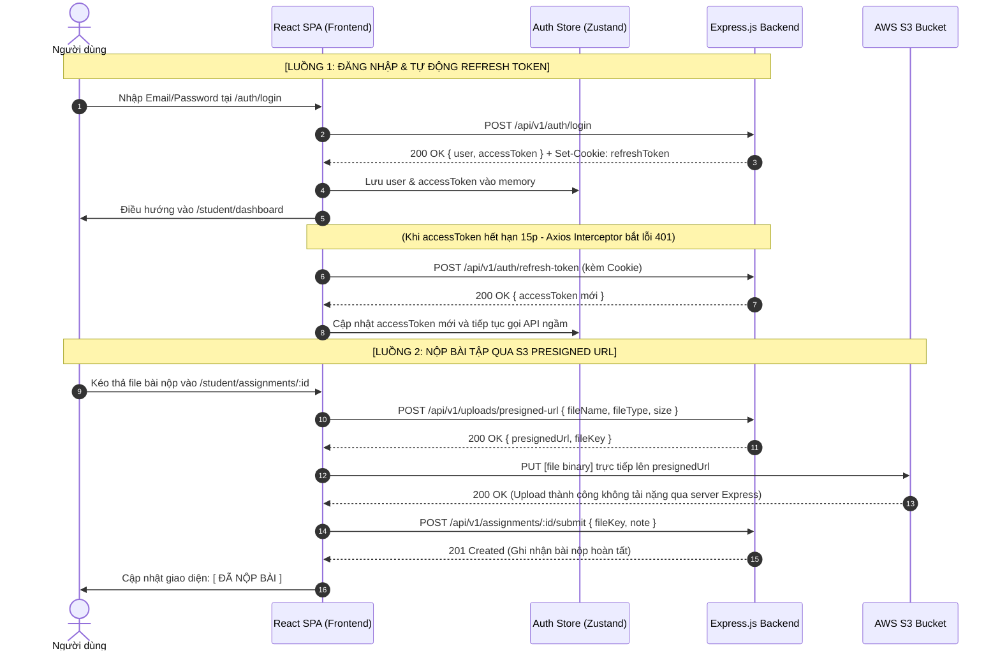

# 📘 Master Frontend Blueprint — EduVerse

> **Phiên bản:** 1.0 (Enterprise Specification)  
> **Cập nhật lần cuối:** 26/09/2026  
> **Mục đích tài liệu:** Cẩm nang toàn diện chuẩn **Prompt-ready**. Dành riêng cho **AI Coding Assistants** (ChatGPT, Claude, Cursor, Antigravity) và **Frontend Engineers** để sinh mã nguồn và xây dựng toàn bộ ứng dụng Client hoàn chỉnh, chuẩn xác 100%, không bị sai lệch kiến trúc.

---

## 🤖 Phần 0: AI Meta-Prompt & Hướng dẫn Lập trình viên

> [!TIP]
> **Prompt dành cho AI:** Hãy copy toàn bộ nội dung khối bên dưới gửi vào công cụ AI để AI nắm bắt vai trò và bắt đầu sinh mã nguồn Frontend:

```text
BẠN LÀ SENIOR FRONTEND ARCHITECT & REACT SPECIALIST ĐƯỢC GIAO NHIỆM VỤ XÂY DỰNG TOÀN BỘ GIAO DIỆN FRONTEND CHO HỆ THỐNG EDUVERSE.
DỰA TRÊN TÀI LIỆU MASTER BLUEPRINT DƯỚI ĐÂY, HÃY TUÂN THỦ NGHIÊM NGẶT CÁC QUY TẮC SAU:
1. Tech Stack: React 18 + Vite (JavaScript .jsx) + Tailwind CSS + Lucide React Icons.
2. Routing & Guard: React Router v6, phân tầng Route Guard theo 4 vai trò (student, teacher, training_manager, admin) và Public routes.
3. State Management: Zustand quản lý Client State (Auth, UI Modals, Toast) + TanStack React Query v5 quản lý Server State/Cache.
4. API Client: Axios instance với baseURL = "/api/v1", đính kèm Authorization: Bearer <accessToken>, tự động bắt lỗi 401 để kích hoạt cơ chế Refresh Token qua cookie HttpOnly.
5. Form & Validation: React Hook Form kết hợp Joi schemas.
6. Thẩm mỹ & UX: Bảng màu chuẩn C4 (#1168bd primary), giao diện hiện đại, sạch sẽ, chuẩn responsive (Desktop, Tablet, Mobile), luôn có Loading Skeletons, Empty States và Toast Notifications.
7. Triển khai theo đúng danh mục 25 màn hình và 5 Layout Shells được đặc tả chi tiết trong tài liệu này.
```

---

## 1. Cấu trúc Thư mục Mã nguồn Chuẩn (`frontend/src/`)

```
frontend/
├── index.html
├── vite.config.js
├── tailwind.config.js
├── package.json
└── src/
    ├── main.jsx                     # Entry point (QueryClientProvider, BrowserRouter)
    ├── App.jsx                      # App root (AppRoutes, ToastContainer)
    ├── index.css                    # Tailwind directives & global utility classes
    │
    ├── assets/                      # Hình ảnh tĩnh, SVG logo, default avatars
    │
    ├── layouts/                     # ⭐ 5 Khung Layout chính (Master Shells)
    │   ├── PublicLayout.jsx         # Header + Navbar + Content + Footer
    │   ├── AuthLayout.jsx           # Split screen (Banner minh họa + Form card)
    │   ├── StudentLayout.jsx        # Sidebar học viên + TopHeader + Main Content
    │   ├── TeacherLayout.jsx        # Sidebar giảng dạy + TopHeader + Main Content
    │   ├── ManagerLayout.jsx        # Sidebar kiểm duyệt + TopHeader + Main Content
    │   └── AdminLayout.jsx          # Sidebar quản trị hệ thống + Breadcrumb + Content
    │
    ├── routes/                      # ⭐ Hệ thống Định tuyến & Phân quyền
    │   ├── AppRoutes.jsx            # Cây định tuyến tập trung toàn hệ thống
    │   ├── ProtectedRoute.jsx       # Bắt buộc đăng nhập (Redirect -> /auth/login)
    │   └── RoleBasedGuard.jsx       # Kiểm tra quyền Role (403 Forbidden nếu sai quyền)
    │
    ├── stores/                      # ⭐ Quản lý Global Client State (Zustand)
    │   ├── useAuthStore.js          # user, accessToken, roles, login(), logout(), checkAuth()
    │   └── useUIStore.js            # sidebarOpen, theme, modalState, activeToast
    │
    ├── services/                    # ⭐ Tầng Tương tác Backend API (Axios Instance)
    │   ├── api.js                   # Axios base client + Request/Response Interceptors
    │   ├── authService.js           # login, register, verifyOtp, refreshToken, logout
    │   ├── courseService.js         # getCourses, getCourseDetail, createCourse, updateCurriculum
    │   ├── classService.js          # getClasses, joinClassByCode, getClassStudents
    │   ├── quizService.js           # getQuizzes, submitQuizAttempt, generateAIQuiz
    │   ├── assignmentService.js     # getAssignments, submitAssignmentFile, gradeSubmission
    │   ├── uploadService.js         # getPresignedUrl, directUploadToS3
    │   └── adminService.js          # getUsers, createUser, toggleUserStatus, getAuditLogs
    │
    ├── components/                  # ⭐ Thư viện Component tái sử dụng
    │   ├── common/                  # Button, Input, Modal, Dropdown, Table, Badge, Skeleton, Toast
    │   ├── course/                  # CourseCard, CourseFilter, CurriculumTree, ChapterAccordion
    │   ├── classroom/               # VideoPlayer, MarkdownViewer, AttachmentList, CompleteButton
    │   ├── quiz/                    # QuizTimer, QuestionMatrix, QuestionCard, QuizResultModal
    │   ├── assignment/              # FileDropzone, SubmissionStatusBadge, GradeFeedbackCard
    │   └── ai/                      # AIQuizPromptModal, AIQuestionReviewCard
    │
    ├── pages/                       # ⭐ 25 Màn hình Giao diện Ứng dụng
    │   ├── public/                  # HomePage, CourseCatalogPage, CourseDetailPage, NotFoundPage
    │   ├── auth/                    # LoginPage, RegisterPage, VerifyOtpPage, ForgotPasswordPage, ResetPasswordPage
    │   ├── student/                 # StudentDashboardPage, MyCoursesPage, ClassroomPage, QuizTakePage, QuizResultPage, AssignmentDetailPage, GradesPage, ProfilePage
    │   ├── teacher/                 # TeacherDashboardPage, TeacherCoursesPage, CourseCurriculumBuilderPage, TeacherClassesPage, TeacherQuizzesPage, AIQuizGeneratorPage, TeacherAssignmentsPage, AssignmentGradingPage, GradebookPage
    │   ├── manager/                 # ManagerDashboardPage, CourseApprovalQueuePage, CourseReviewDetailPage, CategoryManagementPage
    │   └── admin/                   # AdminDashboardPage, UserManagementPage, CreateUserModalPage, AuditLogsPage, PlatformSettingsPage
    │
    ├── hooks/                       # Custom hooks (useDebounce, useQuizCountdown, usePagination)
    └── utils/                       # formatters.js (date, currency), constants.js (ROLES, STATUSES)
```

---

## 2. Hệ thống 5 Master Layout Shells

```
[1. PUBLIC LAYOUT]              [2. AUTH LAYOUT]               [3. ROLE DASHBOARD LAYOUT]
+--------------------------+    +----------------------------+  +-------------------------------+
| Logo  Nav Links  [Login] |    | Minh họa | Form đăng nhập/ |  | [Logo]   Top Header    [Avatar]|
+--------------------------+    | đồ họa   | đăng ký         |  +---------+---------------------+
|                          |    |          |                 |  | SIDEBAR |                     |
|      Main Content        |    | EduVerse | [ Nhập liệu ]   |  | • Menu  |    Breadcrumb /     |
|                          |    | Platform |                 |  | • Menu  |    Main Content     |
+--------------------------+    |          | [ Submit Btn ]  |  | • Menu  |                     |
| Footer: EduVerse © 2026  |    +----------------------------+  +---------+---------------------+
```

1. **`PublicLayout`:** Dành cho khách vãng lai duyệt khóa học. Header cố định phía trên, hiển thị thanh tìm kiếm, danh mục, nút Đăng nhập / Đăng ký.
2. **`AuthLayout`:** Tỉ lệ chia đôi 50/50. Cột trái là đồ họa minh họa thương hiệu EduVerse, cột phải là Card form nhập liệu có viền mềm và đổ bóng nhẹ.
3. **`StudentLayout` / `TeacherLayout` / `ManagerLayout` / `AdminLayout`:** Bố cục Dashboard chuẩn quốc tế:
   - **Sidebar (260px):** Logo, Menu điều hướng theo quyền, Trạng thái tài khoản, Nút Đăng xuất. Thu gọn thành hamburger menu trên mobile.
   - **Header (64px):** Nút toggle sidebar, Tiêu đề phân hệ, Thanh tìm kiếm nhanh, Chuông thông báo, Dropdown User Profile.
   - **Content Canvas:** Nền xám nhạt (`#f8fafc`), khối card nền trắng (`#ffffff`), padding rộng rãi.

---

## 3. Danh mục Chi tiết Toàn bộ 25 Màn hình (Screen Inventory & API Mapping)

### Phân hệ 1: Public & Khám phá (3 màn hình)

| ID | Tên Màn hình | Route URL | Quyền hạn | Components chính | API Endpoints tương ứng |
|---|---|---|:---:|---|---|
| **SCR-01** | Trang chủ (Landing Page) | `/` | Public | HeroBanner, SearchBar, CategoryPills, FeaturedCourseGrid, TestimonialSection, Footer | `GET /api/v1/courses?status=published&sort=popular&limit=8` |
| **SCR-02** | Khám phá Khóa học | `/courses` | Public | CourseFilterBar (giá, chuyên mục, đánh giá), SearchInput, CourseCardGrid, PaginationBar | `GET /api/v1/courses?status=published&page=1&limit=12&category=...` |
| **SCR-03** | Chi tiết Khóa học | `/courses/:slug` | Public | CourseHero (Thumbnail, Giảng viên, Đánh giá), CurriculumAccordion (Xem trước bài giảng), EnrollmentCard, StickyCTA | `GET /api/v1/courses/:id/preview`, `POST /api/v1/classes/:id/join` |

---

### Phân hệ 2: Xác thực & Tài khoản (5 màn hình)

| ID | Tên Màn hình | Route URL | Quyền hạn | Components chính | API Endpoints tương ứng |
|---|---|---|:---:|---|---|
| **SCR-04** | Đăng nhập | `/auth/login` | Public | LoginForm (Email, Mật khẩu, Checkbox Remember me), SocialLoginPlaceholder, Link sang Quên MK/Đăng ký | `POST /api/v1/auth/login` |
| **SCR-05** | Đăng ký Học viên | `/auth/register` | Public | RegisterForm (Họ tên, Email, Mật khẩu, Xác nhận MK), PasswordStrengthMeter, Link sang Đăng nhập | `POST /api/v1/auth/register` (Tự động role = `student`) |
| **SCR-06** | Xác thực Email OTP | `/auth/verify-email` | Public | OtpInputBox (6 ô nhập tự động focus), CountdownTimer (cooldown 60s), ResendOtpButton | `POST /api/v1/auth/verify-email`, `POST /api/v1/auth/resend-otp` |
| **SCR-07** | Quên Mật khẩu | `/auth/forgot-password` | Public | ForgotPasswordForm (Nhập Email đã đăng ký), Thông báo email đã gửi thành công | `POST /api/v1/auth/forgot-password` |
| **SCR-08** | Đặt lại Mật khẩu | `/auth/reset-password` | Public | ResetPasswordForm (Mã token/OTP, Mật khẩu mới, Xác nhận mật khẩu mới) | `POST /api/v1/auth/reset-password` |

---

### Phân hệ 3: Học viên — Student Portal (7 màn hình)

| ID | Tên Màn hình | Route URL | Quyền hạn | Components chính | API Endpoints tương ứng |
|---|---|---|:---:|---|---|
| **SCR-09** | Student Dashboard | `/student/dashboard` | `student` | StatCards (Khóa đang học, Bài sắp hết hạn, Điểm TB), RecentCourseList, UpcomingDeadlineList | `GET /api/v1/users/me/dashboard`, `GET /api/v1/classes/my-classes` |
| **SCR-10** | Khóa học của tôi | `/student/my-courses` | `student` | EnrolledCourseGrid, ProgressBar, JoinClassByCodeModal (Nhập mã lớp) | `GET /api/v1/classes/my-classes`, `POST /api/v1/classes/join` |
| **SCR-11** | Không gian Học tập (Classroom) | `/student/courses/:courseId/learn/:lessonId` | `student` | VideoPlayer (hoặc MarkdownContentViewer), AttachmentDownloadList (S3), MarkCompletedButton, NextPrevLessonNav, CurriculumSidebar | `GET /api/v1/lessons/:id`, `POST /api/v1/lessons/:id/progress` |
| **SCR-12** | Làm bài Quiz Trắc nghiệm | `/student/quizzes/:id/take` | `student` | FullscreenExamHeader, StickyCountdownTimer, QuestionAnswerRadioGroup, QuestionNavigationMatrix, SubmitExamConfirmModal | `POST /api/v1/quizzes/:id/attempts/start`, `POST /api/v1/quizzes/:id/attempts/:attemptId/submit` |
| **SCR-13** | Kết quả Bài Quiz | `/student/quizzes/:id/result/:attemptId` | `student` | ScoreBanner (Đạt/Không đạt, Số điểm), DetailedAnswerReview (Xem lại câu đúng/sai & lời giải thích), RetakeQuizButton | `GET /api/v1/quizzes/:id/attempts/:attemptId` |
| **SCR-14** | Chi tiết Bài tập & Nộp bài | `/student/assignments/:id` | `student` | AssignmentInstructionCard, DeadlineCountdownBadge, FileDropzone (Upload trực tiếp S3 Presigned URL), SubmittedFileList, TeacherFeedbackCard | `GET /api/v1/assignments/:id`, `POST /api/v1/uploads/presigned-url`, `POST /api/v1/assignments/:id/submit` |
| **SCR-15** | Bảng điểm & Hồ sơ cá nhân | `/student/grades` & `/student/profile` | `student` | GradeSummaryTable (Điểm Quiz, Điểm Bài tập, Trọng số), AvatarUploader, EditProfileForm, ChangePasswordForm | `GET /api/v1/grades/my-grades`, `PUT /api/v1/users/profile`, `PUT /api/v1/auth/change-password` |

---

### Phân hệ 4: Giảng viên — Teacher Portal (6 màn hình)

| ID | Tên Màn hình | Route URL | Quyền hạn | Components chính | API Endpoints tương ứng |
|---|---|---|:---:|---|---|
| **SCR-16** | Teacher Dashboard | `/teacher/dashboard` | `teacher` | TeacherMetricCards (Số khóa, Số lớp, Tổng học viên, Bài tập chờ chấm), PendingGradingAlertTable, QuickActionButtons | `GET /api/v1/teacher/dashboard-stats` |
| **SCR-17** | Quản lý Khóa học & Đề cương | `/teacher/courses` & `.../:id/curriculum` | `teacher` | CourseListTable, CreateCourseModal, CurriculumTreeBuilder (Chương $\rightarrow$ Bài học, Drag-and-drop sort), LessonEditorModal, SubmitForApprovalButton | `GET /api/v1/courses/my-courses`, `POST /api/v1/courses`, `POST /api/v1/chapters`, `POST /api/v1/lessons`, `POST /api/v1/courses/:id/submit-approval` |
| **SCR-18** | Quản lý Lớp học & Thành viên | `/teacher/classes` & `.../:id` | `teacher` | ClassCardGrid, CreateClassModal (Tạo mã `class_code`), StudentDataTable (Họ tên, Email, % Tiến độ hoàn thành, Thao tác mời/xóa) | `GET /api/v1/classes`, `POST /api/v1/classes`, `GET /api/v1/classes/:id/students`, `POST /api/v1/classes/:id/invite` |
| **SCR-19** | Quản lý Bài Quiz & AI Generator | `/teacher/quizzes` & `.../ai-generator` | `teacher` | QuizListTable, ManualQuestionBuilderForm, **Gemini AI Generator Modal** (Chọn bài học $\rightarrow$ AI sinh trắc nghiệm $\rightarrow$ Review/Edit card $\rightarrow$ Lưu vào đề) | `GET /api/v1/quizzes`, `POST /api/v1/quizzes`, `POST /api/v1/quizzes/generate-ai` (Gemini API) |
| **SCR-20** | Quản lý Bài tập & Chấm điểm | `/teacher/assignments` & `.../:id/grade` | `teacher` | AssignmentListTable, CreateAssignmentForm, SubmissionSplitPane (Bên trái: Danh sách sinh viên; Bên phải: Xem bài nộp, Tải file S3, Ô nhập điểm 0-10, Rich-text nhận xét) | `GET /api/v1/assignments`, `POST /api/v1/assignments`, `GET /api/v1/assignments/:id/submissions`, `POST /api/v1/assignments/submissions/:id/grade` |
| **SCR-21** | Sổ điểm Tổng hợp (Gradebook) | `/teacher/classes/:id/gradebook` | `teacher` | GradebookMatrixGrid (Học viên x Điểm các cột Quiz/Bài tập), AverageScoreCol, ExportToExcelButton | `GET /api/v1/classes/:id/gradebook`, `GET /api/v1/classes/:id/export-grades` |

---

### Phân hệ 5: Quản lý Đào tạo — Training Manager Portal (2 màn hình)

| ID | Tên Màn hình | Route URL | Quyền hạn | Components chính | API Endpoints tương ứng |
|---|---|---|:---:|---|---|
| **SCR-22** | Hàng đợi & Duyệt Khóa học | `/manager/approvals` & `.../:id/review` | `training_manager` | ApprovalQueueTable (Danh sách khóa `pending_approval`), CourseAuditPreview (Kiểm tra video, bài học, bản quyền), ApproveButton (Xuất bản), RejectWithFeedbackDialog (Từ chối kèm lý do) | `GET /api/v1/courses/pending-approval`, `POST /api/v1/courses/:id/approve`, `POST /api/v1/courses/:id/reject` |
| **SCR-23** | Quản lý Danh mục & Báo cáo | `/manager/categories` & `/reports` | `training_manager` | CategoryTreeManager (Thêm/Sửa/Ẩn danh mục), CompletionRateChart, TeacherPerformanceTable | `GET /api/v1/categories`, `POST /api/v1/categories`, `GET /api/v1/manager/analytics` |

---

### Phân hệ 6: Quản trị viên — Admin Console (2 màn hình)

| ID | Tên Màn hình | Route URL | Quyền hạn | Components chính | API Endpoints tương ứng |
|---|---|---|:---:|---|---|
| **SCR-24** | Quản lý Người dùng & RBAC | `/admin/users` | `admin` | UserDataTable (Lọc theo 4 role, lọc theo trạng thái Active/Locked), **CreatePrivilegedUserModal** (Tạo tài khoản Giảng viên / Quản lý theo BR-004/005), ToggleLockUserDialog | `GET /api/v1/admin/users`, `POST /api/v1/admin/users`, `PATCH /api/v1/admin/users/:id/status` |
| **SCR-25** | Nhật ký Hệ thống & Cài đặt | `/admin/audit-logs` & `/settings` | `admin` | AuditLogTable (Theo dõi login, tạo token, thu hồi phiên), SystemHealthWidget, PlatformSettingsForm (Tham số S3, JWT, SMTP, Rate limit) | `GET /api/v1/admin/audit-logs`, `GET /api/v1/admin/system-health`, `PUT /api/v1/admin/settings` |

---

## 4. Đặc tả 4 Luồng Người dùng Cốt lõi (Core End-to-End User Journeys)



---

## 5. Quy chuẩn API Client Pattern (Axios Instance)

File cấu hình chuẩn tại `frontend/src/services/api.js`:

```javascript
import axios from 'axios';
import { useAuthStore } from '../stores/useAuthStore';

export const api = axios.create({
  baseURL: '/api/v1',
  headers: {
    'Content-Type': 'application/json',
  },
  withCredentials: true, // Bắt buộc để gửi và nhận Cookie refreshToken
});

// 1. Request Interceptor: Tự động đính kèm Bearer Access Token
api.interceptors.request.use((config) => {
  const token = useAuthStore.getState().accessToken;
  if (token) {
    config.headers.Authorization = `Bearer ${token}`;
  }
  return config;
});

// 2. Response Interceptor: Tự động gọi Refresh Token khi gặp lỗi 401
let isRefreshing = false;
let failedQueue = [];

const processQueue = (error, token = null) => {
  failedQueue.forEach((prom) => {
    if (error) prom.reject(error);
    else prom.resolve(token);
  });
  failedQueue = [];
};

api.interceptors.response.use(
  (response) => response.data,
  async (error) => {
    const originalRequest = error.config;

    if (error.response?.status === 401 && !originalRequest._retry) {
      if (isRefreshing) {
        return new Promise((resolve, reject) => {
          failedQueue.push({ resolve, reject });
        }).then((token) => {
          originalRequest.headers.Authorization = `Bearer ${token}`;
          return api(originalRequest);
        });
      }

      originalRequest._retry = true;
      isRefreshing = true;

      try {
        const res = await axios.post('/api/v1/auth/refresh-token', {}, { withCredentials: true });
        const newAccessToken = res.data.data.accessToken;
        useAuthStore.getState().setAccessToken(newAccessToken);

        processQueue(null, newAccessToken);
        originalRequest.headers.Authorization = `Bearer ${newAccessToken}`;
        return api(originalRequest);
      } catch (refreshErr) {
        processQueue(refreshErr, null);
        useAuthStore.getState().logout();
        window.location.href = '/auth/login?expired=true';
        return Promise.reject(refreshErr);
      } finally {
        isRefreshing = false;
      }
    }

    return Promise.reject(error.response?.data || error);
  }
);
```

---

## 6. Checklist Sinh mã Dành cho AI Developer

Khi nhận yêu cầu code bất kỳ màn hình nào, AI cần thực hiện theo 4 bước tuần tự:
1. **Kiểm tra Route & Layout:** Đặt file đúng thư mục `pages/<role>/` và bọc trong đúng Layout Shell (`StudentLayout`, `TeacherLayout`...).
2. **Khai báo State & Query:** Dùng TanStack Query (`useQuery`, `useMutation`) kết nối đúng service API trong `services/`.
3. **Hiển thị Đầy đủ 4 Trạng thái:**
   - Đang tải: Component `<Skeleton />` tương ứng.
   - Trống dữ liệu: Component `<EmptyState />` kèm icon Lucide và nút hành động.
   - Có dữ liệu: Card, Bảng dữ liệu hoặc Form.
   - Thông báo lỗi/thành công: Gọi `<Toast />`.
4. **Validation Dữ liệu:** Form nhập liệu luôn bọc qua React Hook Form + Joi validation trước khi gửi API.

---

_Tài liệu Master Frontend Blueprint đã được hoàn thiện và đóng gói sẵn sàng để làm tài liệu chuẩn bàn giao cho AI hoặc Developer triển khai mã nguồn._
