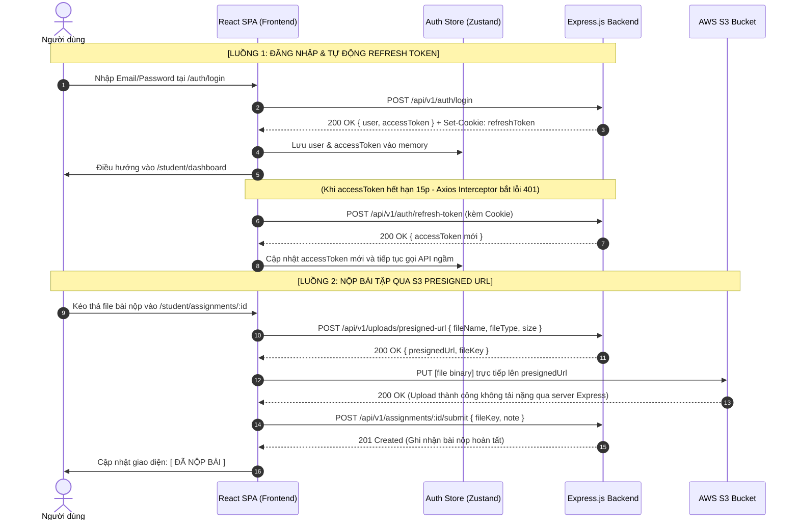

# 📘 Master Frontend Blueprint — EduVerse

> **Phiên bản:** 1.0 (Enterprise Specification)  
> **Cập nhật lần cuối:** 26/09/2026  
> **Mục đích tài liệu:** Cẩm nang toàn diện chuẩn **Prompt-ready**. Dành riêng cho **AI Coding Assistants** (ChatGPT, Claude, Cursor, Antigravity) và **Frontend Engineers** để sinh mã nguồn và xây dựng toàn bộ ứng dụng Client hoàn chỉnh, chuẩn xác 100%, không bị sai lệch kiến trúc.

---

## 🤖 Phần 0: AI Meta-Prompt & Hướng dẫn Lập trình viên

> [!TIP]
> **Prompt dành cho AI:** Hãy copy toàn bộ nội dung khối bên dưới gửi vào công cụ AI để AI nắm bắt vai trò và bắt đầu sinh mã nguồn Frontend:

```text
BẠN LÀ SENIOR FRONTEND ARCHITECT & REACT SPECIALIST ĐƯỢC GIAO NHIỆM VỤ XÂY DỰNG TOÀN BỘ GIAO DIỆN FRONTEND CHO HỆ THỐNG EDUVERSE.
DỰA TRÊN TÀI LIỆU MASTER BLUEPRINT DƯỚI ĐÂY, HÃY TUÂN THỦ NGHIÊM NGẶT CÁC QUY TẮC SAU:
1. Tech Stack: React 18 + Vite (JavaScript .jsx) + Tailwind CSS + Lucide React Icons + Radix UI Primitives (Dialog, Dropdown, Tabs) + Sonner (Toast Notifications) + DOMPurify (Chống XSS).
2. Routing & Guard: React Router v6, phân tầng Route Guard theo 4 vai trò (student, teacher, training_manager, admin) và Public routes.
3. State Management: Zustand quản lý Client State (Auth, UI Modals, Toast) + TanStack React Query v5 quản lý Server State/Cache.
4. API Client & Auth Security: Axios instance với baseURL = "/api/v1", đính kèm Authorization: Bearer <accessToken> trong bộ nhớ (Zustand memory - KHÔNG lưu localStorage để chống XSS). Tự động phục hồi phiên khi F5 qua initializeAuth() và tự động bắt lỗi 401 để kích hoạt cơ chế Refresh Token qua cookie HttpOnly.
5. Form & Validation: React Hook Form kết hợp Joi schemas.
6. Thẩm mỹ & UX: Tuân thủ 100% bộ Design Tokens trong `docs/ui/design-system.md` (Primary `#1168bd`, Secondary `#0c2d48`, Tertiary `#0ea5e9`, Canvas `#f8f9ff`, Font `Inter` với `tabular-nums`), giao diện Corporate SaaS sạch sẽ, chuẩn responsive (Desktop, Tablet, Mobile), luôn có Loading Skeletons (Shimmer Gradient), Empty States và Toast Notifications (Sonner).
7. Bảo mật & Toàn vẹn: Bắt buộc sanitize toàn bộ Markdown/Rich-text qua DOMPurify; Client timer chỉ phục vụ UX (server timestamp là chốt chặn); Upload S3 phải validate MIME whitelist (.pdf, .docx, .zip, .png, .jpg, .webp) và giới hạn `MAX_UPLOAD_SIZE = 25MB` trước khi xin Presigned URL.
8. Triển khai theo đúng danh mục 37 Màn hình độc lập (SCR-01 đến SCR-37) và 6 Master Layout Shells được đặc tả chi tiết trong tài liệu này.
```

---

## 1. Cấu trúc Thư mục Mã nguồn Chuẩn (`frontend/src/`)

```
frontend/
├── index.html
├── vite.config.js
├── tailwind.config.js
├── package.json
└── src/
    ├── main.jsx                     # Entry point (QueryClientProvider, BrowserRouter)
    ├── App.jsx                      # App root (AppRoutes, Toaster)
    ├── index.css                    # Tailwind directives & global utility classes
    │
    ├── assets/                      # Hình ảnh tĩnh, SVG logo, default avatars
    │
    ├── layouts/                     # ⭐ 6 Khung Layout chính (Master Shells)
    │   ├── PublicLayout.jsx         # 1. Header + Navbar + Content + Footer
    │   ├── AuthLayout.jsx           # 2. Split screen (Banner minh họa + Form card)
    │   ├── StudentLayout.jsx        # 3. Sidebar học viên + TopHeader + Main Content
    │   ├── TeacherLayout.jsx        # 4. Sidebar giảng dạy + TopHeader + Main Content
    │   ├── ManagerLayout.jsx        # 5. Sidebar kiểm duyệt + TopHeader + Main Content
    │   └── AdminLayout.jsx          # 6. Sidebar quản trị hệ thống + Breadcrumb + Content
    │
    ├── routes/                      # ⭐ Hệ thống Định tuyến & Phân quyền
    │   ├── AppRoutes.jsx            # Cây định tuyến tập trung toàn hệ thống
    │   ├── ProtectedRoute.jsx       # Bắt buộc đăng nhập (Redirect -> /auth/login)
    │   └── RoleBasedGuard.jsx       # Kiểm tra quyền Role (403 Forbidden nếu sai quyền)
    │
    ├── stores/                      # ⭐ Quản lý Global Client State (Zustand)
    │   ├── useAuthStore.js          # user, accessToken, roles, login(), logout(), initializeAuth()
    │   └── useUIStore.js            # sidebarOpen, theme, modalState, activeToast
    │
    ├── services/                    # ⭐ Tầng Tương tác Backend API (Axios Instance)
    │   ├── api.js                   # Axios base client + Request/Response Interceptors
    │   ├── authService.js           # login, register, verifyOtp, refreshToken, logout
    │   ├── courseService.js         # getCourses, getCourseDetail, createCourse, updateCurriculum
    │   ├── classService.js          # getClasses, joinClassByCode, getClassStudents
    │   ├── quizService.js           # getQuizzes, submitQuizAttempt, generateAIQuiz
    │   ├── assignmentService.js     # getAssignments, submitAssignmentFile, gradeSubmission
    │   ├── uploadService.js         # getPresignedUrl, directUploadToS3
    │   └── adminService.js          # getUsers, createUser, toggleUserStatus, getAuditLogs
    │
    ├── components/                  # ⭐ Thư viện Component tái sử dụng
    │   ├── common/                  # Button, Input, Modal, Dropdown, Table, Badge, Skeleton, Toast (Sonner wrapper)
    │   ├── course/                  # CourseCard, CourseFilter, CurriculumTree, ChapterAccordion
    │   ├── classroom/               # VideoPlayer, MarkdownViewer, AttachmentList, CompleteButton
    │   ├── quiz/                    # QuizTimer, QuestionMatrix, QuestionCard, QuizResultModal
    │   ├── assignment/              # FileDropzone, SubmissionStatusBadge, GradeFeedbackCard
    │   └── ai/                      # AIQuizPromptModal, AIQuestionReviewCard
    │
    ├── pages/                       # ⭐ 37 Màn hình Giao diện Ứng dụng (1:1 với SCR-01 đến SCR-37)
    │   ├── public/                  # HomePage, CourseCatalogPage, CourseDetailPage, NotFoundPage (4 screens)
    │   ├── auth/                    # LoginPage, RegisterPage, VerifyOtpPage, ForgotPasswordPage, ResetPasswordPage (5 screens)
    │   ├── student/                 # StudentDashboardPage, MyCoursesPage, StudentClassDetailPage, ClassroomPage, QuizTakePage, QuizResultPage, AssignmentDetailPage, GradesPage, ProfilePage (9 screens)
    │   ├── teacher/                 # TeacherDashboardPage, TeacherCoursesPage, CourseCurriculumBuilderPage, TeacherClassesPage, TeacherClassDetailPage, TeacherQuizzesPage, AIQuizGeneratorPage, TeacherAssignmentsPage, AssignmentGradingPage, GradebookPage (10 screens)
    │   ├── manager/                 # ManagerDashboardPage, CourseApprovalQueuePage, CourseReviewDetailPage, CategoryManagementPage, ManagerReportsPage (5 screens)
    │   └── admin/                   # AdminDashboardPage, UserManagementPage, AuditLogsPage, PlatformSettingsPage (4 screens)
    │
    ├── hooks/                       # Custom hooks (useDebounce, useQuizCountdown, usePagination)
    └── utils/                       # formatters.js, constants.js (ROLES, STATUSES), sanitize.js (DOMPurify)
```

---

## 2. Hệ thống 6 Master Layout Shells

```
[1. PUBLIC LAYOUT]              [2. AUTH LAYOUT]               [3-6. ROLE DASHBOARD LAYOUTS]
+--------------------------+    +----------------------------+  +-------------------------------+
| Logo  Nav Links  [Login] |    | Minh họa | Form đăng nhập/ |  | [Logo]   Top Header    [Avatar]|
+--------------------------+    | đồ họa   | đăng ký         |  +---------+---------------------+
|                          |    |          |                 |  | SIDEBAR |                     |
|      Main Content        |    | EduVerse | [ Nhập liệu ]   |  | • Menu  |    Breadcrumb /     |
|                          |    | Platform |                 |  | • Menu  |    Main Content     |
+--------------------------+    |          | [ Submit Btn ]  |  | • Menu  |                     |
| Footer: EduVerse © 2026  |    +----------------------------+  +---------+---------------------+
```

Hệ thống phân định rành mạch **6 Master Layouts** tương ứng với từng ngữ cảnh người dùng:
1. **`PublicLayout`:** Dành cho khách vãng lai duyệt khóa học. Header cố định phía trên, thanh tìm kiếm, danh mục, footer.
2. **`AuthLayout`:** Tỉ lệ chia đôi 50/50. Cột trái là đồ họa minh họa thương hiệu EduVerse, cột phải là Card form nhập liệu.
3. **`StudentLayout`:** Dành riêng cho Học viên. Sidebar học tập cá nhân (Khóa học của tôi, Lịch nộp bài, Điểm số).
4. **`TeacherLayout`:** Dành riêng cho Giảng viên. Sidebar nghiệp vụ giảng dạy (Khóa học, Lớp học, Bài tập, Chấm điểm, Ngân hàng đề thi AI).
5. **`ManagerLayout`:** Dành riêng cho Quản lý Đào tạo. Sidebar kiểm định chất lượng (Hàng đợi duyệt khóa học, Danh mục, Báo cáo thống kê).
6. **`AdminLayout`:** Dành riêng cho Quản trị viên. Giao diện Back-office quản trị người dùng RBAC, Cấu hình hệ thống, Audit Logs.

---

## 3. Danh mục Chi tiết Toàn bộ 37 Màn hình Độc lập (1:1 với React Router)

> [!NOTE]
> Để tránh việc AI gộp nhầm các màn hình con vào chung một component, danh mục dưới đây **tách bạch 100% từng Route URL độc lập thành 1 Screen Component riêng biệt** (tổng cộng 37 màn hình).

### Phân hệ 1: Public & Khám phá (4 màn hình)

| ID | Tên Màn hình & Component | Route URL | Quyền hạn | Components chính | API Endpoints tương ứng |
|---|---|---|:---:|---|---|
| **SCR-01** | Landing Page (`HomePage.jsx`) | `/` | Public | HeroBanner, SearchBar, CategoryPills, FeaturedCourseGrid, TestimonialSection, Footer | `GET /api/v1/courses?status=published&sort=popular&limit=8` |
| **SCR-02** | Khám phá Khóa học (`CourseCatalogPage.jsx`) | `/courses` | Public | CourseFilterBar (giá, chuyên mục, đánh giá), SearchInput, CourseCardGrid, PaginationBar | `GET /api/v1/courses?status=published&page=1&limit=12` |
| **SCR-03** | Chi tiết Khóa học (`CourseDetailPage.jsx`) | `/courses/:slug` | Public | CourseHero (Thumbnail, Giảng viên, Đánh giá), CurriculumAccordion (Xem trước đề cương), EnrollmentCard, StickyCTA | `GET /api/v1/courses/:id/preview`, `POST /api/v1/classes/:id/join` |
| **SCR-04** | Trang 404 Không tìm thấy (`NotFoundPage.jsx`) | `*` | Public | Illustration404, SearchRedirectInput, BackToHomeButton | N/A |

---

### Phân hệ 2: Xác thực & Tài khoản (5 màn hình)

| ID | Tên Màn hình & Component | Route URL | Quyền hạn | Components chính | API Endpoints tương ứng |
|---|---|---|:---:|---|---|
| **SCR-05** | Đăng nhập (`LoginPage.jsx`) | `/auth/login` | Public | LoginForm (Email, Mật khẩu, Checkbox Remember me), SocialLoginPlaceholder, Link sang Quên MK/Đăng ký | `POST /api/v1/auth/login` |
| **SCR-06** | Đăng ký Học viên (`RegisterPage.jsx`) | `/auth/register` | Public | RegisterForm (Họ tên, Email, Mật khẩu, Xác nhận MK), PasswordStrengthMeter, Link sang Đăng nhập | `POST /api/v1/auth/register` (Tự động role = `student`) |
| **SCR-07** | Xác thực Email OTP (`VerifyOtpPage.jsx`) | `/auth/verify-email` | Public | OtpInputBox (6 ô nhập tự động focus), CountdownTimer (cooldown 60s), ResendOtpButton | `POST /api/v1/auth/verify-otp`, `POST /api/v1/auth/resend-otp` |
| **SCR-08** | Quên Mật khẩu (`ForgotPasswordPage.jsx`) | `/auth/forgot-password` | Public | ForgotPasswordForm (Nhập Email đã đăng ký), Thông báo email đã gửi thành công | `POST /api/v1/auth/forgot-password` |
| **SCR-09** | Đặt lại Mật khẩu (`ResetPasswordPage.jsx`) | `/auth/reset-password` | Public | ResetPasswordForm (Mã token/OTP, Mật khẩu mới, Xác nhận mật khẩu mới) | `POST /api/v1/auth/reset-password` |

---

### Phân hệ 3: Học viên — Student Portal (9 màn hình)

| ID | Tên Màn hình & Component | Route URL | Quyền hạn | Components chính | API Endpoints tương ứng |
|---|---|---|:---:|---|---|
| **SCR-10** | Student Dashboard (`StudentDashboardPage.jsx`) | `/student/dashboard` | `student` | StatCards (Khóa đang học, Bài sắp hết hạn, Điểm TB), RecentCourseList, UpcomingDeadlineList | `GET /api/v1/users/me/dashboard`, `GET /api/v1/classes/my-classes` |
| **SCR-11** | Khóa học của tôi (`MyCoursesPage.jsx`) | `/student/my-courses` | `student` | EnrolledCourseGrid, ProgressBar, JoinClassByCodeModal (Nhập mã lớp) | `GET /api/v1/classes/my-classes`, `POST /api/v1/classes/join` |
| **SCR-12** | Chi tiết Lớp học (`StudentClassDetailPage.jsx`) | `/student/classes/:id` | `student` | ClassHeaderInfo, ClassNoticeList, ClassMaterialDownloadList, ClassmatesList | `GET /api/v1/classes/:id`, `GET /api/v1/classes/:id/materials` |
| **SCR-13** | Không gian Học tập (`ClassroomPage.jsx`) | `/student/courses/:courseId/learn/:lessonId` | `student` | VideoPlayer, MarkdownContentViewer (Bọc DOMPurify), AttachmentDownloadList (S3), MarkCompletedButton, NextPrevLessonNav, CurriculumSidebar | `GET /api/v1/lessons/:id`, `POST /api/v1/lessons/:id/progress`, `GET /api/v1/lessons/:id/video-stream-url` |
| **SCR-14** | Làm bài Quiz Trắc nghiệm (`QuizTakePage.jsx`) | `/student/quizzes/:id/take` | `student` | FullscreenExamHeader, StickyCountdownTimer (Client UX only), QuestionAnswerRadioGroup (KHÔNG chứa đáp án đúng), Autosave sessionStorage, QuestionNavigationMatrix, SubmitExamConfirmModal | `POST /api/v1/quizzes/:id/attempts/start`, `POST /api/v1/quizzes/:id/attempts/:attemptId/submit` |
| **SCR-15** | Kết quả Bài Quiz (`QuizResultPage.jsx`) | `/student/quizzes/:id/result/:attemptId` | `student` | ScoreBanner (Đạt/Không đạt, Số điểm), DetailedAnswerReview (Xem lại câu đúng/sai & lời giải thích), RetakeQuizButton | `GET /api/v1/quizzes/:id/attempts/:attemptId` |
| **SCR-16** | Chi tiết Bài tập & Nộp bài (`AssignmentDetailPage.jsx`) | `/student/assignments/:id` | `student` | AssignmentInstructionCard, DeadlineCountdownBadge, FileDropzone (Client validate MIME/size trước khi xin S3 Presigned URL), SubmittedFileList, TeacherFeedbackCard | `GET /api/v1/assignments/:id`, `POST /api/v1/uploads/presigned-url`, `POST /api/v1/assignments/:id/submit` |
| **SCR-17** | Bảng điểm cá nhân (`GradesPage.jsx`) | `/student/grades` | `student` | GradeSummaryTable (Điểm Quiz, Điểm Bài tập, Trọng số, Điểm trung bình môn), ExportPDFButton | `GET /api/v1/grades/my-grades` |
| **SCR-18** | Hồ sơ cá nhân (`ProfilePage.jsx`) | `/student/profile` | `student` | AvatarUploader (S3), EditProfileForm (Họ tên, SĐT, Bio), ChangePasswordForm | `GET /api/v1/auth/me`, `PATCH /api/v1/users/me`, `PATCH /api/v1/auth/change-password` |

---

### Phân hệ 4: Giảng viên — Teacher Portal (10 màn hình)

| ID | Tên Màn hình & Component | Route URL | Quyền hạn | Components chính | API Endpoints tương ứng |
|---|---|---|:---:|---|---|
| **SCR-19** | Teacher Dashboard (`TeacherDashboardPage.jsx`) | `/teacher/dashboard` | `teacher` | TeacherMetricCards (Số khóa, Số lớp, Tổng học viên, Bài tập chờ chấm), PendingGradingAlertTable, QuickActionButtons | `GET /api/v1/teacher/dashboard-stats` |
| **SCR-20** | Quản lý Khóa học (`TeacherCoursesPage.jsx`) | `/teacher/courses` | `teacher` | CourseListTable, CreateCourseModal, FilterStatusTabs (`draft`, `pending_approval`, `published`), ActionDropdown | `GET /api/v1/courses/my-courses`, `POST /api/v1/courses` |
| **SCR-21** | Soạn thảo Đề cương Khóa học (`CourseCurriculumBuilderPage.jsx`) | `/teacher/courses/:id/curriculum` | `teacher` | CurriculumTreeBuilder (Chương $\rightarrow$ Bài học, Drag-drop reorder), AddChapterModal, LessonEditorModal (Video URL / S3 Upload), SubmitForApprovalButton | `GET /api/v1/courses/:id`, `POST /api/v1/chapters`, `POST /api/v1/lessons`, `POST /api/v1/courses/:id/submit-approval` |
| **SCR-22** | Quản lý Lớp học (`TeacherClassesPage.jsx`) | `/teacher/classes` | `teacher` | ClassCardGrid, CreateClassModal (Tự động sinh mã `class_code`), FilterSemesterSelect | `GET /api/v1/classes`, `POST /api/v1/classes` |
| **SCR-23** | Chi tiết Lớp & Học viên (`TeacherClassDetailPage.jsx`) | `/teacher/classes/:id` | `teacher` | ClassInfoBanner, InviteStudentModal (mời qua email), StudentDataTable (Họ tên, Email, % Tiến độ, Thao tác xóa khỏi lớp) | `GET /api/v1/classes/:id`, `GET /api/v1/classes/:id/students`, `POST /api/v1/classes/:id/invite` |
| **SCR-24** | Quản lý Đề kiểm tra (`TeacherQuizzesPage.jsx`) | `/teacher/quizzes` | `teacher` | QuizListTable, CreateQuizModal, QuestionListSummary, ActionEditDelete | `GET /api/v1/quizzes`, `POST /api/v1/quizzes` |
| **SCR-25** | Bộ tạo Quiz bằng AI (`AIQuizGeneratorPage.jsx`) | `/teacher/quizzes/ai-generator` | `teacher` | SelectLessonDropdown, QuestionCountSlider, **Gemini AI Generator Action**, AIQuestionReviewCardGrid (Chỉnh sửa câu hỏi/đáp án AI sinh), SaveToQuestionBankButton | `POST /api/v1/quizzes/generate-ai`, `POST /api/v1/quizzes` |
| **SCR-26** | Quản lý Bài tập (`TeacherAssignmentsPage.jsx`) | `/teacher/assignments` | `teacher` | AssignmentListTable, CreateAssignmentForm (Hạn nộp, File mẫu đính kèm), GradingStatusBadge | `GET /api/v1/assignments`, `POST /api/v1/assignments` |
| **SCR-27** | Giao diện Chấm bài tập (`AssignmentGradingPage.jsx`) | `/teacher/assignments/:id/grade` | `teacher` | SubmissionSplitPane (Cột trái: Danh sách bài nộp SV; Cột phải: Xem bài nộp, Tải file S3, Form nhập điểm 0-10, Nhận xét giảng viên, Nút Lưu & Gửi thông báo) | `GET /api/v1/assignments/:id/submissions`, `POST /api/v1/assignments/submissions/:id/grade` |
| **SCR-28** | Sổ điểm Lớp học (`GradebookPage.jsx`) | `/teacher/classes/:id/gradebook` | `teacher` | GradebookMatrixGrid (Học viên x Điểm các cột Quiz/Bài tập), AverageScoreCol, ExportToExcelButton | `GET /api/v1/classes/:id/gradebook`, `GET /api/v1/classes/:id/export-grades` |

---

### Phân hệ 5: Quản lý Đào tạo — Training Manager Portal (5 màn hình)

| ID | Tên Màn hình & Component | Route URL | Quyền hạn | Components chính | API Endpoints tương ứng |
|---|---|---|:---:|---|---|
| **SCR-29** | Manager Dashboard (`ManagerDashboardPage.jsx`) | `/manager/dashboard` | `training_manager` | PendingCourseMetricCard, TotalActiveCourseMetric, SystemLearnerChart, QuickReviewQueueWidget | `GET /api/v1/manager/analytics` |
| **SCR-30** | Hàng đợi Phê duyệt Khóa học (`CourseApprovalQueuePage.jsx`) | `/manager/approvals` | `training_manager` | ApprovalQueueTable (Danh sách khóa `pending_approval`), FilterByCategory, SortBySubmissionDate | `GET /api/v1/courses/pending-approval` |
| **SCR-31** | Chi tiết Kiểm duyệt Khóa học (`CourseReviewDetailPage.jsx`) | `/manager/approvals/:id/review` | `training_manager` | CourseFullAuditPreview (Kiểm tra từng video, bài giảng, bài tập), ApproveButton (Chuyển sang `published`), RejectWithFeedbackDialog (Từ chối kèm lý do) | `GET /api/v1/courses/:id`, `POST /api/v1/courses/:id/approve`, `POST /api/v1/courses/:id/reject` |
| **SCR-32** | Quản lý Danh mục (`CategoryManagementPage.jsx`) | `/manager/categories` | `training_manager` | CategoryTreeManager (Thêm, Sửa, Ẩn/Hiện danh mục khóa học), CategoryOrderSorter | `GET /api/v1/categories`, `POST /api/v1/categories`, `PATCH /api/v1/categories/:id` |
| **SCR-33** | Báo cáo & Thống kê Đào tạo (`ManagerReportsPage.jsx`) | `/manager/reports` | `training_manager` | CompletionRateBarChart, StudentRetentionLineChart, TeacherPerformanceLeaderboard, ExportReportCSVButton | `GET /api/v1/manager/analytics` |

---

### Phân hệ 6: Quản trị viên — Admin Console (4 màn hình)

| ID | Tên Màn hình & Component | Route URL | Quyền hạn | Components chính | API Endpoints tương ứng |
|---|---|---|:---:|---|---|
| **SCR-34** | Admin Dashboard (`AdminDashboardPage.jsx`) | `/admin/dashboard` | `admin` | SystemMetricCards (Tổng User 4 role, S3 Storage used, API Request count), ServerHealthStatus, DatabaseConnectionIndicator | `GET /api/v1/admin/system-health` |
| **SCR-35** | Quản lý Người dùng & RBAC (`UserManagementPage.jsx`) | `/admin/users` | `admin` | UserDataTable (Lọc theo 4 role, lọc theo trạng thái Active/Locked), **CreatePrivilegedUserModal** (Tạo tài khoản Giảng viên / Quản lý theo BR-004/005), ToggleLockUserDialog | `GET /api/v1/admin/users`, `POST /api/v1/admin/users`, `PATCH /api/v1/admin/users/:id/status` |
| **SCR-36** | Nhật ký Hệ thống (`AuditLogsPage.jsx`) | `/admin/audit-logs` | `admin` | AuditLogTable (Theo dõi đăng nhập, cấp/hủy token trong `user_tokens`, giám sát thao tác nhạy cảm), FilterByDateRange | `GET /api/v1/admin/audit-logs` |
| **SCR-37** | Cấu hình Nền tảng (`PlatformSettingsPage.jsx`) | `/admin/settings` | `admin` | S3ConfigForm, EmailSmtpConfigForm, RateLimitThresholdForm, JwtExpirationSettingForm, SaveSettingsButton | `GET /api/v1/admin/settings`, `PUT /api/v1/admin/settings` |

---

## 4. Đặc tả 4 Luồng Người dùng Cốt lõi (Core End-to-End User Journeys)



---

## 5. Quy chuẩn Kết nối API & Chống Lỗi CORS

### 5.1. Cấu hình Vite Dev Server Proxy (`vite.config.js` — Triệt tiêu CORS khi Dev)

Để khi lập trình cục bộ (Local Development) không bao giờ bị lỗi CORS trên trình duyệt, Vite được cấu hình proxy ngầm toàn bộ request `/api` sang backend cổng `3000`:

```javascript
// vite.config.js
import { defineConfig } from 'vite';
import react from '@vitejs/plugin-react';

export default defineConfig({
  plugins: [react()],
  server: {
    port: 5173,
    proxy: {
      '/api': {
        target: 'http://localhost:3000',
        changeOrigin: true,
        secure: false,
      },
    },
  },
});
```

### 5.2. File cấu hình chuẩn Axios Client (`frontend/src/services/api.js`)

```javascript
import axios from 'axios';
import { useAuthStore } from '../stores/useAuthStore';

export const api = axios.create({
  baseURL: '/api/v1',
  headers: {
    'Content-Type': 'application/json',
  },
  withCredentials: true, // Bắt buộc để gửi và nhận Cookie refreshToken
});

// 1. Request Interceptor: Tự động đính kèm Bearer Access Token
api.interceptors.request.use((config) => {
  const token = useAuthStore.getState().accessToken;
  if (token) {
    config.headers.Authorization = `Bearer ${token}`;
  }
  return config;
});

// 2. Response Interceptor: Tự động gọi Refresh Token khi gặp lỗi 401
let isRefreshing = false;
let failedQueue = [];

const processQueue = (error, token = null) => {
  failedQueue.forEach((prom) => {
    if (error) prom.reject(error);
    else prom.resolve(token);
  });
  failedQueue = [];
};

api.interceptors.response.use(
  (response) => response.data,
  async (error) => {
    const originalRequest = error.config;

    if (error.response?.status === 401 && !originalRequest._retry) {
      if (isRefreshing) {
        return new Promise((resolve, reject) => {
          failedQueue.push({ resolve, reject });
        }).then((token) => {
          originalRequest.headers.Authorization = `Bearer ${token}`;
          return api(originalRequest);
        });
      }

      originalRequest._retry = true;
      isRefreshing = true;

      try {
        const res = await axios.post('/api/v1/auth/refresh-token', {}, { withCredentials: true });
        const newAccessToken = res.data.data.accessToken;
        useAuthStore.getState().setAccessToken(newAccessToken);

        processQueue(null, newAccessToken);
        originalRequest.headers.Authorization = `Bearer ${newAccessToken}`;
        return api(originalRequest);
      } catch (refreshErr) {
        processQueue(refreshErr, null);
        useAuthStore.getState().logout();
        window.location.href = '/auth/login?expired=true';
        return Promise.reject(refreshErr);
      } finally {
        isRefreshing = false;
      }
    }

    return Promise.reject(error.response?.data || error);
  }
);
```

### 5.2. Quản lý Auth State & Khôi phục Phiên khi F5 (`useAuthStore.js`)

Để đảm bảo an toàn tuyệt đối chống **XSS**, Access Token được lưu trữ trong **Memory** của Zustand (không lưu `localStorage`). Khi người dùng F5 hoặc tải lại trình duyệt, hàm `initializeAuth()` sẽ tự động gọi endpoint Silent Refresh để cấp lại Access Token mới dựa trên Cookie `refreshToken` (HttpOnly):

```javascript
// src/stores/useAuthStore.js
import { create } from 'zustand';
import axios from 'axios';

export const useAuthStore = create((set) => ({
  user: null,
  accessToken: null,
  isAuthenticated: false,
  isInitializing: true, // Cờ kiểm tra phiên khi F5 tải trang

  setAuth: (user, token) => set({ user, accessToken: token, isAuthenticated: true, isInitializing: false }),
  setAccessToken: (token) => set({ accessToken: token, isAuthenticated: true }),
  
  logout: async () => {
    try {
      await axios.post('/api/v1/auth/logout', {}, { withCredentials: true });
    } finally {
      set({ user: null, accessToken: null, isAuthenticated: false, isInitializing: false });
    }
  },

  // Khôi phục phiên ngầm khi người dùng F5 trang
  initializeAuth: async () => {
    try {
      const res = await axios.post('/api/v1/auth/refresh-token', {}, { withCredentials: true });
      const { user, accessToken } = res.data.data;
      set({ user, accessToken, isAuthenticated: true, isInitializing: false });
    } catch {
      set({ user: null, accessToken: null, isAuthenticated: false, isInitializing: false });
    }
  },
}));
```

---

## 6. Checklist Sinh mã Dành cho AI Developer

Khi nhận yêu cầu code bất kỳ màn hình nào, AI cần thực hiện theo 6 bước tuần tự:
1. **Kiểm tra Route & Layout:** Đặt file đúng thư mục `pages/<role>/` và bọc trong đúng Layout Shell (`StudentLayout`, `TeacherLayout`...).
2. **Khai báo State & Query:** Dùng TanStack Query (`useQuery`, `useMutation`) kết nối đúng service API trong `services/`.
3. **Hiển thị Đầy đủ 4 Trạng thái:**
   - Đang tải: Component `<Skeleton />` với hiệu ứng Shimmer Gradient.
   - Trống dữ liệu: Component `<EmptyState />` kèm icon Lucide và nút hành động.
   - Có dữ liệu: Card, Bảng dữ liệu hoặc Form.
   - Thông báo lỗi/thành công: Gọi Toast thông báo qua thư viện `sonner` (`toast.success()`, `toast.error()`).
4. **Validation Dữ liệu:** Form nhập liệu luôn bọc qua React Hook Form + Joi validation trước khi gửi API.
5. **Vệ sinh Dữ liệu Render:** Toàn bộ nội dung Markdown hoặc HTML phải đi qua hàm `sanitizeHtml()` (DOMPurify).
6. **Optimistic Updates với Rollback an toàn:** Khi thực hiện cập nhật lạc quan (ví dụ: bấm "Đánh dấu đã hoàn thành bài học"), nếu mutation gặp lỗi (`onError`), **bắt buộc phải rollback trạng thái UI về giá trị trước đó** và bắn thông báo `toast.error("Không thể cập nhật tiến độ, vui lòng thử lại!")`.

---

## 7. Tiêu Chuẩn Bảo Mật Frontend Bắt Buộc (Security Hardening)

Mọi dòng code Frontend được sinh ra bắt buộc phải thỏa mãn 7 nguyên tắc bảo mật:

1. 🛡️ **Tuyệt đối KHÔNG lưu Token trong Web Storage (`localStorage` / `sessionStorage`) & Cơ chế Remember Me:**
   - **Chống XSS đánh cắp phiên:** Lưu trữ `accessToken` trong Web Storage sẽ khiến tài khoản bị chiếm đoạt ngay lập tức nếu xuất hiện lỗ hổng XSS. Do đó, `accessToken` **luôn luôn nằm trong Memory của Zustand State**, còn `refreshToken` nằm trong Cookie `HttpOnly; Secure; SameSite=Strict`.
   - **Xử lý "Ghi nhớ đăng nhập" (Remember Me):** Tuyệt đối KHÔNG lưu token vào `localStorage` để Remember Me! Thay vào đó, checkbox *"Ghi nhớ đăng nhập"* trên form gửi kèm payload `{ email, password, rememberMe: boolean }` lên API `POST /api/v1/auth/login`. Nếu `rememberMe = true`, Backend cấp Cookie `refreshToken` có thời hạn dài (7 ngày); nếu `false`, Backend cấp Session Cookie (tự hủy khi người dùng đóng trình duyệt).
   - **Phân định rõ phạm vi dùng `sessionStorage`:**
     - ⛔ **CẤM:** Lưu `accessToken`, `refreshToken`, mật khẩu, thông tin thanh toán hay dữ liệu định danh nhạy cảm vào `localStorage` / `sessionStorage`.
     -  **CHO PHÉP:** Chỉ sử dụng `sessionStorage` cho **Dữ liệu tạm thời của phiên thao tác (Transient UX State)** — cụ thể là: lưu tạm câu trả lời bài thi trắc nghiệm (`quiz_draft_${attemptId}`) để chống mất bài khi thí sinh vô tình reload hoặc rớt mạng. Dữ liệu này tự hủy khi tắt tab và không chứa bí mật xác thực.
2. 🧹 **Chống tấn công XSS (Cross-Site Scripting - Stored & Reflected):**
   - Khi render nội dung bài học Markdown, bình luận hỏi đáp hoặc nhận xét bài tập, **bắt buộc bọc qua `DOMPurify.sanitize(dirtyContent)`**.
   - Cấm sử dụng `dangerouslySetInnerHTML` trực tiếp mà không qua bước làm sạch.
3. 🔒 **Bảo mật Tải tệp lên AWS S3 qua Presigned URL:**
   - Client phải kiểm tra định dạng đuôi tệp (Whitelist: `.pdf, .docx, .zip, .png, .jpg, .webp` — tuyệt đối không cho phép `.rar`, `.exe`, `.bat`) và dung lượng tệp (`file.size <= MAX_UPLOAD_SIZE = 25MB`) **trước khi gửi request xin URL**.
   - Header `Content-Type` khi gọi `axios.put(presignedUrl, file)` phải khớp chính xác 100% với kiểu tệp đã khai báo để tránh lỗi chữ ký `SignatureDoesNotMatch` từ AWS S3.
4. ⏱️ **Chống Gian lận Bài thi Trắc nghiệm (Quiz Integrity):**
   - Dữ liệu câu hỏi gửi về Client trong lúc làm bài **tuyệt đối không được chứa đáp án đúng (`is_correct`) hoặc lời giải thích**.
   - Bộ đếm thời gian (Countdown Timer) ở giao diện chỉ phục vụ trải nghiệm người dùng; thời gian nộp bài hợp lệ hoàn toàn do máy chủ Backend kiểm soát (`submitted_at <= started_at + duration + grace_period`).
   - Tự động lưu bản nháp đáp án vào `sessionStorage` theo `attemptId` để bảo vệ học viên khi bị rớt mạng hoặc vô tình đóng tab.
5. 🛡️ **Phân quyền Giao diện (Client-Side Guard) là lớp UX, không phải lớp Security:**
   - `RoleBasedGuard` và `ProtectedRoute` chỉ đóng vai trò che giấu các nút bấm hoặc chuyển hướng màn hình nhằm tạo trải nghiệm thuận tiện cho người dùng.
   - Mọi thao tác ghi dữ liệu, xóa, cập nhật đều phải được máy chủ Backend kiểm tra quyền `authenticate` và `authorize(roles)`.
6. 🔑 **Không để lộ Khóa Bí Mật (No Hardcoded Secrets):**
   - Mã nguồn Frontend chỉ được chứa các biến công khai bắt đầu bằng tiền tố `VITE_*` (ví dụ: `VITE_API_BASE_URL`).
   - Tuyệt đối cấm đưa AWS Secret Key, JWT Secret hay Gemini API Key vào Frontend. Mọi dịch vụ nhạy cảm này đều phải gọi thông qua Backend Express.js API.
7. 🌐 **Chiến lược Xử lý & Chống Lỗi CORS Toàn diện (Zero CORS Errors):**
   - **Khi phát triển cục bộ (Localhost):** Dùng **Vite Dev Server Proxy** chuyển tiếp ngầm từ `localhost:5173/api` sang `localhost:3000/api`. Cùng Origin $\rightarrow$ Trình duyệt không kích hoạt cơ chế chặn CORS.
   - **Backend Express CORS:** Middleware `cors` phải chỉ định rõ `origin: ['http://localhost:5173', 'http://127.0.0.1:5173']` và `credentials: true`. **Tuyệt đối không dùng `origin: '*'`** vì trình duyệt sẽ từ chối nhận Cookie `refreshToken`.
   - **Khi triển khai thật (Production):** Nginx đóng vai trò Reverse Proxy gộp cả Frontend SPA và Backend API về cùng 1 cổng `80/443` $\rightarrow$ Triệt tiêu 100% rủi ro CORS.
   - **Upload trực tiếp AWS S3:** Bucket S3 bắt buộc phải được cấu hình CORS (cho phép method `PUT, GET`, header `*`, origin `localhost:5173` và domain production) để hỗ trợ direct upload qua Presigned URL.

---

_Tài liệu Master Frontend Blueprint đã được hoàn thiện, rà soát bảo mật toàn diện và đóng gói sẵn sàng để làm cẩm nang chuẩn bàn giao cho AI hoặc Developer triển khai mã nguồn._
