# 🗺️ Sitemap & Kiến trúc Điều hướng — EduVerse

> **Phiên bản:** 1.0  
> **Cập nhật lần cuối:** 26/09/2026  
> **Trạng thái:** ✅ Đã phê duyệt  
> **Phạm vi:** 4 Vai trò người dùng (`student`, `teacher`, `training_manager`, `admin`) + Khách vãng lai (Public/Guest)

---

## 1. Sơ đồ Cây Điều hướng Tổng thể (Global Navigation Mindmap)

Hệ thống điều hướng EduVerse được xây dựng trên nền tảng **React 18 SPA (React Router v6)**, kết hợp cơ chế kiểm soát truy cập phân tầng (Role-Based Route Guard):

```mermaid
graph TD
    Root["🌐 EduVerse Web Application"]

    %% Public Routes
    Root --> Public["🌍 Public (Khách vãng lai)"]
    Public --> P_Home["Trang chủ /"]
    Public --> P_Courses["Khám phá Khóa học /courses"]
    Public --> P_CourseDetail["Chi tiết Khóa học /courses/:slug"]
    Public --> P_Auth["Xác thực /auth"]
    P_Auth --> P_Login["Đăng nhập /auth/login"]
    P_Auth --> P_Register["Đăng ký Học viên /auth/register"]
    P_Auth --> P_Verify["Xác thực Email OTP /auth/verify-email"]
    P_Auth --> P_Forgot["Quên mật khẩu /auth/forgot-password"]
    P_Auth --> P_Reset["Đặt lại mật khẩu /auth/reset-password"]

    %% Student Routes
    Root --> Student["🎓 Học viên (Student Portal)"]
    Student --> S_Dash["Dashboard /student/dashboard"]
    Student --> S_Courses["Khóa học của tôi /student/my-courses"]
    Student --> S_ClassJoin["Tham gia Lớp /student/classes/join"]
    Student --> S_ClassDetail["Chi tiết Lớp học /student/classes/:id"]
    Student --> S_Learn["Không gian Học tập /student/courses/:id/learn/:lessonId"]
    Student --> S_Quiz["Làm bài Quiz /student/quizzes/:id/take"]
    Student --> S_QuizResult["Xem điểm Quiz /student/quizzes/:id/result/:attemptId"]
    Student --> S_Assign["Nộp bài tập /student/assignments/:id"]
    Student --> S_Grades["Bảng điểm cá nhân /student/grades"]
    Student --> S_Profile["Hồ sơ cá nhân /student/profile"]

    %% Teacher Routes
    Root --> Teacher["👨‍🏫 Giảng viên (Teacher Portal)"]
    Teacher --> T_Dash["Dashboard /teacher/dashboard"]
    Teacher --> T_Courses["Quản lý Khóa học /teacher/courses"]
    T_Courses --> T_CourseBuilder["Bộ tạo Khóa học & Bài giảng /teacher/courses/:id/curriculum"]
    Teacher --> T_Classes["Quản lý Lớp học /teacher/classes"]
    T_Classes --> T_ClassDetail["Chi tiết Lớp & Học viên /teacher/classes/:id"]
    Teacher --> T_Quizzes["Quản lý Bài kiểm tra /teacher/quizzes"]
    T_Quizzes --> T_QuizAI["Tạo Quiz tự động bằng AI /teacher/quizzes/ai-generator"]
    Teacher --> T_Assignments["Quản lý Bài tập /teacher/assignments"]
    T_Assignments --> T_Grading["Chấm bài & Nhận xét /teacher/assignments/:id/grade"]
    Teacher --> T_Gradebook["Sổ điểm tổng hợp /teacher/classes/:id/gradebook"]

    %% Training Manager Routes
    Root --> Manager["👔 Quản lý Đào tạo (Manager Portal)"]
    Manager --> M_Dash["Dashboard /manager/dashboard"]
    Manager --> M_Approvals["Hàng đợi duyệt Khóa học /manager/approvals"]
    M_Approvals --> M_Review["Kiểm duyệt nội dung /manager/approvals/:id/review"]
    Manager --> M_Categories["Quản lý Danh mục /manager/categories"]
    Manager --> M_Reports["Báo cáo & Thống kê /manager/reports"]

    %% Admin Routes
    Root --> Admin["🛡️ Quản trị viên (Admin Console)"]
    Admin --> A_Dash["Dashboard hệ thống /admin/dashboard"]
    Admin --> A_Users["Quản lý Người dùng /admin/users"]
    A_Users --> A_CreateUser["Tạo tài khoản Giảng viên / Quản lý /admin/users/create"]
    Admin --> A_Audit["Nhật ký hệ thống (Audit Logs) /admin/audit-logs"]
    Admin --> A_Settings["Cấu hình nền tảng /admin/settings"]
```

---

## 2. Cấu trúc URL Chi tiết theo Phân hệ

### 2.1. Phân hệ Công khai (Public / Guest)

| URL Path | Tên Màn hình | Mục đích & Chức năng chính |
|---|---|---|
| `/` | **Landing Page** | Giới thiệu nền tảng, banner, thống kê nổi bật, danh sách khóa học tiêu biểu, CTA đăng ký. |
| `/courses` | **Course Catalog** | Duyệt tìm khóa học, bộ lọc theo Danh mục (Category), tìm kiếm từ khóa, phân trang. |
| `/courses/:slug` | **Course Detail** | Thông tin chi tiết khóa học, đề cương bài giảng (Curriculum preview), giảng viên phụ trách, nút Đăng ký/Vào học. |
| `/auth/login` | **Đăng nhập** | Form đăng nhập (Email + Mật khẩu), ghi nhớ phiên (Remember me), điều hướng quên mật khẩu. |
| `/auth/register` | **Đăng ký Học viên** | Đăng ký tài khoản học viên mới (Họ tên, Email, Mật khẩu, Số điện thoại). |
| `/auth/verify-email` | **Xác thực OTP Email** | Nhập mã OTP 6 số gửi qua Gmail SMTP để kích hoạt tài khoản. Hỗ trợ nút gửi lại OTP (cooldown 60s). |
| `/auth/forgot-password` | **Quên mật khẩu** | Nhập email nhận mã OTP/liên kết đặt lại mật khẩu an toàn. |
| `/auth/reset-password` | **Đặt lại mật khẩu** | Nhập mã xác nhận và mật khẩu mới, kiểm tra độ mạnh mật khẩu. |

---

### 2.2. Phân hệ Học viên (Student Portal — Role: `student`)

Layout: `StudentLayout` (Sidebar điều hướng bên trái + Header thông tin cá nhân/thông báo + Content Area).

| URL Path | Tên Màn hình | Mục đích & Chức năng chính |
|---|---|---|
| `/student/dashboard` | **Student Dashboard** | Thống kê số khóa học đang học, bài tập đến hạn nộp gần nhất, bài quiz chưa làm, tiến độ tổng quan. |
| `/student/my-courses` | **Khóa học của tôi** | Danh sách các khóa học đã ghi danh kèm thanh tiến độ hoàn thành (%). |
| `/student/classes/join` | **Tham gia lớp học** | Modal / Màn hình nhập mã lớp (`class_code`) gồm 6-8 ký tự để tự ghi danh vào lớp học. |
| `/student/classes/:id` | **Thông tin lớp học** | Lịch học, thông báo từ giảng viên, tài liệu chung của lớp, danh sách bạn học. |
| `/student/courses/:courseId/learn/:lessonId` | **Không gian Học tập (Classroom)** | Giao diện học tập tập trung: Phát video bài giảng / nội dung bài viết Markdown, tài liệu đính kèm S3, nút *Đánh dấu hoàn thành* để cập nhật tiến độ, thanh điều hướng bài trước/tiếp theo. |
| `/student/quizzes/:id/take` | **Làm bài Kiểm tra** | Giao diện làm bài tập trắc nghiệm toàn màn hình: Đồng hồ đếm ngược (Timer), danh sách câu hỏi 1/N, lưu nháp đáp án tạm, nộp bài thủ công hoặc tự động nộp khi hết giờ. |
| `/student/quizzes/:id/result/:attemptId` | **Kết quả Kiểm tra** | Xem điểm số bài quiz, trạng thái đạt/chưa đạt, danh sách đáp án đúng/sai kèm giải thích chi tiết. |
| `/student/assignments/:id` | **Chi tiết Bài tập & Nộp bài** | Hạn nộp (Deadline), yêu cầu bài tập, khu vực kéo thả upload file bài làm qua S3 Presigned URL, trạng thái bài nộp (Đã nộp/Chưa nộp/Trễ hạn), xem điểm và nhận xét của giảng viên. |
| `/student/grades` | **Bảng điểm cá nhân** | Tổng hợp điểm toàn bộ bài kiểm tra và bài tập trong các lớp đã tham gia, xuất file PDF/bảng điểm. |
| `/student/profile` | **Hồ sơ cá nhân** | Cập nhật họ tên, ảnh đại diện (avatar upload S3), đổi mật khẩu cá nhân. |

---

### 2.3. Phân hệ Giảng viên (Teacher Portal — Role: `teacher`)

Layout: `TeacherLayout` (Sidebar công cụ giảng dạy chuyên sâu + Quản lý lớp + Chấm điểm).

| URL Path | Tên Màn hình | Mục đích & Chức năng chính |
|---|---|---|
| `/teacher/dashboard` | **Teacher Dashboard** | Thống kê tổng quan: Số khóa học đang dạy, số lớp học đang hoạt động, tổng số học viên, số bài tập chờ chấm điểm. |
| `/teacher/courses` | **Quản lý Khóa học** | Danh sách khóa học do giảng viên tạo (`draft`, `pending_approval`, `published`, `archived`), bộ lọc, nút tạo khóa mới. |
| `/teacher/courses/create` | **Khởi tạo Khóa học** | Nhập tiêu đề, mô tả, chọn danh mục, tải ảnh bìa (thumbnail S3), cấu hình giá/miễn phí. |
| `/teacher/courses/:id/curriculum` | **Soạn thảo Đề cương & Bài học** | Cấu trúc 3 cấp (Khóa học $\rightarrow$ Chương $\rightarrow$ Bài học): Thêm/Sửa/Xóa chương học, kéo thả sắp xếp bài học, trình soạn thảo nội dung (Rich-text/Markdown), tải lên video và tài liệu đính kèm. Nút *Gửi duyệt khóa học* (`submit for approval`). |
| `/teacher/classes` | **Quản lý Lớp học** | Danh sách lớp học giảng viên phụ trách, tạo lớp mới, cấp mã `class_code`, mời học viên bằng email. |
| `/teacher/classes/:id` | **Chi tiết Lớp học & Thành viên** | Quản lý danh sách học viên trong lớp, theo dõi % tiến độ học tập từng học viên, xóa học viên khỏi lớp. |
| `/teacher/quizzes` | **Quản lý Bài kiểm tra** | Danh sách đề thi trắc nghiệm, thời lượng làm bài, số lượt thử tối đa, điểm đạt yêu cầu. |
| `/teacher/quizzes/create` | **Tạo Đề kiểm tra** | Soạn thảo câu hỏi trắc nghiệm (Single/Multiple Choice, True/False), đảo câu hỏi, cấu hình đáp án đúng và điểm từng câu. |
| `/teacher/quizzes/ai-generator` | **AI Tạo Câu hỏi Tự động** | Tích hợp **Google Gemini API**: Chọn bài học $\rightarrow$ AI đọc nội dung và tự sinh bộ câu hỏi trắc nghiệm kèm đáp án $\rightarrow$ Giảng viên xem trước, tinh chỉnh rồi lưu vào ngân hàng đề thi. |
| `/teacher/assignments` | **Quản lý Bài tập** | Danh sách bài tập tự luận/nộp file, tạo bài tập mới, cấu hình hạn nộp bài. |
| `/teacher/assignments/:id/grade` | **Giao diện Chấm bài tập** | Danh sách bài nộp của học sinh, tải file nộp trực tiếp từ S3, nhập điểm số (thang 0-10) và lời phê nhận xét chi tiết, gửi thông báo phản hồi cho học viên. |
| `/teacher/classes/:id/gradebook` | **Sổ điểm Lớp học** | Bảng ma trận điểm kiểm tra và bài tập của cả lớp, xuất bảng điểm ra file Excel/CSV. |

---

### 2.4. Phân hệ Quản lý Đào tạo (Training Manager Portal — Role: `training_manager`)

Layout: `ManagerLayout` (Sidebar kiểm duyệt chất lượng đào tạo + Thống kê).

| URL Path | Tên Màn hình | Mục đích & Chức năng chính |
|---|---|---|
| `/manager/dashboard` | **Manager Dashboard** | Thống kê số khóa học chờ duyệt, tổng số khóa học đang chạy, số giảng viên hoạt động, biểu đồ học tập toàn hệ thống. |
| `/manager/approvals` | **Hàng đợi Phê duyệt Khóa học** | Danh sách các khóa học ở trạng thái `pending_approval` do giảng viên gửi lên. |
| `/manager/approvals/:id/review` | **Màn hình Kiểm duyệt Khóa học** | Xem toàn bộ nội dung khóa học (Video, bài giảng, bài tập), đối chiếu chuẩn chất lượng. Hai hành động: **Phê duyệt (Publish)** hoặc **Từ chối (Reject kèm lý do chi tiết gửi lại cho giảng viên)**. |
| `/manager/categories` | **Quản lý Danh mục Đào tạo** | Thêm, sửa, ẩn/hiện, sắp xếp danh mục khóa học (Categories) phục vụ phân loại khóa học trên hệ thống. |
| `/manager/reports` | **Báo cáo Đào tạo** | Xem báo cáo tỷ lệ hoàn thành khóa học, chất lượng điểm số trung bình, hoạt động giảng dạy của giảng viên. |

---

### 2.5. Phân hệ Quản trị viên (Admin Console — Role: `admin`)

Layout: `AdminLayout` (Giao diện chuẩn Back-office, tối ưu quản trị người dùng và vận hành hệ thống).

| URL Path | Tên Màn hình | Mục đích & Chức năng chính |
|---|---|---|
| `/admin/dashboard` | **Admin Dashboard** | Thống kê vĩ mô: Tổng người dùng (chia theo 4 role), dung lượng lưu trữ S3 đã dùng, số request API, trạng thái kết nối DB/Redis/SMTP. |
| `/admin/users` | **Quản lý Người dùng** | Bảng danh sách toàn bộ tài khoản trong hệ thống, tìm kiếm theo email/tên, lọc theo role (`student`, `teacher`, `training_manager`, `admin`), lọc theo trạng thái (`active`, `inactive`, `locked`). |
| `/admin/users/create` | **Khởi tạo Tài khoản Đặc quyền** | Tạo tài khoản cho Giảng viên (`teacher`), Quản lý đào tạo (`training_manager`) và Admin phụ theo quy tắc nghiệp vụ BR-004, BR-005. |
| `/admin/users/:id/edit` | **Chỉnh sửa Người dùng** | Cập nhật thông tin tài khoản, đặt lại mật khẩu khẩn cấp, cập nhật trạng thái kích hoạt. |
| `/admin/users/:id/toggle-status` | **Khóa / Mở khóa Tài khoản** | Khóa tài khoản vi phạm (hủy bỏ token hiện tại trên Redis, chặn đăng nhập theo BR-007). |
| `/admin/audit-logs` | **Nhật ký Hệ thống (Audit Logs)** | Xem lịch sử đăng nhập, lịch sử cấp phát/thu hồi token trong bảng `user_tokens`, giám sát các thay đổi quyền hạn quan trọng. |
| `/admin/settings` | **Cấu hình Nền tảng** | Quản lý tham số cấu hình: Giới hạn dung lượng upload S3, chính sách bảo mật mật khẩu, thời gian hết hạn JWT, Rate Limiting thresholds. |

---

## 3. Ma trận Phân quyền Điều hướng (Route Access Control Matrix)

| Đường dẫn (Route Pattern) | Khách (Guest) | Học viên (Student) | Giảng viên (Teacher) | Quản lý (Manager) | Quản trị viên (Admin) |
|---|:---:|:---:|:---:|:---:|:---:|
| `/`, `/courses`, `/courses/:slug` | ✅ Cho phép | ✅ Cho phép | ✅ Cho phép | ✅ Cho phép | ✅ Cho phép |
| `/auth/*` (Login, Register, OTP...) | ✅ Cho phép | 🔄 Redirect Dash | 🔄 Redirect Dash | 🔄 Redirect Dash | 🔄 Redirect Dash |
| `/student/*` (Học tập, Quiz, Lớp học) | ⛔ Chặn (-> Login) | ✅ Cho phép | ⛔ 403 Forbidden | ⛔ 403 Forbidden | ⛔ 403 Forbidden |
| `/teacher/*` (Tạo khóa, Chấm bài, AI) | ⛔ Chặn (-> Login) | ⛔ 403 Forbidden | ✅ Cho phép | ⛔ 403 Forbidden | ⛔ 403 Forbidden |
| `/manager/*` (Duyệt khóa học, Báo cáo) | ⛔ Chặn (-> Login) | ⛔ 403 Forbidden | ⛔ 403 Forbidden | ✅ Cho phép | ⛔ 403 Forbidden |
| `/admin/*` (Quản lý User, Audit Logs) | ⛔ Chặn (-> Login) | ⛔ 403 Forbidden | ⛔ 403 Forbidden | ⛔ 403 Forbidden | ✅ Cho phép |

---

## 4. Xử lý Trạng thái Ngoại lệ & Điều hướng Lỗi (Error & Edge Cases)

1. **401 Unauthorized (Chưa xác thực):**
   - Khi người dùng chưa đăng nhập truy cập vào các route được bảo vệ (`/student/*`, `/teacher/*`, `/manager/*`, `/admin/*`), hệ thống tự động lưu URL hiện tại vào query parameter và chuyển hướng:
     `-> /auth/login?redirect=/student/courses/10/learn/1`
   - Sau khi đăng nhập thành công, hệ thống tự động trả người dùng về đúng trang đang định truy cập.
2. **403 Forbidden (Không đủ quyền hạn):**
   - Hiển thị màn hình lỗi thân thiện: *"Bạn không có quyền truy cập khu vực này"* kèm nút quay về Dashboard tương ứng với vai trò của tài khoản.
3. **404 Not Found (Không tìm thấy trang):**
   - Hiển thị trang 404 minh họa trực quan, thanh tìm kiếm khóa học và nút *"Quay lại Trang chủ"*.
4. **Session Expired (Phiên hết hạn):**
   - Cơ chế Axios Interceptor tự động gọi `/api/v1/auth/refresh-token` ngầm qua cookie `refreshToken`. Nếu Refresh Token cũng hết hạn (sau 7 ngày), xóa trạng thái Auth và chuyển hướng về màn hình đăng nhập kèm thông báo *"Phiên đăng nhập đã hết hạn, vui lòng đăng nhập lại"*.

---

_Tài liệu được quản lý tập trung và là chuẩn mực thiết kế cho toàn bộ giao diện Frontend EduVerse._
