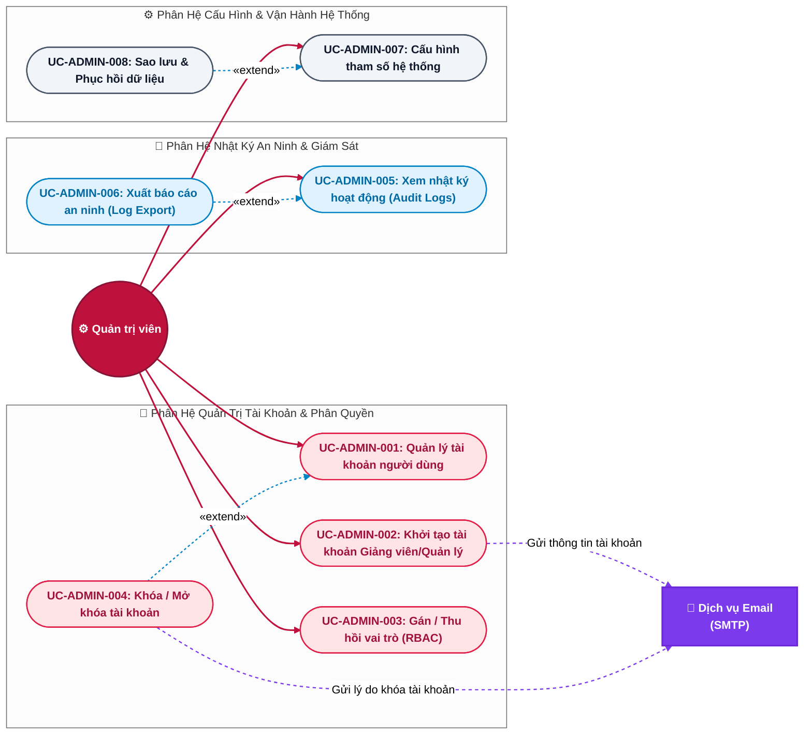

# ⚙️ Đặc Tả Use Case — Tác Nhân: Quản Trị Viên (System Admin)

> **Tài liệu:** Sơ đồ Use Case chi tiết & Bảng đặc tả kịch bản (Specification) dành riêng cho Quản trị viên hệ thống.  
> **Áp dụng cho:** Hệ thống EduVerse (LMS)

---

## 1. Sơ đồ Use Case Chi Tiết (System Admin Use Case Diagram)

Sơ đồ thể hiện toàn bộ các hành vi của **Quản trị viên**, tập trung vào quản lý người dùng, phân quyền vai trò (RBAC), giám sát nhật ký an ninh (Audit Logs) và cấu hình vận hành hệ thống:

---

## 2. Bảng Danh Mục Use Case của Quản Trị Viên

| Mã UC | Tên Use Case | Phân hệ | Mức độ chi tiết | Nghiệp vụ cốt lõi |
|---|---|---|:---:|---|
| **UC-ADMIN-001** | Quản lý tài khoản người dùng | Quản trị User | ⭐⭐⭐ Chi tiết | Tìm kiếm, xem chi tiết, lọc tài khoản toàn trường |
| **UC-ADMIN-002** | Khởi tạo tài khoản Giảng viên / Quản lý | Quản trị User | ⭐⭐⭐ Chi tiết | Cấp tài khoản nhân sự, phân vai trò, gửi mật khẩu tạm |
| **UC-ADMIN-003** | Gán / Thu hồi vai trò (RBAC) | Quản trị User | ⭐⭐ Vắn tắt | Thay đổi quyền: `student`, `teacher`, `manager`, `admin` |
| **UC-ADMIN-004** | Khóa / Mở khóa tài khoản | Quản trị User | ⭐⭐ Vắn tắt | Khóa tài khoản vi phạm chính sách hoặc mở lại khi hết hạn |
| **UC-ADMIN-005** | Xem nhật ký hoạt động (Audit Logs) | Giám sát | ⭐⭐⭐ Chi tiết | Truy vết lịch sử đăng nhập, thay đổi dữ liệu, hành vi nhạy cảm |
| **UC-ADMIN-006** | Xuất báo cáo an ninh (Log Export) | Giám sát | ⭐⭐ Vắn tắt | Tải file log dạng CSV/JSON phục vụ thanh tra an toàn |
| **UC-ADMIN-007** | Cấu hình tham số hệ thống | Vận hành | ⭐⭐ Vắn tắt | Cài đặt giới hạn dung lượng upload, API Gemini Key, SMTP |
| **UC-ADMIN-008** | Sao lưu & Phục hồi dữ liệu | Vận hành | ⭐⭐ Vắn tắt | Tạo bản sao lưu Snapshot Database PostgreSQL & tài liệu S3 |

---

## 3. Đặc Tả Chi Tiết Các Use Case Cốt Lõi (Detailed Specifications)

---

### 📄 UC-ADMIN-001: Quản lý tài khoản người dùng (User Account Management)

- **Tác nhân:** Quản trị viên (System Admin)
- **Mục đích:** Tra cứu, kiểm tra danh tính và theo dõi tình trạng hoạt động của toàn bộ tài khoản trong hệ sinh thái EduVerse.
- **Điều kiện tiên quyết:** Quản trị viên đã đăng nhập thành công với vai trò `admin`.
- **Điều kiện sau:** Danh sách tài khoản được hiển thị với dữ liệu thời gian thực; có thể thực hiện các thao tác quản trị tiếp theo.

#### Luồng sự kiện chính (Main Flow):
1. Admin chọn mục **"Quản trị tài khoản"** trên thanh menu quản trị.
2. Hệ thống hiển thị bảng danh sách toàn bộ người dùng kèm bộ lọc nâng cao:
   - Tìm kiếm theo: Họ tên, Email, Số điện thoại.
   - Lọc theo Vai trò: `student`, `teacher`, `manager`, `admin`.
   - Lọc theo Trạng thái: `active` (Hoạt động), `unverified` (Chưa kích hoạt email), `blocked` (Bị khóa).
3. Admin nhập từ khóa hoặc chọn tiêu chí lọc và nhấn **"Tìm kiếm"**.
4. Hệ thống truy vấn cơ sở dữ liệu và trả về danh sách phân trang (mỗi trang 20 bản ghi).
5. Admin nhấp chọn một người dùng cụ thể để xem chi tiết.
6. Hệ thống hiển thị modal **Hồ sơ tài khoản chuyên sâu**:
   - Thông tin cá nhân: Họ tên, Email, Ngày đăng ký, Lần đăng nhập gần nhất, Địa chỉ IP gần nhất.
   - Danh sách các lớp học / khóa học đang tham gia hoặc phụ trách.
   - Trạng thái xác thực email (`email_verified`).
   - Lịch sử vi phạm hoặc cảnh báo (nếu có).
7. Admin xem xét và có thể chọn thực hiện các thao tác: *Chỉnh sửa thông tin*, *Đổi vai trò* (`UC-ADMIN-003`), hoặc *Khóa tài khoản* (`UC-ADMIN-004`).

#### Luồng phụ / Ngoại lệ:
- **Không tìm thấy kết quả:** Hệ thống hiển thị thông báo: *"Không tìm thấy người dùng phù hợp với tiêu chí tìm kiếm"*.
- **Tài khoản tự thao tác chính mình:** Admin không được phép tự khóa hoặc tự tước quyền Admin của chính tài khoản mình đang đăng nhập.

---

### 📄 UC-ADMIN-002: Khởi tạo tài khoản Giảng viên / Quản lý (Provision Staff Account)

- **Tác nhân:** Quản trị viên (Primary), Giảng viên / Quản lý mới (Secondary - nhận tài khoản)
- **Mục đích:** Tạo mới các tài khoản nhân sự có đặc quyền cao (`teacher`, `manager`), thiết lập thông tin ban đầu và gửi thông tin đăng nhập bảo mật qua email.
- **Điều kiện tiên quyết:** Admin đã đăng nhập; Có thông tin hợp lệ của nhân sự mới được nhà trường tiếp nhận.
- **Điều kiện sau:** Tài khoản mới được tạo trong cơ sở dữ liệu với trạng thái kích hoạt sẵn (`is_active = true`, `email_verified = true`); Mật khẩu tạm thời được gửi qua email.

#### Luồng sự kiện chính (Main Flow):
1. Admin truy cập trang quản lý người dùng và nhấn nút **"Thêm tài khoản nhân sự"**.
2. Hệ thống hiển thị biểu mẫu tạo tài khoản:
   - Họ và tên nhân sự.
   - Email cơ quan / công vụ.
   - Số điện thoại.
   - Vai trò được cấp: `teacher` (Giảng viên) hoặc `manager` (Quản lý đào tạo).
   - Đơn vị / Khoa chuyên môn trực thuộc.
3. Admin điền đầy đủ thông tin và nhấn **"Tạo tài khoản & Gửi email"**.
4. Hệ thống kiểm tra dữ liệu:
   - Email đúng định dạng và chưa tồn tại trong bảng `Users`.
   - Họ tên không được để trống.
5. Hệ thống tự động sinh một mật khẩu ngẫu nhiên an toàn (gồm 12 ký tự: chữ hoa, chữ thường, số và ký tự đặc biệt).
6. Hệ thống mã hóa mật khẩu bằng thuật toán `bcrypt` và lưu bản ghi User mới vào cơ sở dữ liệu với cờ bắt buộc đổi mật khẩu lần đầu (`require_password_change = true`).
7. Hệ thống gọi Dịch vụ Email (SMTP) gửi thư chào mừng đến email nhân sự:
   - Nội dung thư gồm: Tên tài khoản (Email), Mật khẩu tạm thời, Liên kết đăng nhập vào hệ thống EduVerse, và hướng dẫn đổi mật khẩu trong lần đăng nhập đầu tiên.
8. Hệ thống ghi nhận hành động tạo tài khoản vào nhật ký an ninh (`AuditLog`).
9. Hệ thống thông báo: *"Khởi tạo tài khoản cho [Tên nhân sự] thành công! Thông tin đăng nhập đã được gửi tới email"*.

#### Luồng phụ / Ngoại lệ:
- **4a. Email đã tồn tại:** Hệ thống thông báo lỗi: *"Email [email] đã được đăng ký trong hệ thống. Vui lòng kiểm tra lại"* $\rightarrow$ quay lại bước 3.
- **7a. Gửi email thất bại (Lỗi SMTP):** Hệ thống tạo tài khoản thành công nhưng hiển thị cảnh báo: *"Tài khoản đã tạo nhưng gửi email thất bại. Đây là mật khẩu tạm thời của nhân sự: [Mật khẩu]"* để Admin sao chép gửi thủ công.

---

### 📄 UC-ADMIN-005: Xem nhật ký hoạt động hệ thống (System Audit Logs)

- **Tác nhân:** Quản trị viên
- **Mục đích:** Giám sát toàn bộ các hành vi nghiệp vụ nhạy cảm trên hệ thống (ai làm gì, vào lúc nào, từ địa chỉ IP nào) nhằm phát hiện kịp thời các hành vi bất thường, gian lận hoặc vi phạm an ninh dữ liệu.
- **Điều kiện tiên quyết:** Admin đã đăng nhập hệ thống.
- **Điều kiện sau:** Lịch sử thao tác được hiển thị minh bạch, không thể bị chỉnh sửa hay xóa bởi người dùng thường.

#### Luồng sự kiện chính (Main Flow):
1. Admin truy cập mục **"Nhật ký an ninh (Audit Logs)"** trên thanh điều hướng.
2. Hệ thống hiển thị bảng nhật ký gồm các trường thông tin:
   - Thời gian thực (Timestamp).
   - Tác nhân thực hiện (User ID, Tên, Email, Vai trò).
   - Hành động (Action, ví dụ: `LOGIN_FAILED`, `COURSE_APPROVED`, `USER_BLOCKED`, `GRADE_MODIFIED`).
   - Đối tượng bị tác động (Target Entity: Khóa học X, Bài thi Y, Học viên Z).
   - Địa chỉ IP Client và User Agent (Thiết bị/Trình duyệt).
   - Trạng thái kết quả: `SUCCESS` (Thành công) hoặc `FAILURE` (Thất bại/Lỗi).
3. Admin sử dụng bộ lọc để điều tra sự cố:
   - Lọc theo loại hành vi (Xác thực, Thay đổi điểm, Kiểm duyệt, Quản trị).
   - Lọc theo khoảng thời gian cụ thể (ví dụ: trong 24 giờ qua).
   - Lọc theo mức độ nghiêm trọng: `INFO`, `WARNING`, `DANGER`.
4. Admin nhấp vào một dòng nhật ký để xem chi tiết payload dữ liệu trước và sau khi thay đổi (Diff JSON).
5. Hệ thống hiển thị đối sánh dữ liệu cũ và mới để Admin nắm rõ sự can thiệp.

#### Luồng phụ / Ngoại lệ:
- **Phát hiện dấu hiệu tấn công (Brute Force):** Nếu hệ thống ghi nhận một IP có hơn 10 lần `LOGIN_FAILED` trong 5 phút, dòng log được gắn cờ `DANGER` màu đỏ kèm nút *"Khóa tạm thời IP này"*.

---

## 4. Đặc Tả Tóm Tắt Các Use Case Còn Lại (Brief Specifications)

### 🔹 UC-ADMIN-003: Gán / Thu hồi vai trò (Role-Based Access Control - RBAC)
- **Kịch bản:** Khi một nhân sự thay đổi nhiệm vụ (ví dụ: Giảng viên được bổ nhiệm kiêm nhiệm Quản lý đào tạo) $\rightarrow$ Admin mở hồ sơ tài khoản $\rightarrow$ Chọn mục "Phân quyền vai trò" $\rightarrow$ Tích chọn thêm vai trò `manager` hoặc gỡ bỏ vai trò cũ $\rightarrow$ Hệ thống cập nhật bảng `UserRoles` $\rightarrow$ Phiên làm việc tiếp theo của người dùng sẽ được cập nhật quyền hạn tương ứng.

### 🔹 UC-ADMIN-004: Khóa / Mở khóa tài khoản (Block / Unblock User)
- **Kịch bản:** Khi phát hiện học viên có hành vi gian lận thi cử hoặc tài khoản bị lộ lọt mật khẩu $\rightarrow$ Admin nhấn nút **"Khóa tài khoản"** $\rightarrow$ Hệ thống yêu cầu nhập lý do khóa (ví dụ: *"Vi phạm nội quy thi cử - Đình chỉ 1 kỳ"*) $\rightarrow$ Hệ thống đặt cờ `is_blocked = true`, lập tức vô hiệu hóa JWT Token hiện tại (đá người dùng ra khỏi hệ thống) $\rightarrow$ Hệ thống tự động gửi email thông báo lý do khóa tới người dùng.

### 🔹 UC-ADMIN-006: Xuất báo cáo an ninh (Audit Log Export)
- **Kịch bản:** Tại màn hình Audit Logs (`UC-ADMIN-005`), Admin nhấn nút **"Xuất nhật ký"** $\rightarrow$ Chọn phạm vi ngày tháng cần xuất $\rightarrow$ Chọn định dạng `.csv` hoặc `.json` $\rightarrow$ Hệ thống mã hóa và nén file nhật ký $\rightarrow$ Tải về máy Admin để phục vụ công tác thanh tra độc lập hoặc kiểm toán an toàn thông tin.

### 🔹 UC-ADMIN-007: Cấu hình tham số hệ thống (System Settings)
- **Kịch bản:** Admin vào trang cấu hình $\rightarrow$ Thiết lập các biến môi trường và chính sách vận hành của nền tảng EduVerse gồm:
  - Cấu hình SMTP Email (Host, Port, User, Password).
  - Cấu hình AI Service (Google Gemini API Key, Model name: `gemini-1.5-flash`).
  - Giới hạn dung lượng tải lên file bài tập (Mặc định 50MB).
  - Cấu hình thời gian hết hạn của Access Token (15 phút) và Refresh Token (7 ngày).
  $\rightarrow$ Nhấn **"Lưu cấu hình"** $\rightarrow$ Hệ thống xác thực và cập nhật ngay vào bảng cấu hình hệ thống mà không cần khởi động lại server.

### 🔹 UC-ADMIN-008: Sao lưu & Phục hồi dữ liệu (Backup & Restore)
- **Kịch bản:** Admin thiết lập lịch tự động sao lưu cơ sở dữ liệu PostgreSQL vào 02:00 sáng hàng ngày lên AWS S3 Glacier $\rightarrow$ Có thể bấm nút **"Sao lưu ngay (Manual Snapshot)"** trước khi tiến hành cập nhật hệ thống $\rightarrow$ Trong trường hợp xảy ra sự cố, Admin có quyền chọn bản sao lưu an toàn gần nhất và kích hoạt quy trình phục hồi dữ liệu (Restore).
