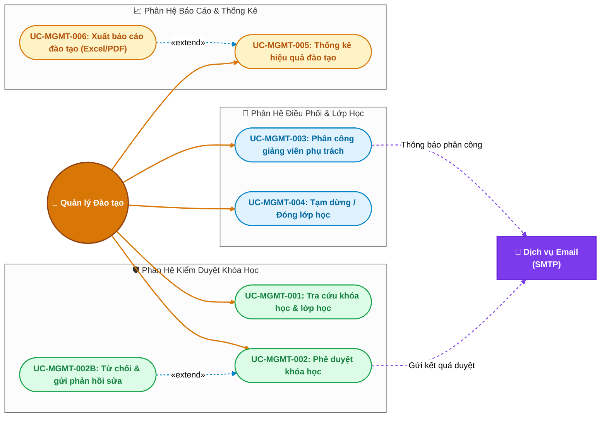

# 👔 Đặc Tả Use Case — Tác Nhân: Quản Lý Đào Tạo (Training Manager)

> **Tài liệu:** Sơ đồ Use Case chi tiết & Bảng đặc tả kịch bản (Specification) dành riêng cho Quản lý Đào tạo.  
> **Áp dụng cho:** Hệ thống EduVerse (LMS)

---

## 1. Sơ đồ Use Case Chi Tiết (Training Manager Use Case Diagram)

Sơ đồ thể hiện toàn bộ các hành vi của **Quản lý Đào tạo**, tập trung vào quy trình kiểm duyệt chất lượng nội dung, điều phối nhân sự giảng dạy và giám sát hiệu quả đào tạo:

---

## 2. Bảng Danh Mục Use Case của Quản Lý Đào Tạo

| Mã UC | Tên Use Case | Phân hệ | Mức độ chi tiết | Nghiệp vụ cốt lõi |
|---|---|---|:---:|---|
| **UC-MGMT-001** | Tra cứu toàn bộ khóa học & lớp học | Kiểm duyệt | ⭐⭐ Vắn tắt | Xem danh mục toàn trường, lọc theo trạng thái, giảng viên |
| **UC-MGMT-002** | Phê duyệt khóa học | Kiểm duyệt | ⭐⭐⭐ Chi tiết | Thẩm định nội dung đề cương, duyệt xuất bản (`published`) |
| **UC-MGMT-002B**| Từ chối & yêu cầu chỉnh sửa | Kiểm duyệt | ⭐⭐ Vắn tắt | Gửi phản hồi ghi rõ lý do chưa đạt để giảng viên bổ sung |
| **UC-MGMT-003** | Phân công Giảng viên phụ trách | Điều phối | ⭐⭐⭐ Chi tiết | Gán hoặc thay đổi giảng viên chủ nhiệm/giảng dạy lớp học |
| **UC-MGMT-004** | Tạm dừng / Đóng lớp học | Điều phối | ⭐⭐ Vắn tắt | Khóa truy cập lớp học vi phạm hoặc lớp đã kết thúc kỳ học |
| **UC-MGMT-005** | Thống kê hiệu quả đào tạo | Báo cáo | ⭐⭐⭐ Chi tiết | Dashboard tổng quan: số lớp, tỷ lệ hoàn thành, điểm trung bình |
| **UC-MGMT-006** | Xuất báo cáo đào tạo (Excel/PDF) | Báo cáo | ⭐⭐ Vắn tắt | Tải báo cáo phục vụ họp giao ban học vụ hoặc thanh tra |

---

## 3. Đặc Tả Chi Tiết Các Use Case Cốt Lõi (Detailed Specifications)

---

### 📄 UC-MGMT-002: Phê duyệt khóa học (Course Review & Approval)

- **Tác nhân:** Quản lý Đào tạo (Primary), Giảng viên biên soạn (Secondary - nhận kết quả)
- **Mục đích:** Thẩm định chất lượng chương trình học, tính hợp lệ của video/tài liệu bài giảng do Giảng viên gửi lên; quyết định cho phép khóa học được chính thức xuất bản trên hệ thống.
- **Điều kiện tiên quyết:** Quản lý đào tạo đã đăng nhập; Khóa học đang ở trạng thái `pending_approval` (Chờ duyệt).
- **Điều kiện sau:** Khóa học chuyển trạng thái thành `published` (Được duyệt) hoặc `rejected` (Bị từ chối); Giảng viên nhận được email thông báo kết quả.

#### Luồng sự kiện chính (Main Flow):
1. Quản lý Đào tạo truy cập mục **"Kiểm duyệt khóa học"** trên thanh điều hướng.
2. Hệ thống hiển thị danh sách các khóa học đang chờ duyệt (`status = pending_approval`), sắp xếp theo thứ tự thời gian gửi từ cũ đến mới.
3. Quản lý chọn một khóa học cần thẩm định.
4. Hệ thống mở giao diện **Thẩm định khóa học (Inspection View)**, cho phép xem:
   - Thông tin chung: Tiêu đề, Mục tiêu đào tạo, Cấp độ, Ảnh bìa.
   - Cây cấu trúc đề cương: Các chương, danh sách bài học, thời lượng.
   - Nội dung chi tiết từng bài học: Văn bản bài giảng, xem trước video đính kèm, tải thử tài liệu PDF.
   - Các bài kiểm tra trắc nghiệm gắn kèm.
5. Quản lý Đào tạo kiểm tra chất lượng và thấy nội dung đạt chuẩn quy định đào tạo.
6. Quản lý nhấn nút **"Phê duyệt & Xuất bản"**.
7. Hệ thống hiển thị hộp thoại xác nhận: *"Bạn có chắc chắn muốn xuất bản khóa học [Tên khóa học]? Sau khi xuất bản, giảng viên có thể mở lớp từ khóa học này."*
8. Quản lý xác nhận đồng ý.
9. Hệ thống cập nhật trạng thái khóa học sang `published`, ghi nhận thời gian duyệt và `manager_id` của người duyệt.
10. Hệ thống gọi Dịch vụ Email (SMTP) gửi thư chúc mừng tới Giảng viên biên soạn.
11. Hệ thống thông báo: *"Khóa học đã được phê duyệt và xuất bản thành công!"*.

#### Luồng phụ / Ngoại lệ (Alternative & Exception Flows):
- **6a. Nội dung không đạt chuẩn (`UC-MGMT-002B`):**
  1. Quản lý nhấn nút **"Từ chối / Yêu cầu chỉnh sửa"**.
  2. Hệ thống hiển thị form nhập: *"Lý do từ chối & Yêu cầu chỉnh sửa"* (bắt buộc nhập tối thiểu 20 ký tự, ví dụ: *"Bài 3 thiếu tài liệu đính kèm, video bài 5 bị lỗi âm thanh"*).
  3. Quản lý nhập lý do và bấm xác nhận gửi.
  4. Hệ thống cập nhật trạng thái khóa học về `rejected` hoặc `draft`, lưu log phản hồi vào cơ sở dữ liệu.
  5. Hệ thống gửi email thông báo chi tiết lý do từ chối tới Giảng viên để họ chỉnh sửa và nộp lại sau.

---

### 📄 UC-MGMT-003: Phân công Giảng viên phụ trách lớp học (Assign Teacher to Class)

- **Tác nhân:** Quản lý Đào tạo (Primary), Giảng viên được phân công (Secondary)
- **Mục đích:** Chỉ định một hoặc nhiều Giảng viên chịu trách nhiệm quản lý, giảng dạy và chấm điểm cho một lớp học cụ thể.
- **Điều kiện tiên quyết:** Lớp học đã được tạo trong hệ thống; Giảng viên có tài khoản `teacher` đang hoạt động.
- **Điều kiện sau:** Quyền quản lý lớp học được chuyển giao/gán cho giảng viên được chỉ định; Giảng viên thấy lớp học xuất hiện trên trang quản lý của mình.

#### Luồng sự kiện chính (Main Flow):
1. Quản lý Đào tạo truy cập vào mục **"Quản lý lớp học"** và chọn lớp học cần phân công.
2. Hệ thống hiển thị thông tin lớp: Tên lớp, Khóa học gốc, Số lượng học viên, và Giảng viên phụ trách hiện tại (hoặc đang để trống `Chưa phân công`).
3. Quản lý nhấn nút **"Phân công Giảng viên"**.
4. Hệ thống hiển thị modal tìm kiếm giảng viên:
   - Cho phép tìm kiếm theo Tên, Email, hoặc Chuyên môn.
   - Hiển thị danh sách các giảng viên khả dụng kèm thông tin số lớp họ đang phụ trách để tránh quá tải.
5. Quản lý chọn một giảng viên từ danh sách.
6. Quản lý có thể chọn vai trò phụ trách: *Giảng viên chính* (Chịu trách nhiệm toàn bộ) hoặc *Trợ giảng* (Hỗ trợ chấm bài).
7. Quản lý nhấn **"Xác nhận phân công"**.
8. Hệ thống cập nhật `teacher_id` trong bảng `Class` và lưu lịch sử phân công vào bảng `ClassAssignmentLog`.
9. Hệ thống gửi thông báo trong ứng dụng (In-app Notification) và Email tới Giảng viên: *"Bạn đã được phân công phụ trách lớp học [Tên lớp]"*.
10. Hệ thống hiển thị thông báo thành công và cập nhật tên giảng viên mới trên giao diện lớp học.

#### Luồng phụ / Ngoại lệ:
- **Thay đổi giảng viên giữa kỳ:** Nếu lớp học đang diễn ra mà cần đổi giảng viên (ví dụ: giảng viên cũ nghỉ ốm), Quản lý chọn giảng viên mới và hệ thống sẽ hiển thị cảnh báo: *"Lớp học đang có [X] học viên. Mọi dữ liệu bài tập và điểm số hiện tại sẽ được bàn giao cho giảng viên mới"*.

---

### 📄 UC-MGMT-005: Thống kê hiệu quả đào tạo (Training Analytics & Dashboard)

- **Tác nhân:** Quản lý Đào tạo
- **Mục đích:** Theo dõi tổng quan các chỉ số sức khỏe đào tạo của toàn bộ trung tâm/nhà trường theo thời gian thực (Real-time Analytics).
- **Điều kiện tiên quyết:** Quản lý đào tạo đã đăng nhập hệ thống.
- **Điều kiện sau:** Dữ liệu thống kê được tổng hợp và biểu diễn dưới dạng biểu đồ trực quan.

#### Luồng sự kiện chính (Main Flow):
1. Quản lý chọn mục **"Báo cáo & Thống kê"** trên menu chính.
2. Hệ thống hiển thị bảng Dashboard với bộ lọc: Khoảng thời gian (Tháng này / Quý này / Năm nay / Tùy chọn), Danh mục môn học, hoặc Giảng viên cụ thể.
3. Hệ thống tổng hợp và trực quan hóa các nhóm chỉ số:
   - **Chỉ số quy mô:** Tổng số khóa học đang xuất bản, Tổng số lớp học đang mở, Tổng số học viên đang hoạt động.
   - **Chỉ số học tập:** Tỷ lệ học viên hoàn thành khóa học trung bình (Completion Rate %), Thời gian học trung bình mỗi ngày.
   - **Chỉ số đánh giá:** Phổ điểm trung bình của các bài kiểm tra Quiz và bài tập lớn (Tỷ lệ Xuất sắc / Giỏi / Khá / Trung bình / Yếu).
   - **Cảnh báo học tập:** Danh sách các lớp học có tỷ lệ học viên bỏ dở cao (> 30%) để kịp thời can thiệp.
4. Quản lý có thể nhấp vào từng biểu đồ để xem chi tiết danh sách học viên hoặc lớp học tương ứng.

#### Luồng phụ / Ngoại lệ:
- **Khoảng thời gian không có dữ liệu:** Hệ thống hiển thị thông báo rỗng thân thiện: *"Không có dữ liệu đào tạo trong khoảng thời gian đã chọn"* và đề xuất mở rộng phạm vi ngày.

---

## 4. Đặc Tả Tóm Tắt Các Use Case Còn Lại (Brief Specifications)

### 🔹 UC-MGMT-001: Tra cứu khóa học & lớp học toàn trường
- **Kịch bản:** Quản lý truy cập trang tra cứu $\rightarrow$ Sử dụng bộ lọc đa tiêu chí (Lọc theo Trạng thái: Nháp/Chờ duyệt/Đã duyệt; Lọc theo Giảng viên tạo; Tìm theo từ khóa tên khóa học) $\rightarrow$ Hệ thống hiển thị danh sách kết quả dạng bảng kèm phân trang và số liệu tóm tắt.

### 🔹 UC-MGMT-004: Tạm dừng / Đóng lớp học (Pause / Close Class)
- **Kịch bản:** Khi một lớp học đã hết thời gian đào tạo hoặc vi phạm quy chế $\rightarrow$ Quản lý chọn chức năng "Đổi trạng thái lớp" $\rightarrow$ Chọn trạng thái: `Tạm dừng` (Tạm khóa truy cập của học viên và giảng viên) hoặc `Đã kết thúc` (Chuyển sang chế độ chỉ xem - Read-only để lưu trữ hồ sơ) $\rightarrow$ Hệ thống cập nhật trạng thái lớp và gửi thông báo tới các thành viên trong lớp.

### 🔹 UC-MGMT-006: Xuất báo cáo đào tạo (Export Training Report)
- **Kịch bản:** Tại trang thống kê (`UC-MGMT-005`), Quản lý nhấn nút **"Xuất báo cáo"** $\rightarrow$ Chọn loại báo cáo: *Báo cáo tổng kết kỳ học* hoặc *Bảng điểm chi tiết toàn trường* $\rightarrow$ Chọn định dạng `.xlsx` hoặc `.pdf` $\rightarrow$ Hệ thống kết xuất dữ liệu và tải file báo cáo đã được định dạng chuẩn tiêu đề, bảng biểu về máy tính.
