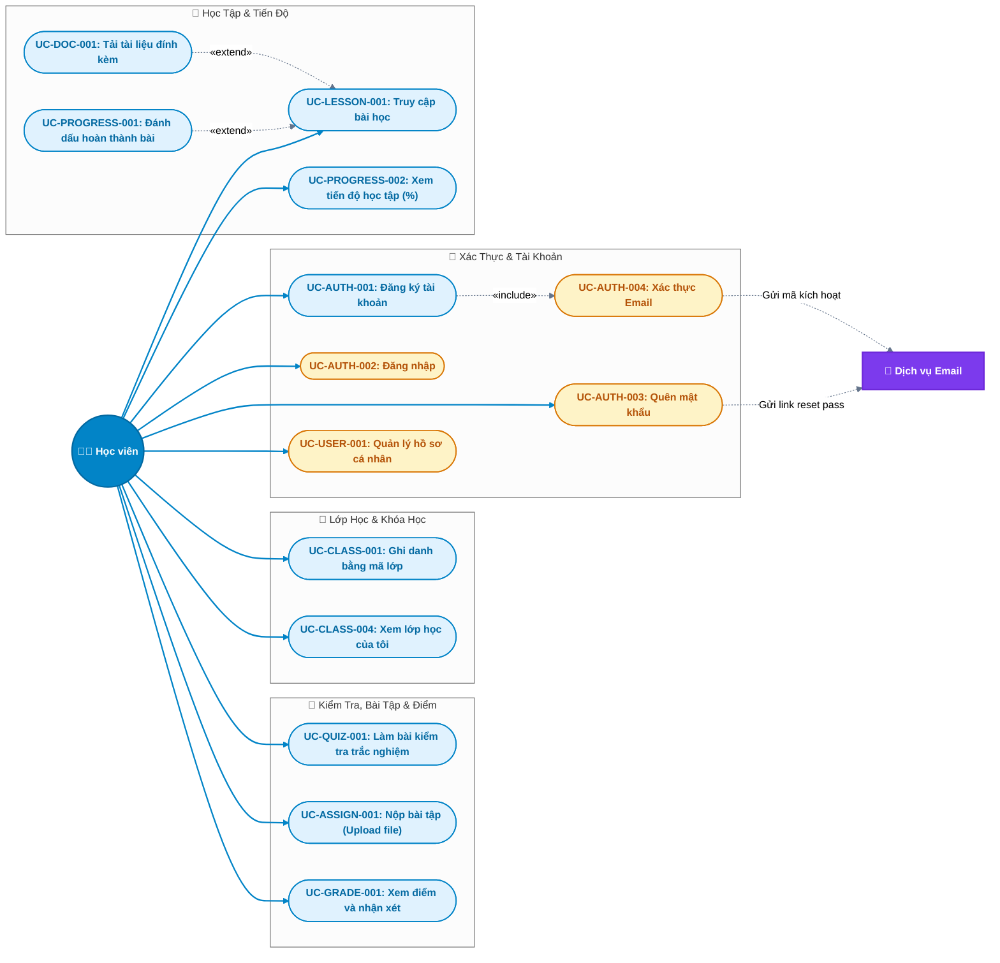

# 🧑‍🎓 Đặc Tả Use Case — Tác Nhân: Học Viên (Student)

> **Tài liệu:** Sơ đồ Use Case chi tiết & Bảng đặc tả kịch bản (Specification) dành riêng cho Học viên.  
> **Áp dụng cho:** Hệ thống EduVerse (LMS)

---

## 1. Sơ đồ Use Case Chi Tiết (Student Use Case Diagram)

Sơ đồ thể hiện toàn bộ các hành vi của **Học viên**, kèm theo các quan hệ phụ thuộc `«include»` (bắt buộc) và `«extend»` (mở rộng khi cần):

---

## 2. Bảng Danh Mục Use Case của Học Viên

| Mã UC | Tên Use Case | Mức độ chi tiết | Nghiệp vụ cốt lõi |
|---|---|---|---|
| **UC-AUTH-001** | Đăng ký tài khoản học viên | ⭐⭐⭐ Chi tiết | Form đăng ký, mã kích hoạt email |
| **UC-AUTH-002** | Đăng nhập hệ thống | ⭐⭐⭐ Chi tiết | Xác thực JWT, phân quyền vai trò |
| **UC-AUTH-003** | Quên / Đặt lại mật khẩu | ⭐⭐ Vắn tắt | Gửi mã xác nhận qua email |
| **UC-AUTH-004** | Xác thực Email | ⭐⭐ Vắn tắt | Kiểm tra token xác nhận kích hoạt |
| **UC-USER-001** | Quản lý hồ sơ cá nhân | ⭐⭐ Vắn tắt | Cập nhật tên, ảnh đại diện, đổi mật khẩu |
| **UC-CLASS-001** | Ghi danh vào lớp học bằng mã | ⭐⭐⭐ Chi tiết | Nhập class code để tham gia lớp |
| **UC-CLASS-004** | Xem danh sách lớp đã tham gia | ⭐⭐ Vắn tắt | Hiển thị dashboard các lớp của mình |
| **UC-LESSON-001** | Truy cập & học nội dung bài | ⭐⭐⭐ Chi tiết | Xem bài giảng text/video, cây cấu trúc |
| **UC-DOC-001** | Tải tài liệu đính kèm | ⭐⭐ Vắn tắt | Download file PDF/Slide từ S3 |
| **UC-PROGRESS-001**| Đánh dấu hoàn thành bài học | ⭐⭐ Vắn tắt | Cập nhật trạng thái hoàn thành |
| **UC-PROGRESS-002**| Xem tiến độ học tập (%) | ⭐⭐ Vắn tắt | Thanh tiến độ tổng kết khóa học |
| **UC-QUIZ-001** | Làm bài kiểm tra trắc nghiệm | ⭐⭐⭐ Chi tiết | Đồng hồ đếm ngược, tự động chấm điểm |
| **UC-ASSIGN-001** | Nộp bài tập (Upload file) | ⭐⭐⭐ Chi tiết | Upload file bài làm lên S3, gia hạn |
| **UC-GRADE-001** | Xem bảng điểm và nhận xét | ⭐⭐ Vắn tắt | Xem điểm số, lời phê của giảng viên |

---

## 3. Đặc Tả Chi Tiết Các Use Case Cốt Lõi (Detailed Specifications)

---

### 📄 UC-AUTH-001: Đăng ký tài khoản học viên

- **Tác nhân:** Khách (chưa đăng nhập) / Học viên tương lai
- **Mục đích:** Tạo một tài khoản học viên mới trên nền tảng EduVerse để tham gia các lớp học.
- **Điều kiện tiên quyết (Pre-conditions):** Người dùng chưa đăng nhập.
- **Điều kiện sau (Post-conditions):** Tài khoản được tạo ở trạng thái `chờ xác thực` (`is_active = false`), email xác thực được gửi đến hòm thư người dùng.

#### Luồng sự kiện chính (Main Flow):
1. Người dùng chọn nút **"Đăng ký"** trên thanh điều hướng.
2. Hệ thống hiển thị biểu mẫu đăng ký gồm: Họ và tên, Email, Mật khẩu, Nhập lại mật khẩu.
3. Người dùng nhập đầy đủ thông tin hợp lệ và nhấn **"Tạo tài khoản"**.
4. Hệ thống kiểm tra dữ liệu:
   - Email đúng định dạng và chưa tồn tại trong cơ sở dữ liệu.
   - Mật khẩu tối thiểu 8 ký tự, bao gồm chữ và số.
   - Mật khẩu nhập lại trùng khớp.
5. Hệ thống mã hóa mật khẩu (`bcrypt`), tạo bản ghi User mới với vai trò `student` và trạng thái `is_active = false`.
6. Hệ thống tạo mã xác thực (Token) có thời hạn 24 giờ và gọi Dịch vụ Email gửi liên kết kích hoạt đến email người dùng.
7. Hệ thống thông báo: *"Đăng ký thành công! Vui lòng kiểm tra email để kích hoạt tài khoản"*.

#### Luồng phụ / Ngoại lệ (Alternative & Exception Flows):
- **4a. Email đã tồn tại:** Hệ thống báo lỗi *"Email này đã được sử dụng. Vui lòng đăng nhập hoặc dùng email khác"* $\rightarrow$ quay lại bước 3.
- **4b. Dữ liệu không hợp lệ:** Hệ thống báo lỗi chi tiết dưới từng ô nhập liệu (ví dụ: *"Mật khẩu không khớp"*, *"Email không đúng định dạng"*) $\rightarrow$ quay lại bước 3.
- **6a. Gửi email thất bại:** Hệ thống ghi log lỗi, thông báo *"Không thể gửi email xác thực lúc này, vui lòng thử lại sau"*.

---

### 📄 UC-AUTH-002: Đăng nhập hệ thống

- **Tác nhân:** Học viên (và các vai trò khác)
- **Mục đích:** Xác thực danh tính để vào hệ thống học tập.
- **Điều kiện tiên quyết:** Đã có tài khoản và đã kích hoạt email.
- **Điều kiện sau:** Nhận được Access Token + Refresh Token (JWT), lưu phiên đăng nhập và chuyển hướng vào Dashboard học tập.

#### Luồng sự kiện chính (Main Flow):
1. Người dùng chọn **"Đăng nhập"**.
2. Hệ thống hiển thị form đăng nhập: Email và Mật khẩu.
3. Người dùng nhập thông tin và bấm **"Đăng nhập"**.
4. Hệ thống tìm kiếm tài khoản theo email:
   - Kiểm tra tài khoản có tồn tại không.
   - Kiểm tra mật khẩu khớp với hash trong cơ sở dữ liệu.
   - Kiểm tra tài khoản đã xác thực email (`email_verified = true`).
   - Kiểm tra tài khoản không bị khóa (`is_blocked = false`).
5. Hệ thống sinh cặp khóa JWT (Access Token hạn ngắn, Refresh Token hạn dài).
6. Hệ thống lưu Refresh Token vào database / cookie an toàn, trả Access Token về cho Frontend.
7. Frontend lưu trữ token và điều hướng Học viên vào trang tổng quan lớp học cá nhân.

#### Luồng phụ / Ngoại lệ:
- **4a. Sai email hoặc mật khẩu:** Hệ thống báo *"Email hoặc mật khẩu không chính xác"* (không chỉ rõ sai email hay mật khẩu để đảm bảo bảo mật).
- **4b. Tài khoản chưa xác thực email:** Hệ thống thông báo *"Tài khoản chưa được kích hoạt, vui lòng kiểm tra email của bạn"* và cung cấp nút *"Gửi lại email kích hoạt"*.
- **4c. Tài khoản bị quản trị viên khóa:** Hệ thống báo *"Tài khoản của bạn đã bị tạm khóa. Vui lòng liên hệ quản trị viên"*.

---

### 📄 UC-CLASS-001: Ghi danh vào lớp học bằng mã (Enroll by Code)

- **Tác nhân:** Học viên
- **Mục đích:** Tham gia vào một lớp học cụ thể do giảng viên tổ chức thông qua mã tham gia (Class Code) do giảng viên cung cấp.
- **Điều kiện tiên quyết:** Học viên đã đăng nhập hệ thống.
- **Điều kiện sau:** Học viên trở thành thành viên chính thức của lớp học, xuất hiện trong danh sách lớp và có quyền truy cập toàn bộ nội dung học tập của lớp đó.

#### Luồng sự kiện chính (Main Flow):
1. Tại Dashboard, học viên bấm nút **"Tham gia lớp học mới"**.
2. Hệ thống hiển thị hộp thoại yêu cầu nhập **Mã lớp học (Class Code)** (gồm 6–8 ký tự chữ và số).
3. Học viên nhập mã lớp (ví dụ: `JAVA2026`) và bấm **"Tham gia"**.
4. Hệ thống kiểm tra mã lớp trong database:
   - Mã lớp có tồn tại hay không.
   - Lớp học đang ở trạng thái hoạt động (`active`) và chưa kết thúc.
   - Học viên chưa từng ghi danh vào lớp này trước đó.
5. Hệ thống tạo bản ghi mới trong bảng `Enrollment` liên kết giữa Học viên và Lớp học, ghi nhận thời gian ghi danh.
6. Hệ thống hiển thị thông báo: *"Ghi danh thành công vào lớp [Tên Lớp]"* và chuyển hướng học viên đến trang chi tiết của lớp học đó.

#### Luồng phụ / Ngoại lệ:
- **4a. Mã lớp không tồn tại:** Hệ thống báo *"Không tìm thấy lớp học với mã này. Vui lòng kiểm tra lại"*.
- **4b. Học viên đã ở trong lớp:** Hệ thống báo *"Bạn đã là thành viên của lớp học này rồi"* và dẫn trực tiếp vào lớp.
- **4c. Lớp học đã đóng / tạm dừng:** Hệ thống báo *"Lớp học này hiện không nhận thêm học viên"*.

---

### 📄 UC-LESSON-001: Truy cập & Học nội dung bài

- **Tác nhân:** Học viên
- **Mục đích:** Đọc tài liệu bài học, xem video hướng dẫn và theo dõi nội dung của từng chương.
- **Điều kiện tiên quyết:** Học viên đã ghi danh vào lớp học chứa bài học này.
- **Điều kiện sau:** Học viên xem được nội dung bài, trạng thái xem được ghi nhận.

#### Luồng sự kiện chính (Main Flow):
1. Học viên vào trang chi tiết Lớp học.
2. Hệ thống hiển thị thanh điều hướng cây nội dung khóa học gồm: Danh sách các Chương $\rightarrow$ Các Bài học con trong mỗi chương.
3. Học viên nhấn chọn một bài học cụ thể.
4. Hệ thống tải và hiển thị nội dung bài học:
   - Tiêu đề bài học và văn bản hướng dẫn (Rich text / Markdown / Video nhúng).
   - Danh sách tài liệu đính kèm (Slide, Source code, PDF) nếu có.
   - Trạng thái hoàn thành của bài học này (Đã xong hay Chưa xong).
5. Học viên nghiên cứu nội dung bài học.

#### Luồng phụ (Mở rộng):
- **Tải tài liệu (`«extend»` UC-DOC-001):** Học viên nhấn vào tên tài liệu đính kèm $\rightarrow$ Hệ thống sinh đường dẫn tải an toàn từ AWS S3 (Presigned URL) và tải file về máy.
- **Đánh dấu hoàn thành (`«extend»` UC-PROGRESS-001):** Học viên nhấn nút **"Đánh dấu đã hoàn thành"** $\rightarrow$ Hệ thống cập nhật trạng thái bài học thành `completed`, tính lại % tiến độ toàn khóa học và cập nhật thanh tiến độ hiển thị ngay lập tức.

---

### 📄 UC-QUIZ-001: Làm bài kiểm tra trắc nghiệm (Auto Grading)

- **Tác nhân:** Học viên
- **Mục đích:** Thực hiện bài kiểm tra trắc nghiệm trực tuyến (Multiple Choice & True/False) trong thời gian quy định và nhận điểm tự động.
- **Điều kiện tiên quyết:** Học viên thuộc lớp học, bài kiểm tra đang trong thời gian mở và học viên chưa vượt quá số lần làm bài cho phép.
- **Điều kiện sau:** Bài làm được lưu trữ, hệ thống tự động chấm điểm, cập nhật kết quả vào bảng điểm.

#### Luồng sự kiện chính (Main Flow):
1. Học viên chọn một bài kiểm tra trong danh mục bài học.
2. Hệ thống hiển thị trang tổng quan bài kiểm tra: Thời gian làm bài (ví dụ: 15 phút), Số lượng câu hỏi, Số lần làm bài còn lại, Điểm đạt.
3. Học viên nhấn **"Bắt đầu làm bài"**.
4. Hệ thống tạo phiên làm bài (`QuizAttempt`), bắt đầu đếm ngược đồng hồ và hiển thị danh sách câu hỏi.
5. Học viên chọn đáp án cho từng câu hỏi (chọn A/B/C/D hoặc Đúng/Sai).
6. Học viên nhấn nút **"Nộp bài"** (hoặc hết giờ đếm ngược hệ thống sẽ tự động nộp).
7. Hệ thống hiển thị hộp thoại xác nhận: *"Bạn có chắc chắn muốn nộp bài? Còn [X] câu chưa chọn đáp án"*.
8. Học viên xác nhận nộp.
9. Hệ thống khóa bài làm, so khớp đáp án của học viên với đáp án đúng trong ngân hàng câu hỏi:
   - Tính toán tổng số câu đúng và quy đổi ra thang điểm 10.
   - Lưu kết quả vào bảng `QuizAttempt` và bảng `Grade`.
10. Hệ thống hiển thị ngay kết quả: Điểm số đạt được, Số câu đúng/sai, và thời gian hoàn thành.

#### Luồng phụ / Ngoại lệ:
- **6a. Hết thời gian làm bài (Time out):** Đồng hồ đếm về 00:00 $\rightarrow$ Hệ thống tự động thu bài với các đáp án đã chọn tại thời điểm đó và tiến hành chấm điểm.
- **8a. Mất kết nối mạng tạm thời:** Giao diện frontend lưu tạm lựa chọn vào LocalStorage, khi có mạng trở lại sẽ đồng bộ về server.
- **Đã hết lượt làm bài:** Nút "Bắt đầu làm bài" bị vô hiệu hóa, chỉ cho phép xem lại lịch sử các lần làm trước đó.

---

### 📄 UC-ASSIGN-001: Nộp bài tập (Upload file)

- **Tác nhân:** Học viên
- **Mục đích:** Nộp sản phẩm bài làm (báo cáo PDF, mã nguồn nén ZIP/RAR) cho bài tập do giảng viên giao.
- **Điều kiện tiên quyết:** Bài tập còn trong hạn nộp hoặc được phép nộp muộn.
- **Điều kiện sau:** File bài làm được lưu trữ an toàn trên AWS S3, bản ghi nộp bài được ghi nhận với trạng thái `Đã nộp` hoặc `Nộp muộn`.

#### Luồng sự kiện chính (Main Flow):
1. Học viên mở bài tập cần nộp.
2. Hệ thống hiển thị đề bài, hướng dẫn, định dạng file cho phép, dung lượng tối đa (ví dụ: 25MB) và hạn chót nộp bài (Deadline).
3. Học viên chọn file từ máy tính hoặc kéo thả file vào khu vực upload.
4. Hệ thống kiểm tra dung lượng và định dạng file tại client.
5. Học viên nhấn **"Nộp bài"**.
6. Hệ thống gửi file lên AWS S3, nhận về URL file an toàn, lưu bản ghi vào bảng `AssignmentSubmission` gồm: File URL, tên file gốc, dung lượng, thời gian nộp bài.
7. Hệ thống so sánh thời gian nộp với Deadline:
   - Nếu trước deadline: Gán trạng thái `submitted`.
   - Nếu sau deadline: Gán trạng thái `late_submitted`.
8. Hệ thống thông báo: *"Nộp bài thành công!"* và hiển thị thông tin bài đã nộp kèm nút *"Nộp lại / Thay thế file"* (nếu còn trong hạn cho phép).

#### Luồng phụ / Ngoại lệ:
- **4a. File quá dung lượng hoặc sai định dạng:** Hệ thống từ chối nhận file và báo: *"Chỉ chấp nhận file định dạng .pdf, .zip dưới 25MB"*.
- **Hết hạn nộp tuyệt đối (Hard Deadline):** Nếu giảng viên không cho phép nộp muộn, form nộp bài sẽ bị khóa và thông báo *"Bài tập đã đóng, không nhận bài nộp nữa"*.

---

## 4. Đặc Tả Tóm Tắt Các Use Case Còn Lại (Brief Specifications)

### 🔹 UC-AUTH-003: Quên / Đặt lại mật khẩu
- **Kịch bản:** Học viên nhấn "Quên mật khẩu" tại màn hình đăng nhập $\rightarrow$ Nhập email $\rightarrow$ Hệ thống kiểm tra email và gửi link reset mật khẩu có token thời hạn 15 phút qua Gmail $\rightarrow$ Học viên bấm link, nhập mật khẩu mới 2 lần $\rightarrow$ Hệ thống cập nhật mật khẩu mới.

### 🔹 UC-USER-001: Quản lý hồ sơ cá nhân
- **Kịch bản:** Học viên vào trang Profile $\rightarrow$ Xem thông tin cá nhân $\rightarrow$ Có thể thay đổi: Tên hiển thị, Số điện thoại, Upload ảnh đại diện mới (avatar lưu trên S3), hoặc Đổi mật khẩu (cần nhập mật khẩu cũ).

### 🔹 UC-PROGRESS-002: Xem tiến độ học tập
- **Kịch bản:** Học viên truy cập trang tổng quan khóa học $\rightarrow$ Hệ thống truy vấn tổng số bài học của khóa và số bài học học viên đã hoàn thành $\rightarrow$ Hiển thị thanh tiến độ trực quan (ví dụ: `Đã hoàn thành 18/24 bài học - 75%`).

### 🔹 UC-GRADE-001: Xem bảng điểm & nhận xét
- **Kịch bản:** Học viên vào tab "Điểm số" của lớp học $\rightarrow$ Hệ thống hiển thị bảng danh sách các đầu điểm gồm: Điểm các bài Quiz trắc nghiệm, Điểm các bài tập lớn kèm lời nhận xét, góp ý chi tiết của giảng viên.
