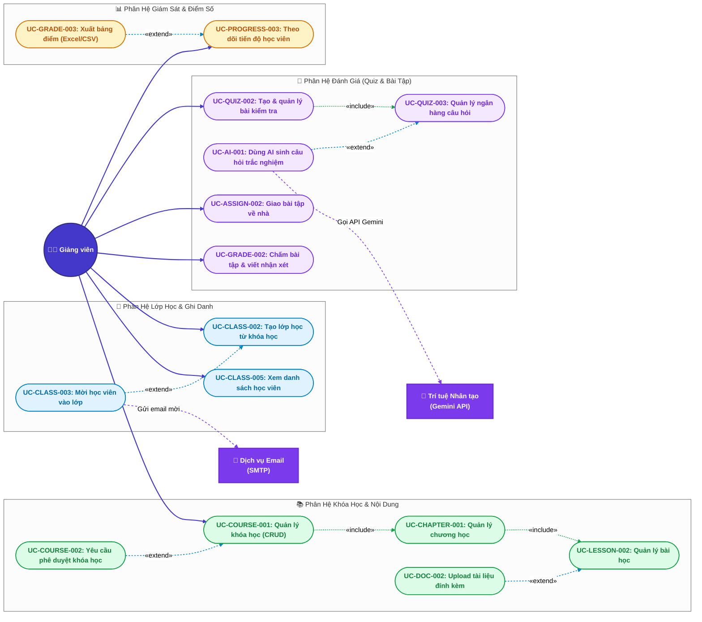

# 👨‍🏫 Đặc Tả Use Case — Tác Nhân: Giảng Viên (Teacher)

> **Tài liệu:** Sơ đồ Use Case chi tiết & Bảng đặc tả kịch bản (Specification) dành riêng cho Giảng viên.  
> **Áp dụng cho:** Hệ thống EduVerse (LMS)

---

## 1. Sơ đồ Use Case Chi Tiết (Teacher Use Case Diagram)

Sơ đồ thể hiện toàn bộ các hành vi của **Giảng viên**, kèm theo các quan hệ phụ thuộc `«include»` (bắt buộc) và `«extend»` (mở rộng khi cần):

---

## 2. Bảng Danh Mục Use Case của Giảng Viên

| Mã UC | Tên Use Case | Phân hệ | Mức độ chi tiết | Nghiệp vụ cốt lõi |
|---|---|---|:---:|---|
| **UC-COURSE-001** | Quản lý khóa học (CRUD) | Khóa học | ⭐⭐⭐ Chi tiết | Tạo, chỉnh sửa tiêu đề, mô tả, ảnh đại diện, danh mục |
| **UC-COURSE-002** | Yêu cầu phê duyệt khóa học | Khóa học | ⭐⭐ Vắn tắt | Gửi yêu cầu để Quản lý đào tạo duyệt xuất bản |
| **UC-CHAPTER-001** | Quản lý chương học | Khóa học | ⭐⭐ Vắn tắt | Thêm, sửa, xóa, kéo thả sắp xếp các chương |
| **UC-LESSON-002** | Quản lý bài học (CRUD) | Khóa học | ⭐⭐⭐ Chi tiết | Soạn nội dung bài học (Rich Text, nhúng video YouTube/S3) |
| **UC-DOC-002** | Upload tài liệu đính kèm bài | Khóa học | ⭐⭐ Vắn tắt | Tải lên file PDF, Slide bài giảng lưu trên AWS S3 |
| **UC-CLASS-002** | Tạo lớp học từ khóa học | Lớp học | ⭐⭐⭐ Chi tiết | Mở lớp mới, sinh mã tham gia (Class Code), đặt lịch học |
| **UC-CLASS-003** | Mời học viên vào lớp | Lớp học | ⭐⭐ Vắn tắt | Nhập danh sách email, hệ thống gửi thư mời tham gia |
| **UC-CLASS-005** | Xem danh sách học viên | Lớp học | ⭐⭐ Vắn tắt | Xem thông tin học viên đã ghi danh, trạng thái học tập |
| **UC-QUIZ-002** | Tạo & quản lý bài kiểm tra | Đánh giá | ⭐⭐⭐ Chi tiết | Cấu hình thời gian làm bài, số lượt thử, điểm đạt |
| **UC-QUIZ-003** | Quản lý ngân hàng câu hỏi | Đánh giá | ⭐⭐ Vắn tắt | Tạo câu hỏi trắc nghiệm (Single/Multiple/True-False) |
| **UC-AI-001** | Dùng AI sinh câu hỏi trắc nghiệm | Đánh giá | ⭐⭐⭐ Chi tiết | Nhập văn bản/tài liệu, AI tự động sinh câu hỏi + đáp án |
| **UC-ASSIGN-002** | Giao bài tập về nhà | Đánh giá | ⭐⭐⭐ Chi tiết | Soạn đề bài, đặt hạn nộp (Deadline), cho phép nộp muộn |
| **UC-GRADE-002** | Chấm bài tập & viết nhận xét | Đánh giá | ⭐⭐⭐ Chi tiết | Tải file bài làm, chấm điểm thang 10, gửi phản hồi |
| **UC-PROGRESS-003**| Theo dõi tiến độ học viên | Giám sát | ⭐⭐ Vắn tắt | Xem tỷ lệ % hoàn thành khóa học của từng học viên |
| **UC-GRADE-003** | Xuất bảng điểm lớp học | Giám sát | ⭐⭐ Vắn tắt | Tải báo cáo tổng kết điểm lớp học ra file Excel/CSV |

---

## 3. Đặc Tả Chi Tiết Các Use Case Cốt Lõi (Detailed Specifications)

---

### 📄 UC-COURSE-001: Quản lý khóa học (Course Management)

- **Tác nhân:** Giảng viên (Primary)
- **Mục đích:** Tạo mới, cập nhật thông tin và quản lý nội dung các khóa học do giảng viên phụ trách.
- **Điều kiện tiên quyết:** Giảng viên đã đăng nhập và tài khoản có quyền `teacher` đang hoạt động.
- **Điều kiện sau:** Bản ghi khóa học được lưu trong cơ sở dữ liệu với trạng thái khởi tạo `draft` (Bản nháp).

#### Luồng sự kiện chính (Main Flow):
1. Giảng viên truy cập vào mục **"Khóa học của tôi"** trên thanh điều hướng.
2. Hệ thống hiển thị danh sách các khóa học do giảng viên đã tạo kèm trạng thái (`draft`, `pending`, `published`).
3. Giảng viên nhấn nút **"Tạo khóa học mới"**.
4. Hệ thống hiển thị biểu mẫu nhập thông tin: Tiêu đề khóa học, Mã khóa học, Danh mục chuyên môn, Cấp độ (Beginner/Intermediate/Advanced), Mô tả tóm tắt, Ảnh bìa (Thumbnail).
5. Giảng viên nhập đầy đủ thông tin, chọn ảnh bìa và nhấn **"Lưu khóa học"**.
6. Hệ thống kiểm tra tính hợp lệ của dữ liệu (Tiêu đề không được để trống, độ dài tối thiểu 6 ký tự, file ảnh đúng định dạng PNG/JPG và dung lượng < 5MB).
7. Hệ thống upload ảnh bìa lên AWS S3 và lưu thông tin khóa học vào cơ sở dữ liệu với trạng thái `draft`.
8. Hệ thống điều hướng giảng viên sang trang **"Xây dựng đề cương khóa học (Curriculum Builder)"** để tiếp tục thêm Chương và Bài học.

#### Luồng phụ / Ngoại lệ:
- **6a. Dữ liệu không hợp lệ:** Hệ thống hiển thị cảnh báo lỗi cụ thể tại ô nhập liệu (ví dụ: *"Tiêu đề khóa học đã tồn tại"* hoặc *"File ảnh quá 5MB"*), giữ lại các dữ liệu đã nhập để giảng viên sửa đổi.
- **Xóa khóa học:** Giảng viên chỉ được xóa khóa học khi khóa học đang ở trạng thái `draft` và chưa có lớp học nào liên kết. Nếu đã có lớp học đang hoạt động, hệ thống từ chối xóa và hiển thị thông báo yêu cầu lưu trữ (Archive).

---

### 📄 UC-LESSON-002: Quản lý bài học (Lesson Management)

- **Tác nhân:** Giảng viên
- **Mục đích:** Thêm, chỉnh sửa bài giảng text (Rich Text Editor), nhúng video bài giảng và quản lý thời lượng bài học trong một chương cụ thể.
- **Điều kiện tiên quyết:** Khóa học và chương học tương ứng đã được khởi tạo.
- **Điều kiện sau:** Bài học mới được lưu trong chương học, có thể xem trước ở chế độ học viên.

#### Luồng sự kiện chính (Main Flow):
1. Tại trang quản lý đề cương khóa học, giảng viên chọn một Chương và nhấn **"Thêm bài học"**.
2. Hệ thống mở trình soạn thảo bài học gồm: Tên bài học, Loại bài học (Video / Lý thuyết văn bản), Nội dung chi tiết (Rich Text Editor), Video URL (nhúng từ YouTube/Vimeo hoặc link S3), Thời lượng dự tính (phút).
3. Giảng viên soạn thảo nội dung kiến thức, đính kèm link video và thiết lập thứ tự bài học.
4. Giảng viên nhấn **"Lưu bài học"**.
5. Hệ thống kiểm tra dữ liệu: Tên bài học không rỗng, thời lượng là số nguyên dương.
6. Hệ thống lưu bài học vào cơ sở dữ liệu, tự động tính toán lại thứ tự hiển thị (`sort_order`) trong chương.
7. Hệ thống hiển thị bài học mới trong cây cấu trúc đề cương và thông báo *"Đã lưu bài học thành công!"*.

#### Luồng phụ / Ngoại lệ:
- **Sắp xếp thứ tự bài học:** Giảng viên có thể dùng chuột kéo thả (Drag & Drop) các bài học để đổi vị trí. Hệ thống tự động cập nhật lại trường `sort_order` cho toàn bộ danh sách bài học qua API.

---

### 📄 UC-CLASS-002: Tạo lớp học từ khóa học (Create Class Instance)

- **Tác nhân:** Giảng viên
- **Mục đích:** Khởi tạo một phiên lớp học thực tế (Classroom) từ giáo trình của khóa học đã xuất bản, tạo mã tham gia (Class Code) để học viên ghi danh.
- **Điều kiện tiên quyết:** Khóa học nguồn đã được phê duyệt và xuất bản (`published`).
- **Điều kiện sau:** Lớp học được tạo, mã lớp (Class Code gồm 6-8 ký tự ngẫu nhiên) được kích hoạt.

#### Luồng sự kiện chính (Main Flow):
1. Giảng viên chọn khóa học cần mở lớp và nhấn **"Tạo lớp học mới"**.
2. Hệ thống hiển thị form thông tin lớp học: Tên lớp học (ví dụ: *Lập trình Web - K18 Đợt 1*), Ngày bắt đầu, Ngày kết thúc dự kiến, Giới hạn số lượng học viên tối đa (mặc định 50).
3. Giảng viên nhập thông tin và nhấn **"Khởi tạo lớp"**.
4. Hệ thống kiểm tra: Ngày kết thúc phải sau ngày bắt đầu; Tên lớp không được để trống.
5. Hệ thống tự động sinh một mã lớp học duy nhất (Unique Class Code, ví dụ: `EDV-8942`).
6. Hệ thống tạo bản ghi trong bảng `Class`, sao chép cấu trúc đề cương từ Khóa học nguồn sang Lớp học để giảng viên có thể điều chỉnh bài tập riêng theo từng lớp.
7. Hệ thống hiển thị màn hình Dashboard của Lớp học, nổi bật mã `Class Code` kèm nút *"Sao chép link mời"* và *"Gửi thư mời qua Email"*.

#### Luồng phụ / Ngoại lệ:
- **Trùng mã lớp ngẫu nhiên:** Hệ thống tự động phát hiện mã bị trùng trong DB và lặp lại thuật toán sinh mã mới trước khi lưu.

---

### 📄 UC-QUIZ-002: Tạo & quản lý bài kiểm tra trắc nghiệm (Quiz Management)

- **Tác nhân:** Giảng viên
- **Mục đích:** Xây dựng bài kiểm tra trắc nghiệm cho bài học hoặc kỳ thi cuối khóa, cấu hình các quy định làm bài.
- **Điều kiện tiên quyết:** Giảng viên đang quản lý lớp học hoặc khóa học tương ứng.
- **Điều kiện sau:** Bài kiểm tra được thiết lập, sẵn sàng đón nhận câu hỏi từ ngân hàng câu hỏi hoặc tạo mới.

#### Luồng sự kiện chính (Main Flow):
1. Giảng viên chọn bài học cần gắn bài kiểm tra và nhấn **"Thêm bài kiểm tra trắc nghiệm"**.
2. Hệ thống hiển thị biểu mẫu thiết lập bài kiểm tra:
   - Tên bài kiểm tra, Hướng dẫn làm bài.
   - Thời gian làm bài (Time limit tính bằng phút, ví dụ: 30 phút).
   - Điểm đạt tối thiểu (Passing score %, ví dụ: 70%).
   - Số lần làm bài cho phép (Attempts allowed: 1, 2, 3 hoặc Không giới hạn).
   - Tùy chọn: Xáo trộn câu hỏi (Shuffle questions), Xáo trộn đáp án (Shuffle choices), Hiển thị đáp án đúng sau khi nộp bài.
3. Giảng viên điền cấu hình và nhấn **"Tiếp tục thêm câu hỏi"**.
4. Hệ thống lưu cấu hình Quiz và chuyển sang giao diện quản lý câu hỏi (`UC-QUIZ-003`), nơi giảng viên có thể:
   - Thêm câu hỏi thủ công từng câu.
   - Chọn câu hỏi từ kho đề có sẵn.
   - Nhấn nút **"Tạo bằng AI (Gemini)"** (`UC-AI-001`).
5. Sau khi đã có danh sách câu hỏi, giảng viên nhấn **"Hoàn tất & Xuất bản Quiz"**.
6. Hệ thống kiểm tra bài quiz phải có tối thiểu 1 câu hỏi hợp lệ $\rightarrow$ cập nhật trạng thái Quiz sang `active`.

#### Luồng phụ / Ngoại lệ:
- **Chưa có câu hỏi:** Nếu giảng viên bấm xuất bản khi chưa có câu hỏi nào, hệ thống thông báo lỗi: *"Bài kiểm tra phải có ít nhất 1 câu hỏi trước khi xuất bản"*.

---

### 📄 UC-AI-001: Dùng AI sinh câu hỏi trắc nghiệm (AI Quiz Generation)

- **Tác nhân:** Giảng viên (Primary), Hệ thống AI Gemini API (Secondary)
- **Mục đích:** Tận dụng Trí tuệ nhân tạo để tự động trích xuất kiến thức từ tài liệu bài học và sinh ra bộ câu hỏi trắc nghiệm kèm đáp án chính xác trong vài giây.
- **Điều kiện tiên quyết:** Bài kiểm tra đang ở chế độ soạn thảo; Hệ thống đã cấu hình API Key Gemini hợp lệ.
- **Điều kiện sau:** Bộ câu hỏi do AI sinh được đưa vào danh sách xem trước để giảng viên chỉnh sửa trước khi lưu chính thức vào ngân hàng câu hỏi.

#### Luồng sự kiện chính (Main Flow):
1. Trong giao diện soạn thảo câu hỏi của Quiz, giảng viên nhấn nút **"✨ Sinh câu hỏi bằng AI"**.
2. Hệ thống mở cửa sổ thiết lập AI Prompt:
   - Nguồn tài liệu: Chọn lấy nội dung từ *Bài học hiện tại*, tải lên file tài liệu (`.pdf`, `.docx`), hoặc dán đoạn văn bản trực tiếp.
   - Cấu hình đề thi: Số lượng câu hỏi muốn sinh (ví dụ: 5, 10, 20 câu), Mức độ khó (Dễ / Trung bình / Khó), Loại câu hỏi (Trắc nghiệm 4 lựa chọn, Đúng/Sai).
3. Giảng viên cấu hình yêu cầu và nhấn **"Bắt đầu sinh câu hỏi"**.
4. Hệ thống hiển thị biểu tượng loading xử lý, gửi nội dung văn bản kèm System Prompt chuẩn hóa cấu trúc JSON tới Google Gemini API.
5. Gemini API xử lý ngôn ngữ tự nhiên và trả về danh sách câu hỏi gồm: Nội dung câu hỏi, 4 đáp án lựa chọn, Đáp án đúng, Giải thích chi tiết vì sao đúng.
6. Hệ thống parse dữ liệu JSON từ AI và hiển thị danh sách các câu hỏi vừa sinh ra lên màn hình xem trước (Preview & Edit).
7. Giảng viên đọc soát lại nội dung:
   - Có thể chỉnh sửa trực tiếp câu từ của câu hỏi hoặc đáp án.
   - Có thể nhấn nút xóa các câu hỏi không ưng ý.
   - Có thể nhấn nút "Tạo lại câu này" nếu muốn AI sinh phương án khác.
8. Giảng viên nhấn **"Chấp nhận & Thêm vào bài Quiz"**.
9. Hệ thống lưu toàn bộ các câu hỏi đã chọn vào bảng `QuizQuestion` và `QuizChoice` của bài kiểm tra.
10. Hệ thống thông báo: *"Đã thêm thành công [X] câu hỏi do AI sinh vào bài kiểm tra!"*.

#### Luồng phụ / Ngoại lệ:
- **4a. Gemini API gặp sự cố hoặc timeout:** Hệ thống ghi nhận lỗi, tắt loading và thông báo: *"Không thể kết nối đến dịch vụ AI lúc này. Vui lòng kiểm tra kết nối mạng hoặc thử lại sau"*.
- **5a. Nội dung bài giảng quá ngắn:** AI không đủ dữ kiện để sinh câu hỏi $\rightarrow$ Hệ thống phản hồi cảnh báo: *"Văn bản nguồn quá ngắn (dưới 100 từ), vui lòng cung cấp thêm nội dung tài liệu"*.

---

### 📄 UC-ASSIGN-002: Giao bài tập về nhà (Assignment Management)

- **Tác nhân:** Giảng viên
- **Mục đích:** Tạo bài tập yêu cầu học viên nộp sản phẩm thực hành (file PDF, Word, file nén Code ZIP), thiết lập thời hạn nộp bài.
- **Điều kiện tiên quyết:** Lớp học đang hoạt động.
- **Điều kiện sau:** Bài tập được công bố tới học viên trong lớp, thông báo xuất hiện trên bảng tin học tập.

#### Luồng sự kiện chính (Main Flow):
1. Giảng viên vào mục **"Bài tập & Đánh giá"** của lớp học và nhấn **"Tạo bài tập mới"**.
2. Hệ thống hiển thị form nhập thông tin bài tập:
   - Tiêu đề bài tập.
   - Hướng dẫn / Đề bài chi tiết (hỗ trợ định dạng văn bản).
   - Tệp đính kèm đề bài (file mẫu, đề bài PDF nếu có).
   - Hạn nộp bài (Due Date: Ngày & Giờ cụ thể).
   - Cho phép nộp muộn (Allow late submission: Có / Không). Nếu có, đặt hạn chót tuyệt đối (Cut-off date).
   - Định dạng file cho phép nộp (ví dụ: `.pdf, .zip, .docx`) và Dung lượng tối đa (ví dụ: 50MB).
3. Giảng viên điền thông tin và nhấn **"Giao bài tập"**.
4. Hệ thống kiểm tra dữ liệu: Deadline phải lớn hơn thời điểm hiện tại.
5. Hệ thống lưu bản ghi vào bảng `Assignment`.
6. Hệ thống hiển thị bài tập vào danh sách và gửi thông báo (Notification) tới tất cả học viên trong lớp.

#### Luồng phụ / Ngoại lệ:
- **Chỉnh sửa bài tập đã có học viên nộp:** Nếu bài tập đã bắt đầu có học viên nộp bài, hệ thống hiển thị cảnh báo: *"Bài tập đã có [X] lượt nộp. Việc thay đổi hạn nộp có thể ảnh hưởng đến kết quả đánh giá nộp muộn"*.

---

### 📄 UC-GRADE-002: Chấm bài tập & viết nhận xét (Grade & Feedback)

- **Tác nhân:** Giảng viên
- **Mục đích:** Xem danh sách bài nộp của học viên, tải bài làm về thẩm định, chấm điểm theo thang điểm 10 và gửi phản hồi, lời nhận xét cải thiện.
- **Điều kiện tiên quyết:** Bài tập đã được tạo và có học viên nộp bài.
- **Điều kiện sau:** Điểm số và lời nhận xét được lưu vào hệ thống, học viên nhận được thông báo điểm.

#### Luồng sự kiện chính (Main Flow):
1. Giảng viên truy cập vào bài tập cần chấm.
2. Hệ thống hiển thị bảng thống kê: Tổng số học viên, Số bài đã nộp, Số bài nộp muộn, Số bài chưa chấm.
3. Giảng viên nhấn chọn một học viên trong danh sách nộp bài.
4. Hệ thống hiển thị chi tiết bài làm: File đính kèm học viên đã nộp, Thời gian nộp, Ghi chú của học viên (nếu có).
5. Giảng viên nhấn tải file bài làm về máy hoặc xem trực tiếp trên trình duyệt (với file PDF).
6. Giảng viên nhập điểm số (thang điểm từ 0.0 đến 10.0) vào ô **Điểm số**.
7. Giảng viên nhập lời phê, góp ý chi tiết vào ô **Nhận xét của giảng viên**.
8. Giảng viên nhấn **"Lưu & Trả kết quả"** (hoặc nhấn *"Lưu & Chuyển sang bài tiếp theo"*).
9. Hệ thống kiểm tra điểm hợp lệ ($0 \le \text{Điểm} \le 10$), lưu dữ liệu vào bảng `AssignmentSubmission` và cập nhật bảng `Grade`.
10. Hệ thống gửi thông báo cho học viên: *"Giảng viên đã chấm điểm bài tập [Tên bài] của bạn"*.

#### Luồng phụ / Ngoại lệ:
- **Yêu cầu nộp lại bài:** Nếu bài làm bị lỗi hỏng file hoặc sai đề, giảng viên có thể chọn tùy chọn *"Yêu cầu nộp lại"* kèm lý do $\rightarrow$ Hệ thống mở lại quyền nộp file cho học viên đó kể cả khi đã quá hạn.

---

## 4. Đặc Tả Tóm Tắt Các Use Case Còn Lại (Brief Specifications)

### 🔹 UC-COURSE-002: Yêu cầu phê duyệt khóa học (Request Course Approval)
- **Kịch bản:** Sau khi giảng viên đã xây dựng hoàn chỉnh đề cương khóa học (tối thiểu 1 chương và 1 bài học) $\rightarrow$ Giảng viên nhấn nút **"Gửi yêu cầu phê duyệt"** $\rightarrow$ Hệ thống chuyển trạng thái khóa học từ `draft` sang `pending_approval` $\rightarrow$ Hệ thống gửi thông báo tới Quản lý đào tạo (Training Manager) để kiểm duyệt chất lượng nội dung trước khi xuất bản lên nền tảng.

### 🔹 UC-CHAPTER-001: Quản lý chương học (Chapter Management)
- **Kịch bản:** Trong màn hình Curriculum Builder $\rightarrow$ Giảng viên nhấn "Thêm chương mới" $\rightarrow$ Nhập tên chương (ví dụ: *Chương 1: Tổng quan về TypeScript*) $\rightarrow$ Hệ thống tạo chương mới $\rightarrow$ Giảng viên có thể kéo thả để đổi thứ tự các chương hoặc nhấn nút sửa/xóa chương.

### 🔹 UC-DOC-002: Upload tài liệu đính kèm bài học (Upload Attachments)
- **Kịch bản:** Tại giao diện bài học $\rightarrow$ Giảng viên vào tab "Tài liệu đính kèm" $\rightarrow$ Chọn file từ máy tính (PDF, PPTX, Source Code ZIP) $\rightarrow$ Hệ thống kiểm tra dung lượng $\le 50\text{MB}$ $\rightarrow$ Upload lên AWS S3 và lưu URL tải về $\rightarrow$ Học viên có thể thấy nút download file này khi học bài.

### 🔹 UC-CLASS-003: Mời học viên vào lớp qua Email (Invite Students)
- **Kịch bản:** Giảng viên mở giao diện lớp học $\rightarrow$ Chọn "Mời học viên" $\rightarrow$ Nhập danh sách các địa chỉ email học viên (ngăn cách bằng dấu phẩy) $\rightarrow$ Nhấn "Gửi lời mời" $\rightarrow$ Hệ thống gọi Email Service gửi thư chứa mã lớp và liên kết ghi danh trực tiếp đến hòm thư của từng học viên.

### 🔹 UC-CLASS-005: Xem danh sách học viên trong lớp
- **Kịch bản:** Giảng viên truy cập tab "Thành viên" của lớp $\rightarrow$ Hệ thống hiển thị bảng danh sách học viên gồm: Họ tên, Email, Ngày tham gia lớp, % Tiến độ học tập và Điểm trung bình hiện tại. Giảng viên có thể lọc hoặc tìm kiếm theo tên học viên.

### 🔹 UC-QUIZ-003: Quản lý ngân hàng câu hỏi (Question Bank)
- **Kịch bản:** Giảng viên tạo kho câu hỏi dùng chung theo từng chủ đề môn học $\rightarrow$ Mỗi câu hỏi gồm nội dung, mức độ khó (Dễ/Trung bình/Khó), danh sách đáp án và nhãn phân loại (Tags) $\rightarrow$ Khi tạo bài Quiz mới, giảng viên có thể chọn nhanh các câu hỏi từ kho này thay vì phải gõ lại từ đầu.

### 🔹 UC-PROGRESS-003: Theo dõi tiến độ học viên của lớp
- **Kịch bản:** Giảng viên mở tab "Báo cáo & Thống kê" của lớp $\rightarrow$ Hệ thống trực quan hóa biểu đồ tiến độ học tập: Số học viên đã hoàn thành 100%, số học viên đang học dở dang, số học viên chưa bắt đầu học $\rightarrow$ Giúp giảng viên phát hiện kịp thời các học viên có nguy cơ bỏ dở để nhắc nhở.

### 🔹 UC-GRADE-003: Xuất bảng điểm lớp học (Export Grades to Excel)
- **Kịch bản:** Giảng viên nhấn nút **"Xuất bảng điểm"** tại tab Điểm số $\rightarrow$ Chọn định dạng file (`.xlsx` hoặc `.csv`) $\rightarrow$ Hệ thống tổng hợp toàn bộ cột điểm (Điểm chuyên cần, Điểm Quiz, Điểm Bài tập, Điểm trung bình) $\rightarrow$ Tạo file Excel có định dạng chuẩn và gửi lệnh tải xuống máy tính của giảng viên.
