# 🗺️ Sơ Đồ Ngữ Cảnh & Phân Hệ Cấp Cao (Level-0 Package Diagram)

> **Hệ thống:** EduVerse (LMS)  
> **Kiến trúc:** Chuẩn Doanh nghiệp C4 Model & OMG UML 2.5 — Bảng màu công nghiệp dịu mắt, độ tương phản cao, dễ đọc trên cả Dark Mode và Light Mode.

---

## 1. Sơ Đồ Phân Hệ Cấp Cao (C4 Enterprise Style)

```mermaid
%%{init: {'theme': 'neutral', 'themeVariables': { 'fontFamily': 'Inter, Roboto, sans-serif', 'fontSize': '14px', 'primaryTextColor': '#0f172a', 'lineColor': '#64748b' }}}%%
flowchart LR
    %% ================= STYLE DEFINITIONS (ENTERPRISE PALETTE) =================
    classDef actorHuman fill:#0f172a,stroke:#334155,stroke-width:2px,color:#ffffff,font-weight:600;
    classDef actorRole fill:#1e40af,stroke:#1d4ed8,stroke-width:2px,color:#ffffff,font-weight:600;
    classDef actorExt fill:#475569,stroke:#334155,stroke-width:2px,color:#ffffff,font-weight:600;

    classDef pkgBox fill:#ffffff,stroke:#0284c7,stroke-width:2px,color:#0f172a,font-weight:bold;
    classDef pkgAuth fill:#ffffff,stroke:#64748b,stroke-width:2px,color:#0f172a,font-weight:bold;
    classDef pkgCourse fill:#ffffff,stroke:#16a34a,stroke-width:2px,color:#0f172a,font-weight:bold;
    classDef pkgAssess fill:#ffffff,stroke:#9333ea,stroke-width:2px,color:#0f172a,font-weight:bold;
    classDef pkgAdmin fill:#ffffff,stroke:#e11d48,stroke-width:2px,color:#0f172a,font-weight:bold;

    %% ================= LEFT: ACTORS =================
    subgraph ACTORS ["👥 TÁC NHÂN NGƯỜI DÙNG"]
        direction TB
        BaseUser(("👤 User<br/>(Dùng chung)")):::actorHuman
        Student(("🧑‍🎓 Học viên<br/>(Student)")):::actorRole
        Teacher(("👨‍🏫 Giảng viên<br/>(Teacher)")):::actorRole
        Manager(("👔 Quản lý<br/>(Manager)")):::actorRole
        Admin(("⚙️ Admin<br/>(Quản trị)")):::actorRole

        Student -.->|kế thừa| BaseUser
        Teacher -.->|kế thừa| BaseUser
        Manager -.->|kế thừa| BaseUser
        Admin -.->|kế thừa| BaseUser
    end

    %% ================= CENTER: PACKAGES =================
    subgraph SYSTEM_CORE ["🏫 NỀN TẢNG EDUVERSE (CÁC PHÂN HỆ CỐT LÕI)"]
        direction TB

        PKG_AUTH["🔐 1. PHÂN HỆ XÁC THỰC & HỒ SƠ<br/>━━━━━━━━━━━━━━━━━━━━━<br/>• Đăng ký, Đăng nhập (JWT)<br/>• Kích hoạt Email & Quên mật khẩu<br/>• Quản lý thông tin cá nhân"]:::pkgAuth

        PKG_COURSE["📚 2. PHÂN HỆ KHÓA HỌC & NỘI DUNG<br/>━━━━━━━━━━━━━━━━━━━━━<br/>• Soạn thảo Khóa học, Chương, Bài học<br/>• Đính kèm tài liệu học tập (S3)<br/>• Quy trình Phê duyệt & Xuất bản"]:::pkgCourse

        PKG_CLASS["🏫 3. PHÂN HỆ LỚP HỌC & GHI DANH<br/>━━━━━━━━━━━━━━━━━━━━━<br/>• Mở lớp học từ Khóa học<br/>• Ghi danh bằng mã (Class Code)<br/>• Phân công Giảng viên phụ trách"]:::pkgBox

        PKG_ASSESS["📝 4. PHÂN HỆ ĐÁNH GIÁ (QUIZ & BÀI TẬP)<br/>━━━━━━━━━━━━━━━━━━━━━<br/>• Tạo & Làm đề thi trắc nghiệm (Auto-grading)<br/>• Giao bài & Nộp file bài tập về nhà<br/>• Giảng viên chấm điểm & Viết nhận xét"]:::pkgAssess

        PKG_PROGRESS["📊 5. PHÂN HỆ TIẾN ĐỘ & ĐIỂM SỐ<br/>━━━━━━━━━━━━━━━━━━━━━<br/>• Theo dõi % hoàn thành bài giảng<br/>• Xem bảng điểm tổng hợp cá nhân<br/>• Giảng viên giám sát kết quả lớp"]:::pkgBox

        PKG_ADMIN["🛠️ 6. PHÂN HỆ QUẢN TRỊ HỆ THỐNG<br/>━━━━━━━━━━━━━━━━━━━━━<br/>• Quản lý tài khoản (Khóa/Mở khóa)<br/>• Cấp tài khoản Giảng viên / Quản lý<br/>• Phân quyền và giám sát hệ thống"]:::pkgAdmin
    end

    %% ================= RIGHT: SERVICES =================
    subgraph EXTERNAL ["🌐 HỆ THỐNG NGOÀI"]
        direction TB
        EmailService["📧 Dịch vụ Email<br/>(Nodemailer / SMTP)"]:::actorExt
        AIService["🤖 Trí tuệ Nhân tạo<br/>(Gemini API)"]:::actorExt
    end

    %% ================= CONNECTIONS =================
    BaseUser ==>|Xác thực chung| PKG_AUTH
    Student ==>|Học & làm bài| PKG_CLASS
    Student ==> PKG_PROGRESS
    Student ==> PKG_ASSESS

    Teacher ==>|Soạn bài & giảng dạy| PKG_COURSE
    Teacher ==> PKG_CLASS
    Teacher ==> PKG_ASSESS
    Teacher ==> PKG_PROGRESS

    Manager ==>|Kiểm duyệt & phân công| PKG_COURSE
    Manager ==> PKG_CLASS

    Admin ==>|Quản trị toàn quyền| PKG_ADMIN

    PKG_AUTH -.->|Gửi email OTP| EmailService
    PKG_ASSESS -.->|Sinh câu hỏi tự động| AIService

    %% Link Colors (Dịu mắt, rõ ràng)
    linkStyle 0,1,2,3 stroke:#94a3b8,stroke-width:1.5px,stroke-dasharray:3 3;
    linkStyle 4 stroke:#475569,stroke-width:2.5px;
    linkStyle 5,6,7 stroke:#0284c7,stroke-width:2px;
    linkStyle 8,9,10,11 stroke:#16a34a,stroke-width:2px;
    linkStyle 12,13 stroke:#ea580c,stroke-width:2px;
    linkStyle 14 stroke:#e11d48,stroke-width:2px;
    linkStyle 15,16 stroke:#7c3aed,stroke-width:1.5px,stroke-dasharray:4 4;
```

---

## 2. Ma Trận Quyền Hạn Phân Hệ (Role-to-Package Matrix)

| Gói Phân Hệ (Subsystem) | Người dùng chung | Học viên | Giảng viên | Quản lý Đào tạo | Quản trị viên |
|---|:---:|:---:|:---:|:---:|:---:|
| **1. Xác thực & Hồ sơ** | 🔑 Đăng nhập, đổi pass | 📝 Đăng ký tài khoản | — | — | — |
| **2. Khóa học & Nội dung** | — | — | ✏️ Soạn bài, tải file | 🛡️ Phê duyệt mở | 👁️ Giám sát |
| **3. Lớp học & Ghi danh** | — | 🔑 Nhập mã lớp | 🏫 Tạo lớp, quản lý | 📌 Phân công GV | 👁️ Giám sát |
| **4. Đánh giá (Quiz/Bài tập)** | — | 📝 Làm bài, nộp file | ✏️ Ra đề, chấm bài | — | — |
| **5. Tiến độ & Điểm số** | — | 📊 Xem kết quả cá nhân | 📈 Giám sát cả lớp | 📈 Báo cáo chung | — |
| **6. Quản trị Hệ thống** | — | — | — | — | 👑 Toàn quyền |

---

## 3. Danh Sách Tài Liệu Đặc Tả Chi Tiết Từng Tác Nhân

Sau khi xem bức tranh tổng quan ở trên, vui lòng mở từng file dưới đây để xem kịch bản chi tiết:

- 🧑‍🎓 **[actor-student.md](actor-student.md):** Kịch bản chi tiết của Học viên *(Đã hoàn thành)*
- 👨‍🏫 **[actor-teacher.md](actor-teacher.md):** Kịch bản chi tiết của Giảng viên *(Đã hoàn thành)*
- 👔 **[actor-manager.md](actor-manager.md):** Kịch bản chi tiết của Quản lý Đào tạo *(Đã hoàn thành)*
- ⚙️ **[actor-admin.md](actor-admin.md):** Kịch bản chi tiết của Quản trị viên *(Đã hoàn thành)*
- 📐 **[use-case-guidelines.md](use-case-guidelines.md):** Bộ quy chuẩn kỹ thuật thiết kế Use Case
