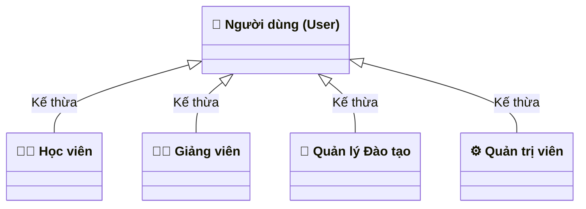

# 📐 Bộ Quy Chuẩn Thiết Kế Use Case (Enterprise Standard)

> **Tài liệu quy chuẩn kỹ thuật:** Hướng dẫn phân tích, vẽ sơ đồ và viết kịch bản Use Case theo chuẩn OMG UML 2.5 & Alistair Cockburn Methodology.  
> **Áp dụng cho:** Toàn bộ thành viên dự án EduVerse.

---

## 1. Các Nguyên Tắc Vàng Khi Thiết Kế Use Case (5 Golden Rules)

### 📌 Nguyên Tắc 1: Phân cấp trừu tượng theo Alistair Cockburn
Trong thực tế doanh nghiệp, Use Case được chia làm 3 tầng:
1. **Mức Tổng Quan (Summary Level - Cloud ☁️):** Sơ đồ ngữ cảnh, thể hiện tương tác giữa Actor và các Gói phân hệ (Package/Subsystem). Dành cho sếp, đối tác và khách hàng.
2. **Mức Mục Tiêu Người Dùng (User Goal Level - Sea 🌊):** **Đây là mức duy nhất được vẽ hình oval trên sơ đồ Use Case chi tiết.** Mỗi Use Case phải đem lại một giá trị hoàn chỉnh, đo lường được cho người dùng (ví dụ: *Ghi danh vào lớp*, *Nộp bài tập*, *Xuất bản khóa học*).
3. **Mức Thao Tác Con (Sub-function Level - Fish 🐟):** Các thao tác kỹ thuật như *Nhấn nút Submit*, *Validate định dạng email*, *Mã hóa mật khẩu*, *Ghi log*. **TUYỆT ĐỐI KHÔNG vẽ thành hình oval trên sơ đồ**, chỉ được viết thành các bước nhỏ trong bản đặc tả kịch bản (Specification).

---

### 📌 Nguyên Tắc 2: Quy tắc Đặt tên Chuẩn Quốc Tế
- **Cú pháp bắt buộc:** `[Động từ hành động] + [Bổ ngữ / Danh từ]`
- **Ví dụ ĐÚNG:**
  - ✅ *Đăng ký tài khoản*
  - ✅ *Tạo đề thi trắc nghiệm*
  - ✅ *Nộp bài tập*
  - ✅ *Phê duyệt khóa học*
- **Ví dụ SAI (Thường gặp ở đồ án yếu):**
  - ❌ *Đăng nhập* (quá ngắn, nên là *Đăng nhập hệ thống*)
  - ❌ *Khóa học* (Danh từ, không thể hiện hành vi)
  - ❌ *Xử lý dữ liệu AI* (Hệ thống tự làm, không phải mục tiêu người dùng)
  - ❌ *Giao diện bảng điểm* (Tên màn hình, không phải use case)

---

### 📌 Nguyên Tắc 3: Ranh Giới Hệ Thống & Phân Loại Tác Nhân
- **Ranh giới hệ thống (System Boundary):** Vẽ bằng khung hình chữ nhật lớn bao quanh toàn bộ các Use Case.
- **Vị trí Actor:**
  - **Tác nhân chính (Primary Actor):** Đặt bên **TRÁI**. Là người chủ động kích hoạt use case để đạt mục đích (Học viên, Giảng viên...).
  - **Tác nhân phụ / Hỗ trợ (Secondary Actor):** Đặt bên **PHẢI** hoặc bên **DƯỚI**. Là các hệ thống/dịch vụ ngoài hỗ trợ thực hiện use case (Email Service, AI Gemini API).
- **Cấm kỵ:**
  - ❌ Không bao giờ có đường nối trực tiếp giữa `Actor` và `Actor`.
  - ❌ Không bao giờ có Use Case nào nằm "bơ vơ" mà không nối với Actor nào (trừ khi nó được `«include»` hoặc `«extend»`).

---

### 📌 Nguyên Tắc 4: Kế Thừa Tác Nhân (Actor Generalization)
- Khi nhiều Actor cùng có các hành động giống nhau (*Đăng nhập*, *Quản lý hồ sơ*, *Quên mật khẩu*), ta tạo một Tác nhân trừu tượng là `Người dùng hệ thống (User)`.
- Các Actor cụ thể (`Student`, `Teacher`, `Manager`, `Admin`) sẽ **kế thừa** (`<|--`) từ `User`.
- **Tác dụng:** Giảm ngay 70% số đường dây chéo trên sơ đồ, thể hiện tư duy thiết kế hướng đối tượng chuyên nghiệp.

---

### 📌 Nguyên Tắc 5: Phân biệt Tuyệt đối giữa `«include»` và `«extend»`

| Tiêu chí | Quan hệ `«include»` (Bắt buộc) | Quan hệ `«extend»` (Mở rộng tùy chọn) |
|---|---|---|
| **Bản chất** | Use case A **bắt buộc** phải gọi B để hoàn thành. Nếu B lỗi, A không thành công. | Use case B **mở rộng** tính năng của A tại một điểm nhất định (Extension Point) khi thỏa mãn điều kiện. |
| **Chiều mũi tên** | **A trỏ đến B:** `A -.->|«include»| B` | **B trỏ ngược về A:** `B -.->|«extend»| A` |
| **Ví dụ thực tế** | *Đăng ký tài khoản* $\xrightarrow{\text{«include»}}$ *Xác thực Email* | *Tải tài liệu đính kèm* $\xrightarrow{\text{«extend»}}$ *Truy cập bài học* (chỉ tải khi bài học có file) |
| | *Tạo câu hỏi trắc nghiệm* $\xrightarrow{\text{«extend»}}$ *Dùng AI gợi ý* (chỉ gọi AI khi giảng viên bấm nút AI) |

---

## 2. Tiêu Chuẩn 1 Bản Đặc Tả Kịch Bản (Use Case Specification Template)

Mỗi Use Case chi tiết bắt buộc phải gồm 7 mục theo chuẩn IEEE 830:
1. **Mã & Tên Use Case:** (Ví dụ: `UC-QUIZ-001: Làm bài kiểm tra trắc nghiệm`)
2. **Tác nhân:** Primary Actor và Secondary Actor (nếu có).
3. **Mục đích:** Người dùng đạt được giá trị gì sau khi hoàn thành.
4. **Điều kiện tiên quyết (Pre-conditions):** Điều kiện bắt buộc phải có trước khi bấm nút.
5. **Điều kiện sau (Post-conditions):** Trạng thái cơ sở dữ liệu thay đổi như thế nào sau khi thành công.
6. **Luồng sự kiện chính (Main Flow):** Từng bước tương tác từ 1 $\rightarrow$ N (Người dùng làm gì $\rightarrow$ Hệ thống phản hồi gì).
7. **Luồng phụ / Ngoại lệ (Alternative & Exception Flows):** Các trường hợp rẽ nhánh (sai mật khẩu, mất mạng, hết giờ làm bài...).
